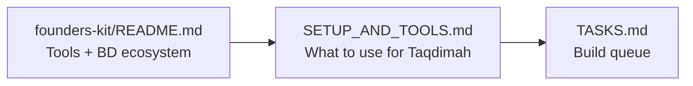
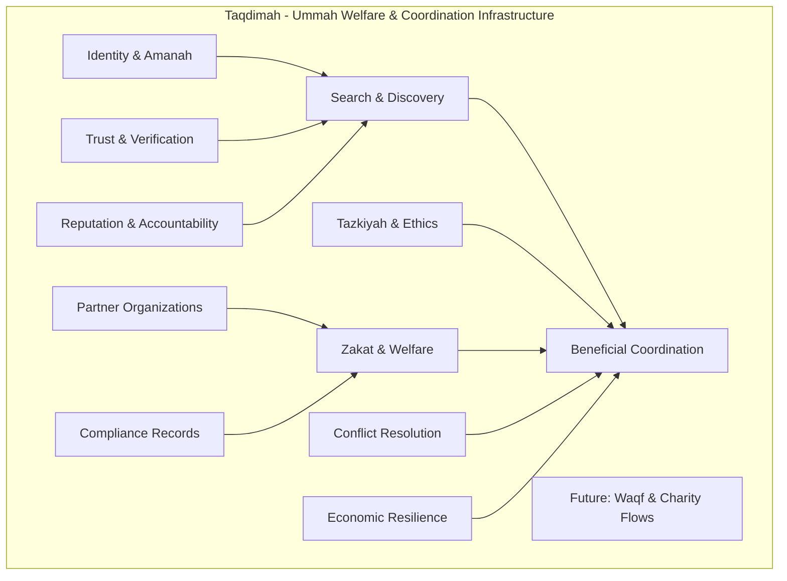
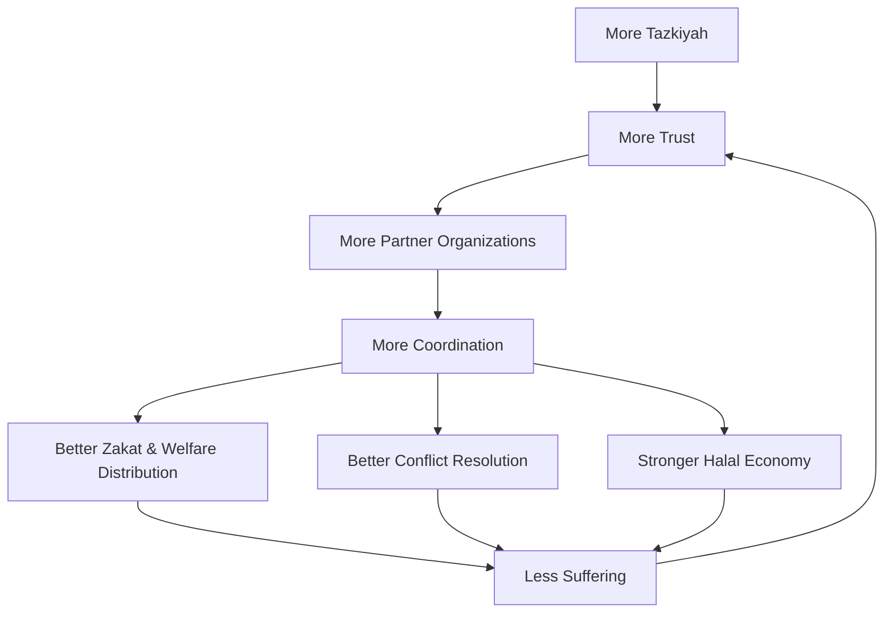

# Taqdimah: Welfare and Coordination Infrastructure for the Ummah

> **Master document for founders, engineers, scholars, community leaders, and operators.**
> Read this file first, then follow the reading order below.

**Taqdimah** - a structured contribution toward shared benefit.  
**Purpose:** Help the Ummah coordinate around what is common, trustworthy, beneficial, halal, and purifying for the heart.

**Launch focus:** Bangladesh -> Global Muslim communities  
**Nature:** Shared Islamic public-benefit infrastructure for trusted discovery, zakat and welfare coordination, conflict resolution, ethical development, organization partnerships, and economic resilience. Primary mission is public benefit, tazkiyah, and islah, not profit maximization.  
**Stage:** Pre-MVP / Full documentation complete  
**Last updated:** July 2026

---

## What Is Taqdimah?

Taqdimah is **not** a commercial marketplace chasing profit.  
Taqdimah is **not** a super app extracting value from the Ummah.  
Taqdimah is **not** a centralized authority that replaces scholars, masjids, families, local communities, or legitimate leadership.

Taqdimah is a **coordination and welfare system for the Ummah**. It connects verified people, scholars, da'ees, teachers, masjids, zakat bodies, charities, Islamic organizations, institutions, professionals, businesses, services, knowledge, and community initiatives through one trusted network.

The aim is to help Muslims answer practical questions with confidence:

- Who can we trust for this need?
- What services, knowledge, institutions, or opportunities are genuinely beneficial?
- Which problems are shared across communities?
- Where are conflicts blocking cooperation?
- How can zakat, sadaqah, resources, work, trade, charity, and knowledge flow to reduce suffering?
- What can the Ummah build together without compromising deen, dignity, or local responsibility?

> When the Ummah needs something beneficial, trustworthy, and coordinated: **"Open Taqdimah."**

Taqdimah exists to help the Ummah become more organized, more spiritually grounded, more economically capable, and less vulnerable to fragmentation. It should make it easier to find trustworthy support, resolve disputes fairly, distribute welfare responsibly, strengthen families and communities, and direct attention toward shared priorities.

The realistic path is not to control everything. Taqdimah should start with practical, auditable workflows that Islamic organizations already need:

- Verified directory of scholars, masjids, charities, teachers, services, and halal businesses.
- Zakat and welfare intake, eligibility checks, case routing, distribution records, and follow-up.
- Partnership tools for Islamic organizations that want to coordinate without losing independence.
- Dispute and complaint routing to trusted mediators or responsible institutions.
- Ethical economic development: halal trade, skills, jobs, services, and support for small vendors.
- Compliance-aware records so organizations can meet legal, tax, audit, and donor-reporting obligations without burdening the poor.

---

## Shared Foundations

Taqdimah should coordinate around what the Ummah already holds in common:

- **Deen first:** Every flow must respect Islam and avoid what is impermissible.
- **Amanah and truthfulness:** Verification, claims, rankings, and mediation must be honest.
- **Justice and conflict resolution:** Disputes should be handled with fairness, evidence, adab, and trusted mediators.
- **Shura and local responsibility:** The system supports consultation and coordination without erasing local communities.
- **Tazkiyah:** The system should help purify hearts, not feed ego, envy, outrage, humiliation, or addiction.
- **Economic dignity:** Muslims should be able to find halal work, trusted trade, useful services, and support during hardship.
- **Family and community strength:** The platform should strengthen households, masjids, education, and neighborhood-level cooperation.
- **Institutional partnership:** Masjids, zakat bodies, madrasahs, charities, NGOs, and Islamic organizations should be able to cooperate through clear roles.
- **Transparency:** Any revenue, ranking advantage, sponsorship, or institutional relationship must be clear.

---

## Tazkiyah by Design

Taqdimah is not only about moving information and money. The Ummah also needs purification of the heart and soul.

Product decisions should protect sincerity, humility, mercy, and accountability:

- No addictive feed designed around outrage, vanity, comparison, or public shaming.
- No public display that humiliates people receiving zakat, aid, mediation, or hardship support.
- No ranking system that turns scholars, charities, masjids, or good deeds into popularity contests.
- Private, respectful case handling for sensitive family, financial, legal, and welfare matters.
- Gentle reminders toward salah, repentance, gratitude, patience, honesty, and service where appropriate.
- Content and guidance reviewed by qualified people, with clear boundaries between product help and religious rulings.
- Design choices that make it easier to do good quietly, give responsibly, reconcile fairly, and seek beneficial knowledge.

Tazkiyah is a product requirement, not a decorative feature. If a feature increases coordination but damages sincerity, dignity, or adab, it should be redesigned.

---

## Malaysia-Inspired Practical Model

Taqdimah should learn from the kind of practical Islamic technology seen in more mature Muslim ecosystems: organized zakat administration, Islamic finance awareness, digital public services, institutional partnerships, and compliance-friendly operations.

For Bangladesh first, this means building realistic tools rather than making broad claims:

- **Zakat and welfare distribution:** Intake forms, need categories, eligibility review, duplicate-case checks, approval workflows, disbursement logs, receipts, follow-up, and impact reporting.
- **Organization partnerships:** Masjids, zakat committees, Islamic NGOs, madrasahs, relief groups, dawah teams, and halal service providers can maintain profiles, receive cases, coordinate referrals, and publish verified services.
- **Tax and compliance awareness:** Keep clean records, receipts, invoices, donor reports, audit trails, and lawful relief documentation. Taqdimah should not promote tax evasion or careless informal money movement.
- **Low-burden design:** Do not push platform fees, confusing paperwork, or hidden costs onto the poor, small vendors, or people seeking help.
- **Shariah and ethics review:** Zakat categories, financial flows, ranking logic, sponsored visibility, and dispute processes should be reviewed by qualified advisors.
- **Economic development:** Help people move from aid dependency toward halal income through skills, apprenticeships, vendor discovery, micro-services, trade networks, and institutional support.

Tax and legal treatment differs by country and must be handled with qualified local advisors. The product can support records, transparency, and workflow discipline; it should not pretend to replace scholars, accountants, lawyers, or regulators.

---

## Common Good Filter

**Non-negotiable:** Taqdimah only facilitates, lists, or promotes what is clearly beneficial and permissible for the Ummah.

This filter applies to services, knowledge, providers, campaigns, institutional listings, zakat and welfare flows, recommendations, dispute-resolution flows, and future AI-assisted guidance. The platform must not become a channel for manipulation, exploitation, sectarian hostility, vanity growth, spiritual harm, or extractive commerce.

Any sustainability model for the workers must remain transparent, fair, Shariah-compliant, and unable to override the public-benefit mission.

---

## Coordination Goals

Taqdimah should become a central hub for shared Ummah needs while keeping participants independent and accountable.

Core goals:

- **Trusted discovery:** Find verified scholars, teachers, masjids, professionals, vendors, institutions, and beneficial services.
- **Zakat and welfare coordination:** Help eligible people reach responsible organizations, and help organizations distribute aid with dignity, records, and follow-up.
- **Partner organization network:** Build durable ties with Islamic organizations through verified profiles, referrals, shared cases, published services, and clear accountability.
- **Shared direction:** Surface common needs across communities so effort is not scattered or duplicated.
- **Conflict resolution:** Help route disputes, complaints, and coordination failures toward trusted review and mediation.
- **Economic resilience:** Connect people to halal work, trade, skills, services, institutional support, and future charity/waqf flows.
- **Tazkiyah and ethics:** Build flows that encourage sincerity, mercy, repentance, truthfulness, and service.
- **Knowledge and dawah:** Make beneficial knowledge, revert support, family education, and community learning easier to access.
- **Crisis and hardship support:** Help communities coordinate during financial hardship, disasters, displacement, or local emergencies.

The measure of success is not screen time, valuation, or transaction volume. The measure is whether Muslims suffer less, purify their hearts, trust more, coordinate better, and build stronger communities.

---

## Setup & Tools (Start Here for Building)

**Before writing code**, read:

1. **[docs/GUIDELINE_MAP.md](./docs/GUIDELINE_MAP.md)** : **Master Mermaid maps** (journey, daily workflow, tech, stewardship, tools)
2. **[docs/SETUP_AND_TOOLS.md](./docs/SETUP_AND_TOOLS.md)** : Full setup guide, modest budget, daily workflow
3. **[founders-kit/README.md](../README.md)** : Parent tool directory (100+ resources). Use `Cmd+F` to find any tool. Taqdimah's approved stack is mapped in SETUP_AND_TOOLS.



---

## Documentation Reading Order

### For product & business

1. [docs/PRD.md](./docs/PRD.md) : Strategic PRD for Ummah coordination, trusted discovery, and public benefit
2. [docs/BUSINESS_PLAN.md](./docs/BUSINESS_PLAN.md) : Sustainability model for workers serving the Ummah
3. [docs/REVENUE_MODEL_MAP.md](./docs/REVENUE_MODEL_MAP.md) : Visual maps for transparent, Shariah-compliant sustainability

### For engineering (read in order)

4. [docs/PRD-TECHNICAL.md](./docs/PRD-TECHNICAL.md) : **Advanced technical PRD (source of truth)**
5. [docs/TECHNICAL_DESIGN.md](./docs/TECHNICAL_DESIGN.md) : Services, patterns, deployment
6. [docs/DATA_MODEL.md](./docs/DATA_MODEL.md) : Full database schema + RLS
7. [docs/API_REFERENCE.md](./docs/API_REFERENCE.md) : REST API contracts
8. [docs/ARCHITECTURE.md](./docs/ARCHITECTURE.md) : Platform layers overview

### Deep dives

| Doc | Topic |
|-----|-------|
| [docs/FEATURES.md](./docs/FEATURES.md) | Features + acceptance criteria (incl. dawah) |
| [docs/DAWAH_AND_ISLAH_IDEAS.md](./docs/DAWAH_AND_ISLAH_IDEAS.md) | **Dawah, education, reform & community ideas** |
| [docs/SPECIFICATIONS.md](./docs/SPECIFICATIONS.md) | MVP specs summary |
| [docs/SYSTEM_FLOWS.md](./docs/SYSTEM_FLOWS.md) | 10 end-to-end flows |
| [docs/SEARCH_RANKING.md](./docs/SEARCH_RANKING.md) | Intent parser + ranking algorithm |
| [docs/TRUST_SYSTEM.md](./docs/TRUST_SYSTEM.md) | Verification L0-L4 + trust score |
| [docs/AI_ENGINE.md](./docs/AI_ENGINE.md) | Life-event bundles + deen growth paths (Phase 2) |
| [docs/EVENTS.md](./docs/EVENTS.md) | Event-driven architecture |
| [docs/PAYMENTS_ESCROW.md](./docs/PAYMENTS_ESCROW.md) | Light coordination + halal flows (Phase 2) |
| [docs/DECISIONS.md](./docs/DECISIONS.md) | Architecture decisions |
| [docs/PROGRESS.md](./docs/PROGRESS.md) | Build status |
| [docs/TASKS.md](./docs/TASKS.md) | Implementation queue |
| [docs/GUIDELINE_MAP.md](./docs/GUIDELINE_MAP.md) | **11 Mermaid master maps** (start here for visual guide) |
| [docs/SETUP_AND_TOOLS.md](./docs/SETUP_AND_TOOLS.md) | Setup + founders-kit tool mapping |
| [../README.md](../README.md) | Parent founders-kit tool directory |

---

## Document Maturity

| Level | Docs | Status |
|-------|------|--------|
| Strategic | PRD, BUSINESS_PLAN, DAWAH_AND_ISLAH_IDEAS | Reframed v1.2 |
| Engineering | PRD-TECHNICAL, TDD, DATA_MODEL, API | Complete v1 |
| Deep systems | Search, Trust, AI, Events, Payments | Complete v1 |
| Dawah & Islah | Dedicated ideas + expanded FEATURES | Written & integrated |
| Code | src/ | Not started |

**Verdict:** Documentation is sufficient to build the MVP and explain the mission to partners. Code implementation is next.

---

## Platform Layers



---

## Network Effect for Good



This flywheel serves the Ummah's welfare by making tazkiyah, trust, zakat distribution, coordination, and economic support easier to build at scale.

---

## Sustainability for Workers Serving the Ummah

Taqdimah is public-benefit infrastructure, but it still requires people to build, maintain, verify, moderate, mediate, and improve it. Those workers must be supported fairly so the system can remain reliable and useful.

**Guiding principles for any profit/revenue:**

- It primarily sustains and rewards the workers doing the actual work.
- It must remain transparent and clearly disclosed.
- It should not place heavy burden on regular users, small vendors, or people in hardship.
- Mechanisms should feel like fair exchange for value delivered, not extraction.
- Shariah-compliant at every step. No riba, gharar, or deceptive practices.
- Revenue must not buy trust, override verification, or distort public-benefit ranking.
- Tax, accounting, and compliance records should be clean, lawful, and reviewed by qualified local advisors.
- Zakat recipients, hardship cases, and small vendors should not carry the financial burden of the platform.
- The primary measure of success is benefit to society, not maximized profit.

Acceptable approaches (examples):

- Modest subscriptions or featured placements for businesses that can afford them and receive clear value.
- Small, transparent fees on higher-value or facilitated transactions.
- Institutional support, grants, or partnerships with those who benefit from a stronger Ummah network.
- Voluntary contributions from those who find great benefit.
- Paid verification or operational services when the fee is transparent and does not affect truthfulness.
- Compliance, reporting, or workflow tools for organizations that can afford them, while keeping welfare access low-burden.

The goal is a self-sustaining operation where the team can focus on serving the Ummah without the platform becoming just another money-making app.

See [docs/BUSINESS_PLAN.md](./docs/BUSINESS_PLAN.md) for the sustainability model.

---

## Agent Copy-Paste Prompt

```
You are the senior engineering agent for Taqdimah - welfare and coordination infrastructure for the Ummah.

Read in order:
  1. Taqdimah/README.md
  2. founders-kit/README.md (tool directory : check before adding services)
  3. Taqdimah/docs/SETUP_AND_TOOLS.md
  4. Taqdimah/docs/PRD.md
  5. Taqdimah/docs/DAWAH_AND_ISLAH_IDEAS.md   (dawah & islah priorities)
  6. Taqdimah/docs/FEATURES.md
  7. Taqdimah/docs/PRD-TECHNICAL.md
  8. Taqdimah/docs/TASKS.md

Product: A trusted welfare and coordination system for the Ummah.
It helps Muslims find verified people, knowledge, institutions, services, zakat/welfare support, partner organizations, and opportunities that are beneficial and halal. It should centralize shared needs, support fair conflict resolution, strengthen dawah and education, improve economic resilience, and help people purify their hearts so people suffer less.

Discovery + trust + knowledge + tazkiyah + zakat/welfare + coordination layers. Workers are sustained fairly and transparently. Participants stay independent. Taqdimah holds the amanah of only promoting what is truthful, permissible, purifying, and beneficial.

Rules:
- One PR-sized task at a time
- Update docs/PROGRESS.md after each task
- MVP: Bangladesh, Bengali + English
- Follow trust-gated search (verified participants only)
- **Strict filter:** Only put out things that are clearly beneficial and permissible for the Ummah. No exceptions.
- Sustainability for workers must be fair, transparent, and never compromise trust. Strong Shariah guardrails always.
- Build low-burden zakat, sadaqah, welfare, partner-organization, audit-record, and compliance-aware workflows. Do not provide tax/legal rulings; route sensitive matters to qualified advisors.
- Prioritize tazkiyah, dawah, scholars, masjids, education, revert support, family islah, conflict resolution, hardship support, and beneficial knowledge. Practical services should support dignity, halal livelihood, and community welfare.
```

---

## MVP Scope (6 months)

- Natural language search (BN + EN)
- 500+ verified participants (vendors, professionals, institutions, mosques) in Dhaka, Chattogram, Sylhet
- Connection request loop + simple dashboards for participants
- Trust & verification layer (core amanah)
- Admin tools for truthful verification and moderation
- Partner organization profiles for masjids, zakat committees, Islamic NGOs, madrasahs, relief groups, and dawah teams
- Zakat/welfare intake prototype: need category, documents, eligibility review, referral, disbursement record, receipt, and follow-up
- Foundations for conflict-resolution routing and community issue tracking
- Foundations for tazkiyah-first UX: private aid flows, no public shaming, no vanity ranking, and respectful reminders
- Foundations for economic resilience flows: work, trade, services, institutional support, low-burden compliance records, and future waqf/charity coordination

---

**Taqdimah is welfare and coordination infrastructure for the Ummah: tazkiyah, trusted discovery, zakat distribution, partner organizations, fair resolution, and economic resilience.**

May Allah make it accepted and beneficial. Ameen.

Parent context: [founders-kit](../README.md)
