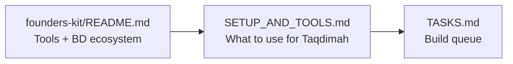
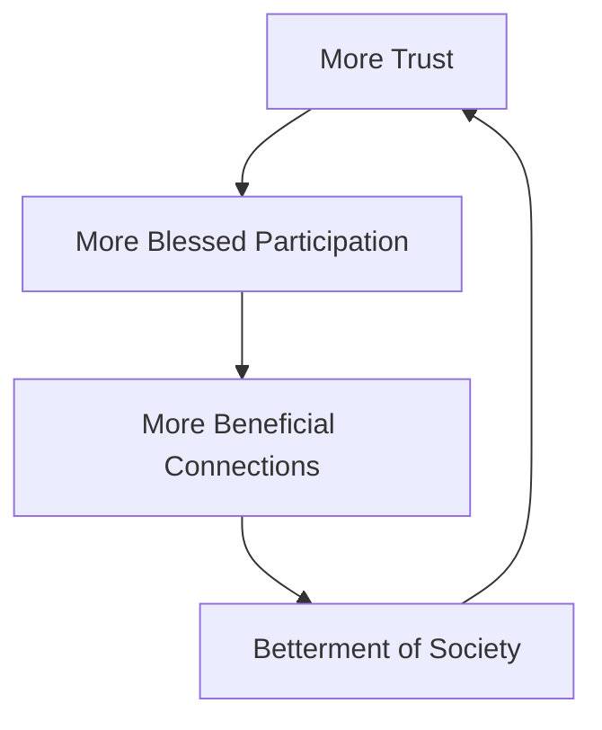

# Taqdimah : A Gift to the Khalifah for the Betterment of Society

> **Master document for founders, engineers, leaders, and AI agents.**
> Read this file first, then follow the reading order below.

**Taqdimah (التقديمة)** — An offering. A gift.  
**Presented to the Khalifah** — for the islah (betterment and reform) of society.

**Launch focus:** Bangladesh → Global Muslim communities  
**Nature:** A gift for societal betterment, sustained so the workers serving the Ummah can be compensated fairly. Primary mission is public good and islah, not profit maximization.  
**Stage:** Pre-MVP / Full documentation complete  
**Last updated:** July 2026

---

## What Is Taqdimah?

Taqdimah is **not** a commercial marketplace chasing profit.  
Taqdimah is **not** a super app extracting value from the Ummah.

**Taqdimah is a gift** — a digital amanah (trust) offered to righteous leadership (the Khalifah) and the Ummah, to strengthen society through trusted discovery of **only what is good and beneficial**, verified relationships, and halal coordination.

We only facilitate connections to things, people, knowledge, and services that are genuinely good for the Ummah — that help Muslims live with dignity, strengthen their faith, families, and communities, and contribute to societal reform (islah).

It connects scholars, da'ees, teachers, mosques, beneficial professionals, institutions, and providers of essential halal goods and services into one network of **trust and barakah**.

> When the Ummah needs something beneficial and trustworthy for their deen or dignified life: **"Open Taqdimah."**

**Purity Filter — Non-negotiable:**  
Taqdimah will only ever facilitate, list, or promote what is genuinely good and beneficial for the Ummah. We do not put out anything else. This filter applies to services, knowledge, providers, content, campaigns — everything.

Taqdimah exists purely to serve the betterment of society. It only surfaces what uplifts the Ummah. Any sustainability for the workers must be transparent, minimal in impact on users, and never compromise the purity of this offering.

---

## Setup & Tools (Start Here for Building)

**Before writing code**, read:

1. **[docs/GUIDELINE_MAP.md](./docs/GUIDELINE_MAP.md)** : **Master Mermaid maps** (journey, daily workflow, tech, stewardship, tools)
2. **[docs/SETUP_AND_TOOLS.md](./docs/SETUP_AND_TOOLS.md)** : Full setup guide, modest budget, daily workflow
3. **[founders-kit/README.md](../README.md)** : Parent tool directory (100+ resources). Use `Cmd+F` to find any tool. Taqdimah's approved stack is mapped in SETUP_AND_TOOLS.



---

## Documentation Reading Order

### For product & business

1. [docs/PRD.md](./docs/PRD.md) : Strategic PRD (vision as gift to Khalifah, users, MVP + dawah)
2. [docs/BUSINESS_PLAN.md](./docs/BUSINESS_PLAN.md) : Sustenance model for workers serving the Ummah
3. [docs/REVENUE_MODEL_MAP.md](./docs/REVENUE_MODEL_MAP.md) : Visual maps (reframed for gift + worker sustenance)

### For engineering (read in order)

4. [docs/PRD-TECHNICAL.md](./docs/PRD-TECHNICAL.md) : **Advanced technical PRD (source of truth)**
5. [docs/TECHNICAL_DESIGN.md](./docs/TECHNICAL_DESIGN.md) : Services, patterns, deployment
6. [docs/DATA_MODEL.md](./docs/DATA_MODEL.md) : Full database schema + RLS
7. [docs/API_REFERENCE.md](./docs/API_REFERENCE.md) : REST API contracts
8. [docs/ARCHITECTURE.md](./docs/ARCHITECTURE.md) : Platform layers overview

### Deep dives

| Doc | Topic |
|-----|-------|
| [docs/FEATURES.md](./docs/FEATURES.md) | Features + acceptance criteria (incl. dawah) |
| [docs/DAWAH_AND_ISLAH_IDEAS.md](./docs/DAWAH_AND_ISLAH_IDEAS.md) | **Rich dawah, education, reform & community ideas** |
| [docs/SPECIFICATIONS.md](./docs/SPECIFICATIONS.md) | MVP specs summary |
| [docs/SYSTEM_FLOWS.md](./docs/SYSTEM_FLOWS.md) | 10 end-to-end flows |
| [docs/SEARCH_RANKING.md](./docs/SEARCH_RANKING.md) | Intent parser + ranking algorithm |
| [docs/TRUST_SYSTEM.md](./docs/TRUST_SYSTEM.md) | Verification L0–L4 + trust score |
| [docs/AI_ENGINE.md](./docs/AI_ENGINE.md) | Life-event bundles + deen growth paths (Phase 2) |
| [docs/DAWAH_AND_ISLAH_IDEAS.md](./docs/DAWAH_AND_ISLAH_IDEAS.md) | **Dawah, scholars, masjids, reverts, content, reform** |
| [docs/EVENTS.md](./docs/EVENTS.md) | Event-driven architecture |
| [docs/PAYMENTS_ESCROW.md](./docs/PAYMENTS_ESCROW.md) | Light coordination + halal flows (Phase 2) |
| [docs/DECISIONS.md](./docs/DECISIONS.md) | Architecture decisions |
| [docs/PROGRESS.md](./docs/PROGRESS.md) | Build status |
| [docs/TASKS.md](./docs/TASKS.md) | Implementation queue |
| [docs/GUIDELINE_MAP.md](./docs/GUIDELINE_MAP.md) | **11 Mermaid master maps** (start here for visual guide) |
| [docs/SETUP_AND_TOOLS.md](./docs/SETUP_AND_TOOLS.md) | Setup + founders-kit tool mapping |
| [../README.md](../README.md) | Parent founders-kit tool directory |

---

## Document Maturity

| Level | Docs | Status |
|-------|------|--------|
| Strategic (Gift framing) | PRD, BUSINESS_PLAN (sustenance), DAWAH_AND_ISLAH_IDEAS | Reframed v1.1 |
| Engineering | PRD-TECHNICAL, TDD, DATA_MODEL, API | Complete v1 |
| Deep systems | Search, Trust, AI, Events, Payments | Complete v1 |
| Dawah & Islah | Dedicated ideas + expanded FEATURES | Written & integrated |
| Code | src/ | Not started |

**Verdict:** Documentation is now **sufficient to build MVP and pitch investors**. Code implementation is next.

---

## Platform Layers

```mermaid
flowchart TB
    subgraph Layers["Taqdimah — Gift for Societal Islah"]
        L1[Identity & Amanah]
        L2[Search & Discovery]
        L3[Trust & Verification]
        L4[Reputation & Barakah]
        L5[Coordination (leads, connections)]
        L6[Messaging]
        L7[Light Coordination Tools]
        L8[Future: Waqf & Charity Flows]
    end
    L1 --> L2 --> L5
    L3 --> L2
    L4 --> L2
    L6 --> L5
```

---

## Network Effect for Good



This flywheel serves the Khalifah's responsibility and the Ummah's welfare.

---

## Sustainability for the Workers Serving the Ummah

Taqdimah is fundamentally **a gift (taqdimah)** presented to the Khalifah for the betterment (islah) of society and service to the whole Ummah.

At the same time, the people who work to build, maintain, verify, and improve this gift must be supported. Fair compensation and modest profit for the workers and operating team is not only allowed — it is necessary so that the gift can continue and grow in quality for the benefit of the Ummah.

**Guiding principles for any profit/revenue:**
- It primarily sustains and rewards the workers doing the actual work.
- It must remain transparent and clearly disclosed.
- It should not place heavy burden on regular users or small vendors.
- Mechanisms should feel like fair exchange for value delivered, not extraction.
- Shariah-compliant at every step. No riba, gharar, or deceptive practices.
- The primary measure of success is benefit to society, not maximized profit.

Acceptable approaches (examples):
- Modest subscriptions or featured placements for businesses that can afford them and receive clear value (more leads, visibility).
- Small, transparent fees on higher-value or facilitated transactions.
- Institutional support, grants, or partnerships with those who benefit from a stronger Ummah network.
- Voluntary contributions from those who find great benefit.

The goal is a self-sustaining operation where the team can focus on serving the Ummah and the Khalifah's responsibility of societal improvement — without the platform becoming just another money-making app.

See [docs/BUSINESS_PLAN.md](./docs/BUSINESS_PLAN.md) for the updated sustenance model.

---

## Agent Copy-Paste Prompt

```
You are the senior engineering agent for Taqdimah — a gift (taqdimah) to the Khalifah for the betterment of society.

Read in order:
  1. Taqdimah/README.md
  2. founders-kit/README.md (tool directory : check before adding services)
  3. Taqdimah/docs/SETUP_AND_TOOLS.md
  4. Taqdimah/docs/PRD.md
  5. Taqdimah/docs/DAWAH_AND_ISLAH_IDEAS.md   (dawah & islah priorities)
  6. Taqdimah/docs/FEATURES.md
  7. Taqdimah/docs/PRD-TECHNICAL.md
  8. Taqdimah/docs/TASKS.md

Product: A gift (taqdimah) to the Khalifah for the betterment of society. 
We only facilitate what is good and beneficial for the Ummah — dawah, knowledge, tarbiyah, masjid empowerment, family strength, community coordination, and essential trusted services that help Muslims live with dignity and focus on deen.
Discovery + trust + knowledge layers. Workers are sustained fairly so the gift remains excellent and pure. Participants stay independent. Taqdimah holds the amanah of only promoting good.

Rules:
- One PR-sized task at a time
- Update docs/PROGRESS.md after each task
- MVP: Bangladesh, Bengali + English
- Follow trust-gated search (verified participants only)
- **Strict filter:** Only put out things that are clearly beneficial for the Ummah. No exceptions.
- Sustainability for workers must be fair, transparent, and never taint the purity of the offering. Strong Shariah guardrails always.
- Heavily prioritize dawah, scholars, masjids, education, revert support, family islah, and beneficial knowledge. Practical services only when they are essential and good.

Stack: Next.js 15, Supabase, Vercel, OpenAI mini for intent.
```

---

## MVP Scope (6 months) — Delivering the Gift

- Natural language search (BN + EN)
- 500+ verified participants (vendors, professionals, institutions, mosques) in Dhaka, Chattogram, Sylhet
- Connection request loop + simple dashboards for participants
- Trust & verification layer (core amanah)
- Admin tools for truthful verification
- Foundations that can support tools for societal oversight and uplift

---

**Taqdimah is an offering (taqdimah) — a gift to the Khalifah for the betterment of society.**

May Allah make it accepted and beneficial. Ameen.

Parent context: [founders-kit](../README.md)