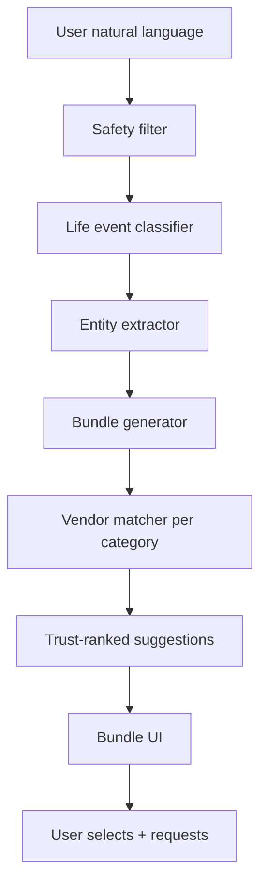
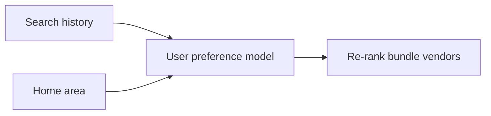

# Taqdimah : AI Recommendation Engine

**Version:** 1.0  
**Phase:** P2 (design now, implement after MVP traction)  
**Parent:** [PRD-TECHNICAL.md](./PRD-TECHNICAL.md) §17

---

## 1. Purpose

Transform Taqdimah from **search** to **solve**:

> User: "I'm moving to Banani next Friday."  
> Taqdimah: Produces a **bundle** of trusted vendors across categories with optional one-tap multi-lead.

---

## 2. AI System Architecture



---

## 3. Life Event Taxonomy

| Event ID | Triggers | Default bundle categories |
|----------|----------|---------------------------|
| `moving` | moving, relocate, নতুন বাসা | moving, electrician, cleaning, interior |
| `wedding` | wedding, marriage, নিকাহ | photographer, caterer, decorator, venue |
| `new_baby` | baby, newborn, আকিকা | photographer, caterer, islamic-gifts |
| `ramadan` | ramadan, iftar, ইফতার | caterer, mosque-events, charity |
| `home_repair` | repair, fix, ভাঙা | infer subcategory from keywords |
| `hire_talent` | hire, developer, freelancer | software-developers, designers |
| `learn_islam` | quran, hifz, islamic class | quran-teachers, madaris |

---

## 4. Pipeline Stages

### Stage 1: Safety filter

Block: illegal, haram explicit, violence, self-harm  
Pass: service-related natural language

### Stage 2: Life event classifier

```typescript
interface LifeEventResult {
  event_type: string | null;
  confidence: number;
  location: { city?: string; area?: string };
  timeline?: string; // "next Friday", "this week"
  urgency: 'low' | 'medium' | 'high';
}
```

**Model:** gpt-4o-mini with structured output  
**Fallback:** rule-based if API down → degrade to single-category search

### Stage 3: Bundle generator

```typescript
interface IntentBundle {
  bundle_id: string;
  event_type: string;
  items: BundleItem[];
  explanation: string; // shown to user : "Because you're moving..."
}

interface BundleItem {
  category_slug: string;
  priority: number;
  optional: boolean;
  reason: string;
  suggested_vendor_ids: string[];
}
```

### Stage 4: Vendor matcher

For each bundle item:
1. Run standard search pipeline
2. Top 3 by trust_score
3. Diversify (no duplicate vendor across items if possible)

---

## 5. Example Output

**Input:** `"I'm moving to Banani next Friday"`

```json
{
  "bundle_id": "bnd_abc123",
  "event_type": "moving",
  "explanation": "Moving usually needs transport, utilities setup, and cleaning.",
  "items": [
    {
      "category_slug": "moving-companies",
      "priority": 1,
      "optional": false,
      "reason": "Transport your belongings",
      "suggested_vendor_ids": ["v1", "v2", "v3"]
    },
    {
      "category_slug": "electricians",
      "priority": 2,
      "optional": false,
      "reason": "Check wiring in new flat",
      "suggested_vendor_ids": ["v4", "v5"]
    },
    {
      "category_slug": "cleaning-services",
      "priority": 3,
      "optional": true,
      "reason": "Deep clean before unpacking",
      "suggested_vendor_ids": ["v6"]
    }
  ]
}
```

---

## 6. API

### POST /api/ai/bundle

**Auth:** optional (better personalization if logged in)

**Body:**
```json
{ "message": "I'm moving to Banani next Friday", "city": "dhaka" }
```

**Response:** IntentBundle + hydrated vendor cards

### POST /api/ai/bundle/[id]/request

**Body:**
```json
{ "item_categories": ["moving-companies", "electricians"], "contact_phone": "+880..." }
```

Creates multiple `lead_assignments` linked by `bundle_id`.

---

## 7. Cost Model

| Component | Est. cost/request |
|-----------|-------------------|
| Life event classify | $0.002 |
| Bundle generate | $0.003 |
| Total | ~$0.005 |

**Monthly budget $50 AI:** ~10,000 bundle requests  
**Mitigation:** Cache common event patterns; free users 3 bundles/day

---

## 8. Quality & Safety

- **Disclosure:** "Suggestions powered by AI : always verify with vendors"
- **No guaranteed outcomes** : avoid gharar language in UI
- **Human override:** User can edit bundle before sending
- **Feedback loop:** Thumbs up/down on bundle → fine-tune prompts

---

## 9. Future: Personalization



Privacy: opt-in only, clear settings, delete history option.

---

## 10. Vendor AI Copilot (P3)

- Suggest profile improvements
- Draft lead responses
- Pricing guidance from category benchmarks

Separate product surface : Pro/Business plan only.

---

**Related:** [SEARCH_RANKING.md](./SEARCH_RANKING.md) · [SYSTEM_FLOWS.md](./SYSTEM_FLOWS.md)