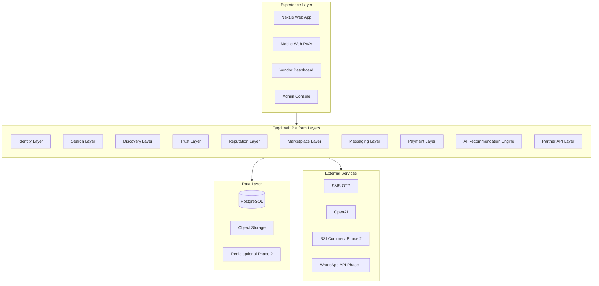
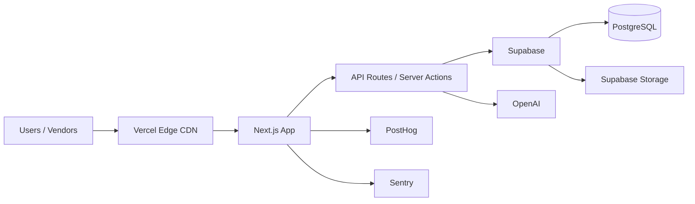
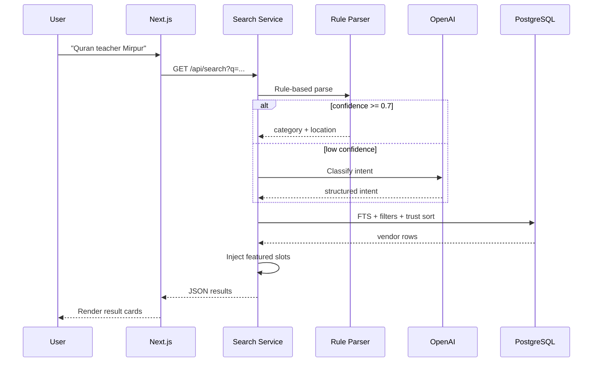
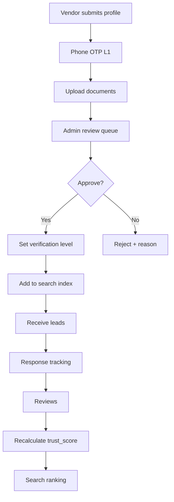
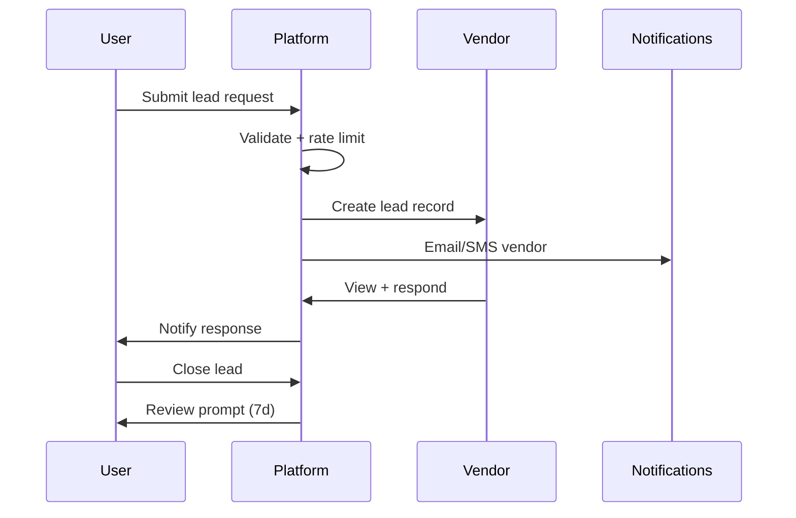
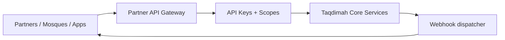

# Taqdimah : System Architecture

**Version:** 1.0  
**Architecture style:** Modular platform (not monolith super-app)

---

## 1. Platform Layer Model

Taqdimah is designed as **layers**, not a single application doing everything.



### Layer responsibilities

| Layer | Owns | MVP? |
|-------|------|------|
| Identity | Auth, roles, profiles | Yes |
| Search | Query parsing, full-text index | Yes |
| Discovery | Category, location, ranking | Yes |
| Trust | Verification, badges, moderation | Yes |
| Reputation | Reviews, trust score | Yes |
| Marketplace | Leads, matching, featured slots | Yes |
| Messaging | User ↔ vendor threads | Phase 2 |
| Payment | Escrow, commissions | Phase 2 |
| AI Engine | Multi-intent bundles | Phase 2 |
| Partner API | External integrations | Phase 3 |

---

## 2. High-Level Deployment



---

## 3. Tech Stack

| Component | Choice | Rationale |
|-----------|--------|-----------|
| Frontend | Next.js 15, React, TypeScript | SSR/SEO for city+category pages |
| UI | Tailwind CSS, shadcn/ui | Fast, accessible components |
| Auth | Supabase Auth (phone OTP + Google) | BD market phone-first |
| Database | Supabase PostgreSQL | RLS, realtime, managed |
| File storage | Supabase Storage | Verification docs, images |
| Search v1 | PostgreSQL FTS + intent parser | Budget-friendly MVP |
| Search v2 | Typesense or Meilisearch | Phase 2 scale |
| AI | OpenAI gpt-4o-mini | Intent fallback |
| Email | Resend | Transactional |
| SMS | Local BD gateway | OTP + lead alerts |
| Analytics | PostHog | Funnels, retention |
| Errors | Sentry | Production monitoring |
| Deploy | Vercel | Git-based CI/CD |

**Monthly infra budget:** $0–50 at MVP scale (fits $200 total founder budget).

---

## 4. Application Structure

```
Taqdimah/
├── README.md
├── docs/
├── src/
│   ├── app/
│   │   ├── (public)/          # Home, search, city, category, vendor pages
│   │   ├── (auth)/            # Login, register
│   │   ├── dashboard/         # Consumer leads
│   │   ├── vendor/            # Vendor dashboard
│   │   ├── admin/             # Admin console
│   │   └── api/               # REST endpoints
│   ├── components/
│   │   ├── ui/                # shadcn
│   │   ├── search/
│   │   ├── vendor/
│   │   └── admin/
│   ├── lib/
│   │   ├── supabase/
│   │   ├── search/            # Intent parser
│   │   ├── trust/             # Score computation
│   │   └── notifications/
│   └── types/
├── supabase/
│   └── migrations/
└── public/
```

---

## 5. Search Architecture



---

## 6. Trust Architecture



---

## 7. Marketplace / Lead Flow



---

## 8. Multi-Tenancy & Vendor Independence

**Principle:** Each vendor is an independent entity. Taqdimah does not operate their business.

| Data | Owner |
|------|-------|
| Brand, logo, pricing | Vendor |
| Customer lead | Shared (platform mediates) |
| Review | User, displayed on vendor profile |
| Payment (Phase 2) | Processed via platform, settled to vendor |
| Operations (delivery, staff) | Vendor only |

---

## 9. Security Architecture

- **Authentication:** Supabase JWT, httpOnly cookies
- **Authorization:** Middleware role checks + Supabase RLS
- **Documents:** Private bucket, signed URLs, 1h expiry
- **API:** Rate limiting via Vercel middleware / Upstash (Phase 2)
- **Admin:** Separate route group, IP allowlist optional
- **Audit:** `admin_audit_log` table for moderation actions

---

## 10. Scalability Path

| Stage | Users | Architecture change |
|-------|-------|---------------------|
| MVP | < 10K MAU | Single Next.js + Supabase |
| Growth | 10K–100K | Add Redis cache, read replicas |
| Scale | 100K+ | Meilisearch, queue workers, CDN images |
| Multi-region | Global | Country shards, localized search |

---

## 11. Integration Architecture (Phase 2+)



**Example partner flows:**
- Mosque website embeds Taqdimah vendor search widget
- Islamic bank refers halal SME listings
- NGO publishes campaign via API

---

## 12. AI Roadmap

| Phase | Capability |
|-------|------------|
| MVP | Single-intent category classification |
| P2 | Multi-service bundles ("moving next week") |
| P3 | Personalized recommendations based on search history |
| P4 | Vendor copilot (respond to leads, improve profile) |

**Cost control:** Rule parser first; LLM only on low-confidence queries. Cache frequent queries.

---

## 13. Observability

| Signal | Tool |
|--------|------|
| Product analytics | PostHog |
| Error tracking | Sentry |
| Uptime | Better Uptime or UptimeRobot |
| Search quality | search_logs + manual review weekly |
| Trust health | Report rate, verification SLA |

---

**Related:** [SPECIFICATIONS.md](./SPECIFICATIONS.md) · [PRD.md](./PRD.md)