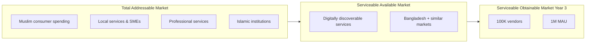
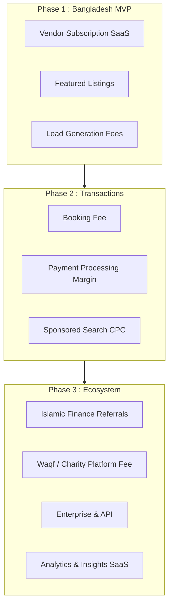
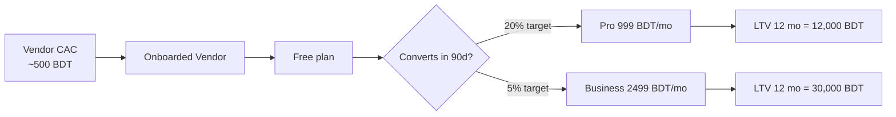
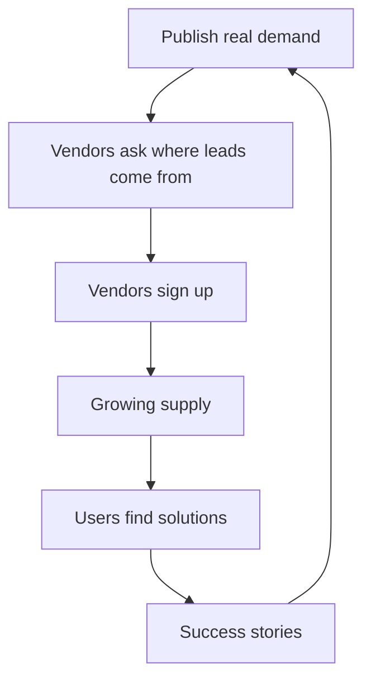
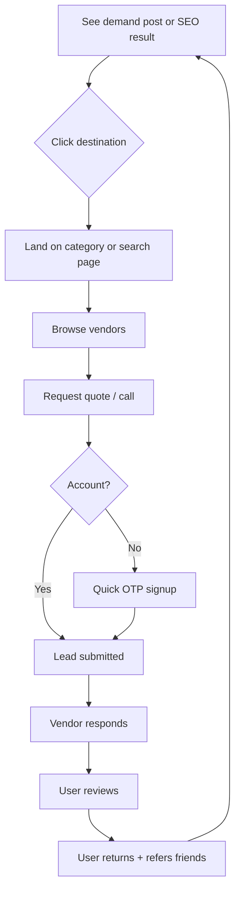
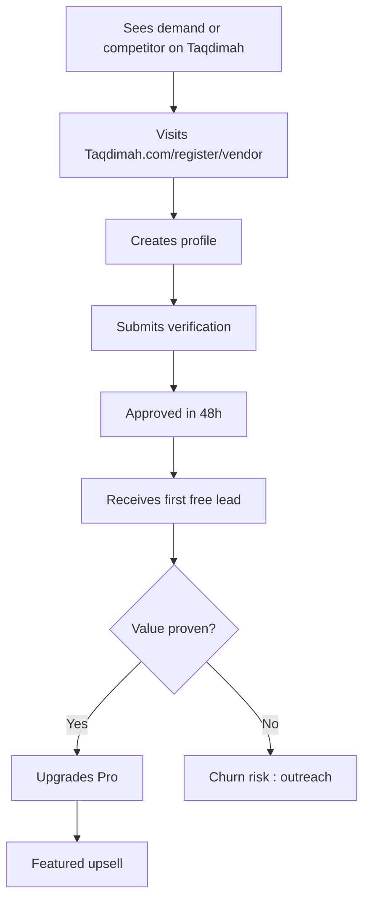
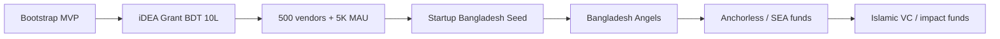

# Taqdimah : Sustenance Model - Workers Sustaining the Pure Gift to the Khalifah

**Version:** 1.1 (Reframed)  
**Core Identity:** A gift (taqdimah) for the betterment of society - **only what is good for the Ummah** - offered in service to the Khalifah and the Ummah.  
**Market entry:** Bangladesh → Global Muslim communities  

**Strict rule:** We do not facilitate, promote, or build anything that is not beneficial for the Ummah.

---

## 1. Executive Summary

Taqdimah is a **gift** to the Khalifah for the islah (betterment and reform) of society. It only provides trusted discovery and coordination for things that are genuinely good and beneficial - dawah, knowledge, community strength, family, and essential services that help the Ummah live with dignity and focus on deen.

The people who build, verify, operate, and improve this pure gift - the workers and team - require fair compensation to sustain their dedication. Any mechanisms exist only to keep the workers able to serve the Ummah with excellence and integrity.

**Core principle:**

> We only facilitate connections to things that are genuinely good and beneficial for the Ummah. The team maintaining this gift is compensated fairly from the value created, so they can continue serving the Ummah purely.

**Year 1 goal:** Deliver real value in Bangladesh with 500+ verified participants (including strong Islamic ecosystem), 5,000+ MAU, meaningful dawah/education connections, and enough operational sustenance for the core team to continue the work full-time with integrity.

---

## 2. Market Opportunity

### 2.1 Bangladesh (Phase 1)

| Factor | Data / estimate |
|--------|-----------------|
| Population | ~170M |
| Muslim population | ~90%+ |
| Smartphone penetration | Growing rapidly |
| SME count | Millions of informal + formal SMEs |
| Digital classifieds habit | Bikroy, Facebook groups dominant |
| Service marketplaces | Sheba.xyz (home services niche) |
| Gap | No trust-first, Islamic-ecosystem-wide platform |

### 2.2 Global Muslim economy (Phase 3+)

| Region | Opportunity |
|--------|-------------|
| Malaysia / Indonesia | Large Muslim GDP, digital-ready |
| Pakistan | Similar fragmentation to BD |
| GCC | High spending, expat discovery needs |
| Europe / North America diaspora | Halal services, mosques, professionals |

**Opportunity framing:** The Muslim Ummah represents a massive population in need of trusted coordination, knowledge, and beneficial connections for both dunya and deen. Taqdimah provides the infrastructure as a gift while generating enough value to sustain the dedicated workers who maintain it.

---

## 3. Business Model Canvas

```mermaid
flowchart TB
    subgraph KeyPartners["Key Partners"]
        P1[Mosques & madaris]
        P2[Islamic banks / Takaful]
        P3[NGOs & waqf boards]
        P4[Payment gateways]
        P5[Local business associations]
    end

    subgraph KeyActivities["Key Activities"]
        A1[Vendor onboarding]
        A2[Trust verification]
        A3[Search & ranking]
        A4[Ecosystem marketing]
        A5[Community trust building]
    end

    subgraph ValueProp["Value Propositions"]
        V1["Consumers: one trusted search"]
        V2["Vendors: inbound leads"]
        V3["Institutions: community visibility"]
        V4["Ummah: halal-aligned discovery"]
    end

    subgraph CustomerSegments["Customer Segments"]
        C1[Muslim consumers]
        C2[SMEs & freelancers]
        C3[Islamic service providers]
        C4[Institutions]
    end

    subgraph Revenue["Revenue Streams"]
        R1[Vendor subscriptions]
        R2[Featured & sponsored]
        R3[Lead fees]
        R4[Transaction fees]
        R5[Islamic finance referrals]
        R6[Enterprise API]
    end

    KeyPartners --> KeyActivities
    KeyActivities --> ValueProp
    ValueProp --> CustomerSegments
    CustomerSegments --> Revenue
```

---

## 4. How the Platform Sustains Its Workers (Sustenance Model)

All mechanisms must be **transparent, clearly labeled, Shariah-compliant (no riba, no gharar, no deception), and primarily directed at fairly compensating the workers who build and operate this gift for the Ummah.** 

The Ummah is the primary beneficiary. The workers are sustained so they can continue serving.

### 4.1 Revenue streams overview

### 4.2 Stream details

#### Stream 1: Participant Subscription (Sustenance for Workers)

**Who pays:** Businesses, professionals, and institutions that receive significant value (leads, visibility, tools) and can afford it.  
**What they get:** Better tools, more reach, analytics, priority support. Free tier always remains strong.

| Plan | BDT/month | Purpose |
|------|-----------|---------|
| Free | 0 | Full basic access for all |
| Pro | ~999 | Serious users who benefit from unlimited activity |
| Business / Institution | ~2,499 | Featured visibility + advanced tools |

**Important framing:** This is not "charging the Ummah." It is a voluntary way for those who profit most from the infrastructure to help sustain the workers who keep it running for everyone. Free access for small users and seekers of knowledge remains a priority.

---

#### Stream 2: Featured Listings & Sponsored Placement

**Who pays:** Vendors wanting visibility  
**Model:** Flat monthly slot OR weekly auction per category+city  

| Placement | BDT/month | Notes |
|-----------|-----------|-------|
| Category featured (top 3) | 1,500–5,000 | Rotating fairness algorithm |
| City homepage banner | 10,000+ | Limited slots |
| Sponsored search tag | CPC 15–30 BDT | Always labeled "Sponsored" |

**Why halal-aligned:** Advertising is permissible when truthful. No deception about organic ranking.

**Year 1 target:** 30 featured slots avg 2,000 BDT = ~**$600 MRR**

---

#### Stream 3: Lead Generation Fees

**Who pays:** Vendor per qualified lead  
**Model:** Pay-per-lead after free tier exhausted  

| Lead type | BDT/lead |
|-----------|----------|
| Standard service lead | 50–150 |
| High-value (architect, lawyer) | 200–500 |
| Bulk / enterprise RFP | Custom |

**Free tier:** 10 leads/month on Free plan drives adoption.  
**Why halal-aligned:** Fee for a real service connection (wasīlah / intermediary), disclosed upfront.

**Year 1 target:** 800 paid leads × 100 BDT avg = ~**$700/month** at scale month 12

---

#### Stream 4: Booking & Marketplace Commission (Phase 2)

**Who pays:** Vendor on completed booking  
**Rate:** 5–12% depending on category (lower than global gig apps to win trust)  

**Escrow model:**
1. Customer pays Taqdimah escrow
2. Vendor completes job
3. Customer confirms
4. Taqdimah releases funds minus fee

**Why halal-aligned:** Commission on actual sale (ju'ālah / brokerage). Transparent. Escrow reduces dispute gharar.

**Year 2 target:** Primary revenue driver once payments live

---

#### Stream 5: Islamic Finance & Takaful Referrals (Phase 3)

**Who pays:** Partner banks, Islamic fintech, Takaful providers  
**Model:** Referral fee per approved account or policy : **not** interest spread  

**Examples:**
- Halal home financing referral
- SME Murabaha facility introduction
- Takaful family plan signup
- Waqf investment fund (Shariah board approved products only)

**Guardrails:**
- Shariah advisory board reviews partners
- No conventional interest products listed
- Clear disclosure: "Taqdimah may receive a referral fee"

**Why this fits the Ummah:** Muslims need trusted discovery for Islamic finance : Taqdimah becomes the **ethical gateway**, not the lender.

---

#### Stream 6: Waqf, Charity & NGO Tools (Phase 3)

**Who pays:** NGOs, mosques, waqf institutions  
**Model:**
- Free basic institution profile
- Premium campaign tools: 2–5% platform fee on donations OR flat SaaS fee
- Optional: donor pays small "support Taqdimah" tip (transparent)

**Why halal-aligned:** Facilitating sadaqah and waqf is rewarded in Islam. Fee must be minimal and disclosed : ideally capped.

**Spiritual positioning:** "We help the Ummah give better" : not profiting from charity fraud.

---

#### Stream 7: Enterprise & API Access

**Who pays:** Large agencies, property developers, madaris chains  
**Model:** Annual contract for API access, bulk listings, white-label search widget  

| Tier | USD/year |
|------|----------|
| Growth API | $1,200 |
| Enterprise | $6,000+ |

**Use case:** Real estate developer embeds "find halal interior vendors" on their site via Taqdimah API.

---

#### Stream 8: Analytics & Market Insights

**Who pays:** Vendors, investors, brands  
**Model:** Anonymized trend reports : "Top halal catering demand in Dhaka Q3"  

B2B data product. Must respect privacy and aggregate only.

---

### 4.3 Sustenance mix projection (for workers)

| Year | Subscriptions / Featured | Light fees on value | Institutional / grants | Total (team support) |
|------|---------------------------|---------------------|------------------------|----------------------|
| Y1 | 60% | 10% | 30% | Enough for core team |
| Y2 | 50% | 25% | 25% | Growing team capacity |
| Y3+ | Balanced mix | Focus on high-value facilitation | Strong institutional waqf-like support | Sustainable high-quality operation |

**Note:** Numbers are directional. The real metric is "can the workers who maintain the gift continue full-time with excellence and integrity while serving the Ummah?"

---

## 5. Unit Economics (Value to Workers & Ummah)

| Metric | Target |
|--------|--------|
| Vendor CAC | < 500 BDT (ecosystem marketing) |
| Free → Pro conversion | 20% in 90 days |
| Pro monthly churn | < 5% |
| Avg leads per active vendor | 8/month |
| Vendor LTV (Pro) | ~12,000 BDT / year |

---

## 6. Go-to-Market Strategy

### 6.1 Core insight: Ecosystem marketing

**Do NOT run ads saying "Download Taqdimah."**

**DO market real demand:**

| Channel | Example post |
|---------|--------------|
| Facebook groups | "A family in Uttara needs halal catering for 150 guests this Friday. Verified vendors?" |
| LinkedIn | "Dhaka startup needs senior React dev : remote OK" |
| Mosque notice boards | QR to Taqdimah category page for electricians |
| WhatsApp communities | "Sylhet → Dhaka move next week : who do you trust?" |

### 6.2 Launch sequence (Bangladesh)

**Month 1–2: Seed supply (manual)**
- Onboard 100 verified vendors in Dhaka across 10 categories
- Partner with 5 mosques for flyer + QR
- Founder's network: architects, devs, caterers, teachers

**Month 3–4: Seed demand**
- Post 50 ecosystem demand stories in FB groups
- SEO pages live: `/dhaka/architects`, `/dhaka/quran-teachers`
- Micro-influencers (Islamic teachers, home service pages)

**Month 5–6: Monetization**
- Launch Pro plan
- First featured slots (10 vendors)
- Chattogram + Sylhet expansion

### 6.3 User acquisition channels

| Channel | Cost | Users | Purpose |
|---------|------|-------|---------|
| SEO (city + category) | Low | High intent | Long-term moat |
| Facebook groups | Free | Vendors + users | Ecosystem posts |
| Mosque partnerships | Low | Trust | Community credibility |
| Google Maps import outreach | Time | Supply | "Claim your Taqdimah profile" |
| Referral program | CAC share | Both sides | Vendor refers vendor |
| iDEA / Startup Bangladesh | Grant | Credibility | BD ecosystem |

### 6.4 How users get the platform (funnel)

**Vendor funnel:**

---

## 7. Competitive Moat

| Moat | How it builds |
|------|---------------|
| Network effects | More vendors → better search → more users |
| Trust data | Reviews + verification history |
| Islamic categories | Scholar/mosque graph competitors lack |
| SEO long tail | Thousands of city+category pages |
| Community embed | Mosques, NGOs as distribution |
| Brand mental model | "Open Taqdimah" = category ownership |

---

## 8. Cost Structure (Solo Founder + $200/mo tools)

| Item | Monthly USD |
|------|-------------|
| Cursor Pro | $20 |
| OpenAI API | $40–60 |
| Vercel | $0–20 |
| Supabase | $0–25 |
| SMS / email | $10–20 |
| Domain + misc | $10 |
| Reserve | $30–50 |
| **Total** | **~$150–195** |

**Human cost:** Founder time 12h/day (pre-revenue sweat equity).

**Scale costs (Year 2):** Moderator, customer success, BD for mosque partnerships.

---

## 9. Funding Path (Bangladesh → Global)

| Stage | Source | Use of funds |
|-------|--------|--------------|
| Now | Bootstrap | MVP build |
| Month 6 | iDEA | Marketing + moderator |
| Month 12 | SBL / Angels | Team + payments |
| Year 2 | Regional VC | MY + ID expansion |

**Pitch angle for Islamic investors:** Infrastructure for the halal digital economy : ethical monetization, massive underserved TAM, network-effect defensibility.

---

## 10. Shariah & Ethical Guardrails

1. **No riba products** promoted on-platform
2. **No deceptive ads** : sponsored always labeled
3. **No sale of haram categories** (alcohol, gambling, adult)
4. **Transparent fees** : shown before vendor pays
5. **Scholar verification** for religious service providers
6. **Charity fees capped** and disclosed
7. **Data privacy** as amanah (trust)
8. **Future:** Formal Shariah advisory board before finance module

---

## 11. Key Metrics Dashboard

| Category | KPI |
|----------|-----|
| Growth | MAU, new vendors, searches |
| Marketplace | MQL, response rate, time-to-response |
| Revenue | MRR, ARPU, paid vendor % |
| Trust | Avg rating, verification %, report rate |
| Retention | Vendor churn, user repeat search |

---

## 12. 12-Month Milestones (Gift Delivery + Worker Sustenance)

| Month | Milestone |
|-------|-----------|
| 1 | Reframed docs + scaffold + seed 20 high-quality participants (incl. scholars/masjids) |
| 2 | Search + profiles + basic Islamic categories live (Dhaka) |
| 3 | Connection requests + verification + basic masjid needs |
| 4 | Reviews + trust + initial scholar verification |
| 5 | 200+ verified, dawah content foundation, SEO |
| 6 | Sustenance tools live (Pro for those who benefit most), 500 participants |
| 7 | Chattogram + Sylhet + more masjid tools |
| 8 | Messaging + "Ask Scholar" beta |
| 9 | 1,000 participants, strong dawah/education activity, 5K MAU |
| 10 | Light coordination/payments where high value |
| 11 | Revert support + campaign tools |
| 12 | Team sustenance demonstrated, impact metrics positive, ready for larger support |

---

## 13. Why Participants Will Support the Workers

The Ummah benefits from trusted infrastructure for both practical needs and deen.

People and institutions will support (through subscriptions, featured visibility, small fees, or voluntary contributions) because:
- **Trust & barakah** saves time, risk, and spiritual harm.
- **Dawah, knowledge, and community tools** help individuals and families grow in faith.
- **Fairness**: They see that money primarily goes to real workers keeping the platform excellent and accessible for everyone.
- **Societal good**: Contributing to a tool that serves the Khalifah's responsibility of bettering society feels meaningful.

Taqdimah does not aim to extract wealth from the Ummah. It organizes existing beneficial activity and uses a portion of the value created to sustain the dedicated team serving the Ummah.

---

**Visual revenue maps (17 diagrams):** [REVENUE_MODEL_MAP.md](./REVENUE_MODEL_MAP.md)

**Related:** [PRD.md](./PRD.md) · [FEATURES.md](./FEATURES.md) · [README.md](../README.md)