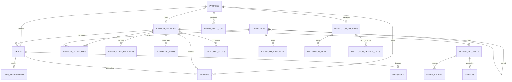

# Taqdimah : Complete Data Model

**Version:** 1.0  
**Database:** PostgreSQL 15+ (Supabase)  
**Parent:** [PRD-TECHNICAL.md](./PRD-TECHNICAL.md)

---

## 1. Entity Relationship (Full)



---

## 2. Core Tables (DDL)

### 2.1 profiles

```sql
CREATE TABLE profiles (
  id UUID PRIMARY KEY REFERENCES auth.users(id) ON DELETE CASCADE,
  full_name TEXT,
  phone TEXT UNIQUE,
  email TEXT,
  role TEXT NOT NULL DEFAULT 'user'
    CHECK (role IN ('user','vendor','moderator','admin')),
  locale TEXT DEFAULT 'bn' CHECK (locale IN ('bn','en')),
  avatar_url TEXT,
  is_suspended BOOLEAN DEFAULT FALSE,
  created_at TIMESTAMPTZ DEFAULT NOW(),
  updated_at TIMESTAMPTZ DEFAULT NOW()
);
```

### 2.2 categories + synonyms

```sql
CREATE TABLE categories (
  id UUID PRIMARY KEY DEFAULT gen_random_uuid(),
  parent_id UUID REFERENCES categories(id) ON DELETE SET NULL,
  slug TEXT UNIQUE NOT NULL,
  name_en TEXT NOT NULL,
  name_bn TEXT NOT NULL,
  description_en TEXT,
  description_bn TEXT,
  icon TEXT,
  level INT NOT NULL DEFAULT 1 CHECK (level BETWEEN 1 AND 3),
  is_active BOOLEAN DEFAULT TRUE,
  is_haram BOOLEAN DEFAULT FALSE,
  sort_order INT DEFAULT 0,
  created_at TIMESTAMPTZ DEFAULT NOW()
);

CREATE TABLE category_synonyms (
  id UUID PRIMARY KEY DEFAULT gen_random_uuid(),
  category_id UUID NOT NULL REFERENCES categories(id) ON DELETE CASCADE,
  synonym TEXT NOT NULL,
  language TEXT CHECK (language IN ('bn','en','both')),
  UNIQUE (category_id, synonym)
);
```

### 2.3 vendor_profiles (extended)

```sql
CREATE TABLE vendor_profiles (
  id UUID PRIMARY KEY DEFAULT gen_random_uuid(),
  user_id UUID NOT NULL REFERENCES profiles(id) ON DELETE CASCADE,
  slug TEXT UNIQUE NOT NULL,
  business_name TEXT NOT NULL,
  legal_name TEXT,
  description TEXT,
  tagline TEXT,
  logo_url TEXT,
  cover_url TEXT,
  phone TEXT NOT NULL,
  whatsapp TEXT,
  email TEXT,
  website TEXT,
  primary_category_id UUID REFERENCES categories(id),
  service_areas JSONB NOT NULL DEFAULT '[]',
  -- [{ "city": "dhaka", "areas": ["mirpur", "uttara"] }]
  address_text TEXT,
  geo_point GEOGRAPHY(POINT, 4326),
  verification_level INT DEFAULT 0 CHECK (verification_level BETWEEN 0 AND 4),
  verification_status TEXT DEFAULT 'draft'
    CHECK (verification_status IN ('draft','pending','verified','rejected','suspended','banned')),
  trust_score DECIMAL(4,2) DEFAULT 0 CHECK (trust_score BETWEEN 0 AND 5),
  profile_completeness INT DEFAULT 0 CHECK (profile_completeness BETWEEN 0 AND 100),
  plan TEXT DEFAULT 'free' CHECK (plan IN ('free','pro','business')),
  plan_expires_at TIMESTAMPTZ,
  is_featured BOOLEAN DEFAULT FALSE,
  featured_until TIMESTAMPTZ,
  halal_badge BOOLEAN DEFAULT FALSE,
  islamic_verified BOOLEAN DEFAULT FALSE,
  profile_views INT DEFAULT 0,
  lead_count INT DEFAULT 0,
  response_rate DECIMAL(5,2) DEFAULT 0,
  avg_rating DECIMAL(3,2) DEFAULT 0,
  review_count INT DEFAULT 0,
  last_active_at TIMESTAMPTZ,
  claimed_from_seed BOOLEAN DEFAULT FALSE,
  metadata JSONB DEFAULT '{}',
  created_at TIMESTAMPTZ DEFAULT NOW(),
  updated_at TIMESTAMPTZ DEFAULT NOW()
);

CREATE TABLE portfolio_items (
  id UUID PRIMARY KEY DEFAULT gen_random_uuid(),
  vendor_id UUID NOT NULL REFERENCES vendor_profiles(id) ON DELETE CASCADE,
  image_url TEXT NOT NULL,
  caption TEXT,
  sort_order INT DEFAULT 0,
  created_at TIMESTAMPTZ DEFAULT NOW()
);
```

### 2.4 institution_profiles

```sql
CREATE TABLE institution_profiles (
  id UUID PRIMARY KEY DEFAULT gen_random_uuid(),
  user_id UUID NOT NULL REFERENCES profiles(id),
  slug TEXT UNIQUE NOT NULL,
  name TEXT NOT NULL,
  institution_type TEXT NOT NULL
    CHECK (institution_type IN ('mosque','madrasa','ngo','waqf','charity')),
  description TEXT,
  address_text TEXT,
  city TEXT NOT NULL,
  phone TEXT,
  website TEXT,
  verification_status TEXT DEFAULT 'pending',
  logo_url TEXT,
  donation_url TEXT,
  created_at TIMESTAMPTZ DEFAULT NOW()
);

CREATE TABLE institution_vendor_links (
  institution_id UUID REFERENCES institution_profiles(id) ON DELETE CASCADE,
  vendor_id UUID REFERENCES vendor_profiles(id) ON DELETE CASCADE,
  link_type TEXT DEFAULT 'recommended',
  PRIMARY KEY (institution_id, vendor_id)
);
```

### 2.5 leads (extended)

```sql
CREATE TABLE leads (
  id UUID PRIMARY KEY DEFAULT gen_random_uuid(),
  user_id UUID NOT NULL REFERENCES profiles(id),
  vendor_id UUID REFERENCES vendor_profiles(id),
  category_id UUID REFERENCES categories(id),
  description TEXT NOT NULL,
  location_city TEXT NOT NULL,
  location_area TEXT,
  budget_min INT,
  budget_max INT,
  currency TEXT DEFAULT 'BDT',
  urgency TEXT CHECK (urgency IN ('low','medium','high','urgent')),
  contact_phone TEXT NOT NULL,
  contact_method TEXT DEFAULT 'whatsapp'
    CHECK (contact_method IN ('whatsapp','phone','in_app')),
  status TEXT DEFAULT 'sent'
    CHECK (status IN ('sent','viewed','responded','closed','expired','spam','disputed')),
  routing_strategy TEXT DEFAULT 'direct'
    CHECK (routing_strategy IN ('direct','top_n','broadcast','ai_bundle')),
  vendor_response TEXT,
  responded_at TIMESTAMPTZ,
  closed_at TIMESTAMPTZ,
  expires_at TIMESTAMPTZ,
  metadata JSONB DEFAULT '{}',
  created_at TIMESTAMPTZ DEFAULT NOW()
);

CREATE TABLE lead_assignments (
  id UUID PRIMARY KEY DEFAULT gen_random_uuid(),
  lead_id UUID NOT NULL REFERENCES leads(id) ON DELETE CASCADE,
  vendor_id UUID NOT NULL REFERENCES vendor_profiles(id),
  status TEXT DEFAULT 'pending',
  notified_at TIMESTAMPTZ,
  viewed_at TIMESTAMPTZ,
  UNIQUE (lead_id, vendor_id)
);
```

### 2.6 reviews

```sql
CREATE TABLE reviews (
  id UUID PRIMARY KEY DEFAULT gen_random_uuid(),
  lead_id UUID UNIQUE NOT NULL REFERENCES leads(id),
  user_id UUID NOT NULL REFERENCES profiles(id),
  vendor_id UUID NOT NULL REFERENCES vendor_profiles(id),
  rating INT NOT NULL CHECK (rating BETWEEN 1 AND 5),
  comment TEXT CHECK (char_length(comment) <= 2000),
  vendor_reply TEXT,
  vendor_reply_at TIMESTAMPTZ,
  is_visible BOOLEAN DEFAULT TRUE,
  is_flagged BOOLEAN DEFAULT FALSE,
  created_at TIMESTAMPTZ DEFAULT NOW()
);
```

### 2.7 verification

```sql
CREATE TABLE verification_requests (
  id UUID PRIMARY KEY DEFAULT gen_random_uuid(),
  vendor_id UUID NOT NULL REFERENCES vendor_profiles(id) ON DELETE CASCADE,
  level INT NOT NULL CHECK (level BETWEEN 2 AND 4),
  document_urls JSONB NOT NULL DEFAULT '[]',
  document_type TEXT,
  reviewer_notes TEXT,
  reviewed_by UUID REFERENCES profiles(id),
  status TEXT DEFAULT 'pending' CHECK (status IN ('pending','approved','rejected')),
  rejection_reason TEXT,
  created_at TIMESTAMPTZ DEFAULT NOW(),
  reviewed_at TIMESTAMPTZ
);
```

### 2.8 billing

```sql
CREATE TABLE billing_accounts (
  id UUID PRIMARY KEY DEFAULT gen_random_uuid(),
  vendor_id UUID UNIQUE NOT NULL REFERENCES vendor_profiles(id),
  plan TEXT DEFAULT 'free',
  leads_quota_monthly INT DEFAULT 10,
  leads_used_this_month INT DEFAULT 0,
  quota_reset_at TIMESTAMPTZ,
  balance_due DECIMAL(12,2) DEFAULT 0,
  currency TEXT DEFAULT 'BDT',
  created_at TIMESTAMPTZ DEFAULT NOW()
);

CREATE TABLE usage_ledger (
  id UUID PRIMARY KEY DEFAULT gen_random_uuid(),
  billing_account_id UUID REFERENCES billing_accounts(id),
  event_type TEXT NOT NULL,
  amount DECIMAL(12,2),
  lead_id UUID REFERENCES leads(id),
  created_at TIMESTAMPTZ DEFAULT NOW()
);

CREATE TABLE featured_slots (
  id UUID PRIMARY KEY DEFAULT gen_random_uuid(),
  vendor_id UUID NOT NULL REFERENCES vendor_profiles(id),
  category_id UUID NOT NULL REFERENCES categories(id),
  city TEXT NOT NULL,
  slot_type TEXT DEFAULT 'featured' CHECK (slot_type IN ('featured','sponsored')),
  position INT DEFAULT 1,
  starts_at TIMESTAMPTZ NOT NULL,
  ends_at TIMESTAMPTZ NOT NULL,
  amount_paid DECIMAL(12,2),
  created_at TIMESTAMPTZ DEFAULT NOW()
);
```

### 2.9 platform tables

```sql
CREATE TABLE search_logs (
  id UUID PRIMARY KEY DEFAULT gen_random_uuid(),
  query TEXT NOT NULL,
  parsed_intent JSONB,
  results_count INT,
  city TEXT,
  user_id UUID,
  session_id TEXT,
  latency_ms INT,
  created_at TIMESTAMPTZ DEFAULT NOW()
);

CREATE TABLE admin_audit_log (
  id UUID PRIMARY KEY DEFAULT gen_random_uuid(),
  admin_id UUID NOT NULL REFERENCES profiles(id),
  action TEXT NOT NULL,
  entity_type TEXT NOT NULL,
  entity_id UUID,
  payload JSONB,
  ip_address INET,
  created_at TIMESTAMPTZ DEFAULT NOW()
);

CREATE TABLE reports (
  id UUID PRIMARY KEY DEFAULT gen_random_uuid(),
  reporter_id UUID REFERENCES profiles(id),
  entity_type TEXT NOT NULL,
  entity_id UUID NOT NULL,
  reason TEXT NOT NULL,
  status TEXT DEFAULT 'open' CHECK (status IN ('open','reviewed','actioned','dismissed')),
  created_at TIMESTAMPTZ DEFAULT NOW()
);

CREATE TABLE cities (
  id UUID PRIMARY KEY DEFAULT gen_random_uuid(),
  slug TEXT UNIQUE NOT NULL,
  name_en TEXT NOT NULL,
  name_bn TEXT NOT NULL,
  country_code TEXT DEFAULT 'BD',
  areas JSONB DEFAULT '[]',
  is_active BOOLEAN DEFAULT TRUE
);
```

---

## 3. Row Level Security Policies

```sql
-- profiles: users read/update own
ALTER TABLE profiles ENABLE ROW LEVEL SECURITY;
CREATE POLICY profiles_select_own ON profiles FOR SELECT USING (auth.uid() = id);
CREATE POLICY profiles_update_own ON profiles FOR UPDATE USING (auth.uid() = id);

-- vendor_profiles: public read verified only; vendor update own
CREATE POLICY vendor_public_read ON vendor_profiles FOR SELECT
  USING (verification_status = 'verified' OR user_id = auth.uid());
CREATE POLICY vendor_update_own ON vendor_profiles FOR UPDATE
  USING (user_id = auth.uid());

-- leads: user sees own; vendor sees assigned
CREATE POLICY leads_user ON leads FOR SELECT USING (user_id = auth.uid());
CREATE POLICY leads_vendor ON leads FOR SELECT
  USING (vendor_id IN (SELECT id FROM vendor_profiles WHERE user_id = auth.uid()));

-- reviews: public read visible; user insert own
CREATE POLICY reviews_public ON reviews FOR SELECT USING (is_visible = true);
```

---

## 4. Indexes (Performance)

```sql
CREATE INDEX idx_vendor_slug ON vendor_profiles(slug);
CREATE INDEX idx_vendor_trust ON vendor_profiles(trust_score DESC) WHERE verification_status = 'verified';
CREATE INDEX idx_vendor_city_cat ON vendor_profiles(primary_category_id) WHERE verification_status = 'verified';
CREATE INDEX idx_leads_vendor_status ON leads(vendor_id, status, created_at DESC);
CREATE INDEX idx_leads_user ON leads(user_id, created_at DESC);
CREATE INDEX idx_reviews_vendor ON reviews(vendor_id) WHERE is_visible = true;
CREATE INDEX idx_search_logs_time ON search_logs(created_at DESC);
CREATE INDEX idx_featured_active ON featured_slots(city, category_id, starts_at, ends_at);
CREATE INDEX idx_synonym_lookup ON category_synonyms(synonym);
```

---

## 5. Aggregates & Views

```sql
CREATE VIEW vendor_rating_agg AS
SELECT
  vendor_id,
  AVG(rating)::DECIMAL(3,2) AS avg_rating,
  COUNT(*) AS review_count
FROM reviews
WHERE is_visible = TRUE
GROUP BY vendor_id;
```

---

## 6. Seed Data Requirements

| Table | Min rows at launch |
|-------|-------------------|
| categories | 50+ |
| category_synonyms | 200+ |
| cities | 3 cities, 30+ areas each |
| vendor_profiles (seed) | 100 manual verified |

---

## 7. Migration Strategy

```
supabase/migrations/
  001_extensions.sql        -- postgis, uuid
  002_core_tables.sql
  003_institution_tables.sql
  004_billing_tables.sql
  005_rls_policies.sql
  006_indexes.sql
  007_views.sql
  008_seed_categories.sql
  009_seed_cities.sql
```

**Rule:** Never destructive migration in production without backup + rollback script.

---

**Related:** [SPECIFICATIONS.md](./SPECIFICATIONS.md) · [API_REFERENCE.md](./API_REFERENCE.md)