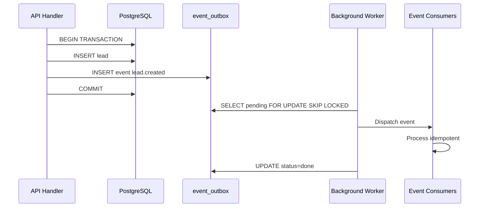
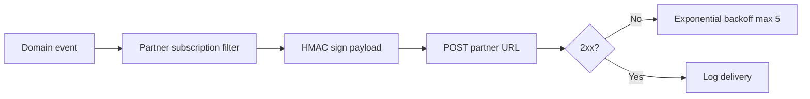

# Taqdimah : Event-Driven Architecture

**Version:** 1.0  
**Parent:** [PRD-TECHNICAL.md](./PRD-TECHNICAL.md) §19

---

## 1. Event Design Principles

1. **CloudEvents 1.0** format
2. **Past tense** names: `vendor.verified` not `verify.vendor`
3. **Idempotent consumers** : `event_id` dedup table
4. **Outbox pattern** : DB transaction + event insert atomic
5. **No PII in event bus** : reference IDs only

---

## 2. Event Envelope

```json
{
  "specversion": "1.0",
  "id": "550e8400-e29b-41d4-a716-446655440000",
  "source": "Taqdimah.marketplace",
  "type": "Taqdimah.lead.created",
  "time": "2026-07-03T12:00:00Z",
  "datacontenttype": "application/json",
  "data": {
    "lead_id": "uuid",
    "vendor_id": "uuid",
    "user_id": "uuid",
    "category_id": "uuid",
    "city": "dhaka"
  }
}
```

---

## 3. Event Catalog

### Identity domain

| Event | Trigger | Consumers |
|-------|---------|-----------|
| `user.registered` | New profile created | Analytics, welcome email |
| `user.role_changed` | Role update | Auth cache invalidate |

### Vendor domain

| Event | Trigger | Consumers |
|-------|---------|-----------|
| `vendor.profile_created` | Draft profile | Analytics |
| `vendor.profile_updated` | Profile save | Search index, completeness |
| `vendor.verification_submitted` | Docs uploaded | Admin queue notify |
| `vendor.verified` | Admin approve | Search index, email, analytics |
| `vendor.rejected` | Admin reject | Email |
| `vendor.suspended` | Moderation | Search remove, email |
| `vendor.plan_changed` | Subscription | Billing, feature flags |

### Marketplace domain

| Event | Trigger | Consumers |
|-------|---------|-----------|
| `lead.created` | POST /api/leads | Notify vendor, billing quota, analytics |
| `lead.viewed` | Vendor opens | Analytics |
| `lead.responded` | Vendor replies | Notify user, trust response_rate |
| `lead.closed` | User/vendor close | Review prompt scheduler |
| `lead.expired` | Cron 30d | Analytics |

### Reputation domain

| Event | Trigger | Consumers |
|-------|---------|-----------|
| `review.created` | POST /api/reviews | Trust score, search index |
| `review.flagged` | Report | Moderation queue |

### Billing domain

| Event | Trigger | Consumers |
|-------|---------|-----------|
| `billing.quota_exceeded` | Lead over free limit | Upsell email |
| `billing.payment_received` | Gateway webhook | Plan activate |
| `featured_slot.activated` | Admin schedule | Search featured cache |

### Search domain

| Event | Trigger | Consumers |
|-------|---------|-----------|
| `search.performed` | GET /api/search | search_logs (sync OK MVP) |
| `trust_score.updated` | Trust worker | Search index refresh |

---

## 4. Outbox Flow



---

## 5. Consumer Implementations

### NotificationConsumer

```typescript
async function handleLeadCreated(event: CloudEvent) {
  const { lead_id, vendor_id } = event.data;
  const vendor = await getVendor(vendor_id);
  const lead = await getLead(lead_id);
  await sendEmail('lead_new', vendor.email, { lead });
  await sendSms(vendor.phone, `New Taqdimah lead: ${lead.description.slice(0, 50)}...`);
}
```

### TrustScoreConsumer

```typescript
async function handleReviewCreated(event: CloudEvent) {
  await trustService.computeTrustScore(event.data.vendor_id);
  await refreshSearchIndex(event.data.vendor_id);
}
```

### BillingConsumer

```typescript
async function handleLeadCreated(event: CloudEvent) {
  const quota = await billingService.decrementQuota(event.data.vendor_id);
  if (!quota.allowed) throw new QuotaExceededError(); // should pre-check in API
}
```

---

## 6. Scheduler Jobs (Cron)

| Job | Schedule | Action |
|-----|----------|--------|
| `expire_leads` | Daily 02:00 UTC | Close leads > 30d inactive |
| `review_prompts` | Daily 10:00 UTC | Email users 7d post-close |
| `quota_reset` | Monthly 1st | Reset leads_used_this_month |
| `refresh_search_index` | Hourly | CONCURRENTLY refresh materialized view |
| `featured_slot_sync` | Every 15 min | Activate/expired slots |

**Phase 1:** Vercel cron or Supabase pg_cron  
**Phase 2:** Inngest / Trigger.dev

---

## 7. Webhook Delivery (Partner API P3)



**Retry:** 1m, 5m, 30m, 2h, 24h

---

## 8. Event Store (Optional P3)

For audit and replay:
- `event_store` append-only table
- Retention 90 days hot, archive S3 cold

---

**Related:** [TECHNICAL_DESIGN.md](./TECHNICAL_DESIGN.md) · [DATA_MODEL.md](./DATA_MODEL.md)