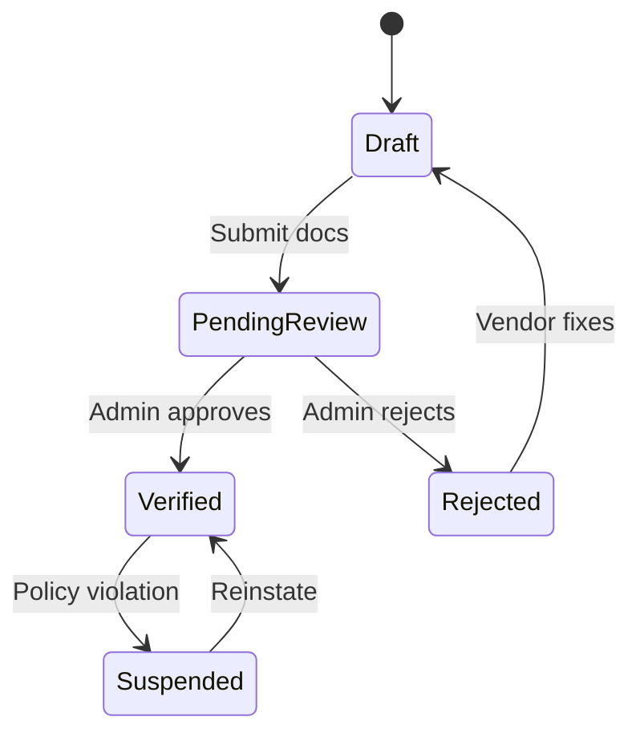

# Taqdimah : Features & Acceptance Criteria

**Version:** 1.0  
**Companion to:** [PRD.md](./PRD.md) · [SPECIFICATIONS.md](./SPECIFICATIONS.md)

---

## Feature Map Overview

```mermaid
flowchart TB
    subgraph ConsumerApp["Consumer Experience"]
        Search[Search & Discovery]
        Profile[Profiles + Institution Pages]
        Lead[Leads & Connections]
        Review[Reviews & Trust]
        Dawah[Dawah & Knowledge]
    end

    subgraph VendorApp["Participant Experience"]
        Onboard[Onboarding & Verification]
        Dashboard[Dashboard]
        Leads[Leads & Needs]
        Premium[Sustainability Tools]
    end

    subgraph Platform["Platform Core"]
        Identity[Identity & Auth]
        TrustEngine[Trust Engine (L0-L4)]
        Notify[Notifications]
        Admin[Admin + Scholar Review]
    end

    subgraph Islah["Dawah & Islah Layer (Gift to Khalifah)"]
        Masjid[Masjid/Madrasa Tools]
        Scholar[Scholar & Da'ee Directory]
        Content[Knowledge & Content Hub]
        Revert[Revert Support]
        Campaign[Community Campaigns]
    end

    subgraph Future["Phase 2+"]
        AI[AI for Intent + Growth Paths]
        Pay[Light Payments/Escrow]
        Msg[Messaging]
    end

    Search --> TrustEngine
    Lead --> Leads
    Onboard --> TrustEngine
    Dawah --> Content
    Masjid --> Islah
```

---

## P0 Features (MVP)

### F-001 : Natural Language Search

**Description:** Users type what they need in plain Bengali or English. System maps intent to category, keywords, and optional location.

**User stories:**
- As a user, I want to search "I need AC repair in Mirpur" and see relevant vendors.
- As a user, I want suggestions as I type.

**Acceptance criteria:**
- [ ] Search input accepts Bengali and English
- [ ] Query parsed into: `category_id`, `keywords[]`, `location` (if detected)
- [ ] Results return in < 2 seconds (p95)
- [ ] Empty state suggests popular categories
- [ ] Search logged for analytics (query, results count, click)

**Priority:** P0  
**Dependencies:** Category taxonomy, vendor index

---

### F-002 : Location Filter

**Description:** Filter and rank results by city, area, and optional GPS proximity.

**Acceptance criteria:**
- [ ] City selector: Dhaka, Chattogram, Sylhet (+ expand later)
- [ ] Area / thana optional filter
- [ ] Vendors have `service_areas[]` in profile
- [ ] Results prioritize vendors covering user's area
- [ ] URL reflects location for SEO (`/dhaka/architects`)

---

### F-003 : Category Taxonomy

**Description:** Hierarchical categories for all supply types including Islamic ecosystem.

**Structure - Only what is good and beneficial for the Ummah:**
```
Level 1: Essential Services for Dignified Muslim Life
  Level 2: Home Maintenance & Repair (electricians, plumbers, basic builders)
  Level 2: Halal Food Producers & Ethical Caterers
  Level 2: Modest Clothing & Necessary Islamic Goods Makers

Level 1: Knowledge, Dawah & Tarbiyah (Core Priority)
  Level 2: Quran Teachers, Hifz & Tajweed
  Level 2: Scholars, Da'ees & Imams (L4 verified)
  Level 2: Islamic Studies, Fiqh, Aqeedah, Arabic
  Level 2: Family Tarbiyah & Sunnah Marriage Counsel
  Level 2: Revert & New Muslim Support
  Level 2: Dawah Methodology & Verified Content

Level 1: Community Infrastructure & Institutions
  Level 2: Mosques & Prayer Facilities
  Level 2: Madaris & Islamic Schools
  Level 2: Waqf, Charities & Beneficial NGOs

Level 1: Beneficial Professions
  Level 2: Ethical Healthcare Providers
  Level 2: Halal Business Support (Shariah-vetted accountants, advisors)
  Level 2: Skilled Trades for Community Good (masjid builders, etc.)
```

**Acceptance criteria:**
- [ ] Admin can CRUD categories
- [ ] Vendor selects 1 primary + up to 5 secondary categories
- [ ] Category pages are SEO-indexable
- [ ] Minimum 50 seed categories at launch

---

### F-004 : Vendor Profile (Public)

**Description:** Public page for each verified business or professional.

**Fields:**
| Field | Required | Notes |
|-------|----------|-------|
| Business name | Yes | |
| Logo | Yes | Min 200x200 |
| Cover image | No | |
| Description | Yes | 50–2000 chars |
| Categories | Yes | Primary + secondary |
| Service areas | Yes | Cities / areas |
| Phone | Yes | Hidden until lead |
| WhatsApp | Optional | |
| Website | Optional | |
| Portfolio images | Optional | Up to 10 |
| Hours / availability | Optional | |
| Halal badge | Optional | Admin-approved |
| Verified badge | Auto | After verification |

**Acceptance criteria:**
- [ ] Profile URL: `/v/{slug}`
- [ ] Mobile-responsive layout
- [ ] Shareable OG meta tags
- [ ] "Request quote" CTA visible
- [ ] Report listing button

---

### F-005 : Verification Workflow

**Description:** Trust layer ensuring real businesses and professionals.

**Flow:**


**Verification levels:**
| Level | Requirements | Badge |
|-------|--------------|-------|
| L1 Phone | OTP verified | Basic |
| L2 Identity | NID or owner ID | Identity Verified |
| L3 Business | Trade license / registration | Business Verified |
| L4 Islamic | Scholar credentials / halal cert | Islamic Verified |

**Acceptance criteria:**
- [ ] Document upload to secure storage
- [ ] Admin review queue with SLA target 48h
- [ ] Email/SMS on approve/reject
- [ ] Unverified profiles not shown in search

---

### F-006 : Trust Score v1

**Description:** Ranking signal combining verification, reviews, and responsiveness.

**Formula (v1):**
```
trust_score = (
  verification_weight * verification_level_score +
  review_weight * normalized_avg_rating +
  response_weight * response_rate +
  freshness_weight * profile_completeness
) / total_weights
```

**Default weights:** verification 35%, reviews 35%, response 20%, completeness 10%

**Acceptance criteria:**
- [ ] Score recalculated on review, verification, lead response
- [ ] Search results sorted by trust_score desc (with sponsored override rules)
- [ ] Score breakdown visible to admin, summary visible to users

---

### F-007 : Lead Request

**Description:** User submits a structured request; matched vendors receive it.

**Lead form fields:**
| Field | Required |
|-------|----------|
| Description | Yes |
| Category | Auto or manual |
| Location | Yes |
| Budget range | Optional |
| Urgency | Optional |
| Contact phone | Yes |
| Contact method | WhatsApp / Call / In-app |

**Acceptance criteria:**
- [ ] Lead created from profile CTA or search results
- [ ] Routed to vendor(s): profile owner OR top 3 in category+location
- [ ] Vendor notified via email + SMS/WhatsApp (P1)
- [ ] User sees lead status: sent / viewed / responded
- [ ] Spam rate limit: 5 leads/day per user

---

### F-008 : Vendor Dashboard

**Description:** Vendor hub for profile, leads, and basic stats.

**Sections:**
1. Overview (leads this week, profile views, trust score)
2. Edit profile
3. Lead inbox (new, responded, closed)
4. Reviews
5. Upgrade (premium CTA)
6. Settings (notifications, password)

**Acceptance criteria:**
- [ ] Auth required (vendor role)
- [ ] Respond to lead marks status + starts response timer
- [ ] Profile completeness meter with tips
- [ ] Mobile-friendly dashboard

---

### F-009 : Reviews & Ratings

**Description:** Post-engagement feedback to build reputation.

**Rules:**
- Only users with a completed lead can review
- 1–5 stars + optional text (10–500 chars)
- Vendor can reply once
- Admin can hide abusive reviews

**Acceptance criteria:**
- [ ] Review prompts 7 days after lead marked closed
- [ ] Average rating displayed on profile
- [ ] Distribution histogram (5★ to 1★)

---

### F-010 : Admin Panel

**Description:** Internal ops for moderation, verification, and featured management.

**Modules:**
- Vendor approval queue
- Reported listings
- Category management
- Featured slot scheduler
- User search / suspend
- Analytics snapshot

**Acceptance criteria:**
- [ ] Role-based access (admin, moderator)
- [ ] Audit log for approve/reject/suspend actions
- [ ] Bulk import CSV for seed vendors

---

### F-011 : Bilingual UI

**Acceptance criteria:**
- [ ] Bengali (bn) and English (en) toggle
- [ ] Category names translated
- [ ] SEO pages in both languages where applicable
- [ ] Default: browser locale → bn for BD

---

### F-012 : SEO Landing Pages

**URL patterns:**
- `/` : Home
- `/dhaka` : City hub
- `/dhaka/architects` : City + category
- `/categories/{slug}` : National category
- `/v/{vendor-slug}` : Vendor profile

**Acceptance criteria:**
- [ ] SSR/SSG for landing pages
- [ ] JSON-LD LocalBusiness schema on vendor pages
- [ ] Sitemap.xml auto-generated

---

## P1 Features

### F-020 : In-App Messaging

- Thread per lead between user and vendor
- Read receipts optional
- No file sharing in v1 (links only)

### F-021 : Support Tools for Beneficial Providers (Optional)

Active providers of clearly beneficial services (especially those doing community or dawah work) may choose to support the workers maintaining Taqdimah through modest, transparent contributions.

In return they may receive better tools (more connections, simple analytics). This is never required. Free access remains full and excellent.

**Important:** We only offer this to providers who are verifiably contributing good to the Ummah. No paid boosting that puts commercial interests above benefit.

### F-022 : Visibility for High-Benefit Providers

- Limited, clearly labeled ways for the most active beneficial providers (e.g. masjids posting needs, active Quran teachers) to gain visibility.
- Always secondary to trust score and verification level.
- Never allows money to override what is genuinely best for the person seeking help.

Any such mechanism must itself be good for the Ummah - it helps sustain the people who keep the gift alive so everyone benefits.

### F-024 : Institution Profiles

- Mosques, madaris, NGOs
- Events, donation links (external Phase 1)
- Linked recommended vendors (electrician, caterer)

### F-025 : Islamic Badges

- Halal Certified (restaurant / caterer)
- Scholar Verified (teachers, counselors)
- Waqf Registered (institutions)

### F-026 : WhatsApp Lead Alerts

- Vendor opt-in
- Template message with lead summary + dashboard link

---

## Dawah, Education & Islah Features (Core to the Gift - Only Beneficial Things)

These features directly support the mission of Taqdimah as a gift to the Khalifah for the betterment of the Ummah. 

**Strict rule:** We only build and include features and content that are clearly good for the Ummah - that increase iman, knowledge, family strength, community bonds, or dignified living in a halal way. Nothing else is put out.

### F-D01 : Verified Scholar & Da'ee Directory

**Description:** Dedicated, high-trust directory for scholars, da'ees, imams, and qualified Islamic teachers. Stronger verification than general vendors.

**Key elements:**
- Ijazah / sanad / institutional credential upload (L4 mandatory for "Scholar Verified")
- Areas of expertise (aqeedah, fiqh, family, dawah methodology, etc.)
- Languages and preferred formats (in-person, online, group)
- Public or moderated "Ask" capability

**Acceptance criteria:**
- [ ] Separate high-trust profile type
- [ ] Credential review by admin or partner scholar panel
- [ ] Clear "Not a fatwa service unless explicitly stated" disclaimers
- [ ] Searchable by topic + location + language

### F-D02 : Masjid & Madrasa Rich Profiles + Needs Board

**Description:** Mosques and madaris get powerful community-facing pages.

**Features:**
- Prayer times (linked or manual)
- Upcoming programs, khutbah topics, classes
- "Current Needs" board (e.g. "seeking Quran teacher", "need electrician for wudu area", "sponsor iftar")
- Verified volunteer / service matching from the platform

**Acceptance criteria:**
- [ ] Institution can post and manage needs
- [ ] Needs appear in relevant searches and alerts to nearby verified providers
- [ ] Public calendar/events view

### F-D03 : Ask a Verified Scholar (Q&A / Consultation Routing)

**Description:** Users can submit questions. Routed to verified scholars with topic expertise. Answers can be public (with permission) or private.

**Phases:**
- P1: Simple lead-style submission → scholar inbox
- P2: Public knowledge base of answered questions (searchable, categorized)
- P3: Group webinars or live sessions surfaced

**Acceptance criteria:**
- [ ] Topic tagging + scholar matching
- [ ] Clear privacy controls and disclaimers (not substitute for local mufti in serious matters)
- [ ] Moderation for quality and adab

### F-D04 : Quran, Hifz & Islamic Education Matching

**Description:** Enhanced matching for Quran teachers, hifz programs, tajweed, Arabic, and structured Islamic classes for children and adults.

**Extras:**
- Group class discovery
- Parent reviews focused on adab + progress
- Madrasa affiliation badges

### F-D05 : Dawah & Beneficial Knowledge Content Hub

**Description:** A curated, searchable library of short-form and long-form content contributed or vetted by verified scholars and da'ees.

**Categories examples:**
- Aqeedah & Tawhid
- Worship & Fiqh
- Family & Marriage (Sunnah way)
- Dawah methodology & character
- Youth guidance (avoiding haram, social media, etc.)
- Revert stories & support

Content types: articles, audio clips, short videos, infographics. Always attributed to verified sources.

**Acceptance criteria:**
- [ ] Verified contributors only (or strong review)
- [ ] Search + topic tags + "recommended for" (new Muslim, parent, youth)
- [ ] Shareable cards for social dawah use

### F-D06 : Revert & New Muslim Welcome Network

**Description:** Special support layer for people entering or returning to Islam.

**Capabilities:**
- Matched local mentor (verified, trained)
- Curated starter resource packs (prayer, Quran basics, community)
- Local masjid introduction requests
- Private support channel option
- Celebration of milestones (with consent)

### F-D07 : Family & Societal Reform Tools

**Description:** Features aimed at strengthening Muslim families and countering social ills.

**Ideas:**
- Pre-marital and marital counseling directory (scholar + counselor verified)
- "Sunnah Family" resources and workshops
- Parent Islamic education matching for children
- Community campaigns against specific harms (interest, zina, substance, neglect of salah) run by verified institutions

### F-D08 : Local Community Campaigns & Coordination

**Description:** Verified organizations and masjids can launch time-bound campaigns (Ramadan preparation, back-to-masjid, youth hifz drive, neighborhood cleanup + dawah).

**Platform support:**
- Campaign page with needs + volunteer signup
- Matching of skills/services to campaign needs
- Progress and impact reporting

### F-D09 : "Open to the Ummah" Needs from Masjids & Institutions

**Description:** Reverse of user leads: Institutions post public or semi-public needs that any verified participant can respond to.

Examples:
- "Our masjid needs 5 volunteers for iftar distribution Friday"
- "Seeking female Quran teacher for sisters' class"
- "Waqf project needs halal caterer for 300"

### F-D10 : Personalized Islamic Growth Paths (Phase 2+)

**Description:** Using verified content + scholar guidance, suggest step-by-step learning or practice paths (e.g., "Build consistent fajr salah", "Learn basic fiqh of worship", "How to give dawah to family").

Can integrate with AI intent later.

---

## P2 Features (AI & Transactions)

### F-030 : AI Intent Engine

**Example:**
> User: "I'm moving next week to Dhaka."

**AI output bundle:**
1. Moving company
2. Electrician (new flat)
3. Cleaning service
4. Interior designer (optional)

**Acceptance criteria:**
- [ ] Multi-vendor bundle suggestion
- [ ] User can request all with one flow
- [ ] Clear AI disclosure

### F-031 : Booking & Scheduling

- Vendor availability calendar
- Confirmed time slot
- Reminder notifications

### F-032 : Payments & Escrow

- SSLCommerz (Bangladesh)
- Platform fee disclosed upfront
- Escrow release on job completion
- Islamic finance partner referrals (no riba products on-platform)

### F-033 : Partner APIs

- `POST /api/v1/leads` for partners
- `GET /api/v1/vendors` search
- API keys + rate limits

### F-034 : Waqf & Charity Module

- Campaign pages for NGOs
- Optional platform tip (transparent)
- Donation receipts

### F-035 : Native Mobile Apps

- React Native or Flutter
- Push notifications for leads

---

## Non-Functional Requirements

| Requirement | Target |
|-------------|--------|
| Uptime | 99.5% MVP |
| Search latency p95 | < 2s |
| Mobile traffic share | Design mobile-first (70%+) |
| Accessibility | WCAG 2.1 AA (progressive) |
| Data residency | AP-South preferred |
| Moderation SLA | 48h verification review |

---

## Out of Scope (MVP)

- Full super-app logistics (ride-hailing, food delivery ops)
- Social feed / reels
- Cryptocurrency payments
- Unverified anonymous listings in search results
- Vendor storefront checkout (Phase 2)

---

**Next:** [SPECIFICATIONS.md](./SPECIFICATIONS.md) · [BUSINESS_PLAN.md](./BUSINESS_PLAN.md)