# Taqdimah : Master Guideline Map (Mermaid)

> **How to read this:** Start at `START` in Diagram 1. Follow arrows. Cross-reference [SETUP_AND_TOOLS.md](./SETUP_AND_TOOLS.md) and [founders-kit README](../../README.md) at each `FK` node.

---

## Diagram 1 : Complete Journey (Idea → Global Platform)

```mermaid
flowchart TD
    START((START<br/>You + founders-kit repo))

    subgraph PHASE0["PHASE 0 : FOUNDATION (Week 1–2)"]
        direction TB
        P0A[Clone founders-kit repo]
        P0B[Read Taqdimah/README.md]
        P0C[Read founders-kit/README.md<br/>Bookmark tool directory]
        P0D[Read PRD.md + PRD-TECHNICAL.md]
        P0E[Read BUSINESS_PLAN.md]
        P0F[Read SETUP_AND_TOOLS.md]
        P0G[Read GUIDELINE_MAP.md<br/>this file]
        P0H[Create accounts:<br/>GitHub, Supabase, Vercel,<br/>OpenAI, PostHog, Sentry, Figma]
        P0I[Set $200/mo budget cap<br/>on OpenAI + tools]
        P0J[Setup Notion workspace<br/>vendor pipeline + content calendar]
        P0A --> P0B --> P0C --> P0D --> P0E --> P0F --> P0G --> P0H --> P0I --> P0J
    end

    START --> P0A

    subgraph PHASE1["PHASE 1 : BUILD MVP (Month 1–3)"]
        direction TB
        P1A[ALD-001: Next.js scaffold<br/>Tool: Cursor]
        P1B[ALD-002: Supabase schema<br/>Tool: Supabase CLI]
        P1C[ALD-003: Seed 50 categories<br/>BN + EN + Islamic branch]
        P1D[ALD-004: Phone OTP Auth<br/>Tool: Supabase Auth]
        P1E[ALD-005: Search API + UI<br/>Tool: OpenAI mini + PostgreSQL FTS]
        P1F[ALD-006: Vendor public profile<br/>Tool: v0.dev + Figma]
        P1G[ALD-007: Lead request flow<br/>Tool: Resend email]
        P1H[ALD-008: Vendor dashboard]
        P1I[ALD-009: Verification workflow<br/>L2 identity + L3 business]
        P1J[ALD-010: Reviews + trust score]
        P1K[ALD-011: Admin panel]
        P1L[ALD-012: SEO city+category pages<br/>Dhaka, Ctg, Sylhet]
        P1M[Deploy production<br/>Tool: Vercel]
        P1N[PostHog + Clarity live]
        P1A --> P1B --> P1C --> P1D --> P1E --> P1F --> P1G --> P1H
        P1H --> P1I --> P1J --> P1K --> P1L --> P1M --> P1N
    end

    P0J --> P1A

    subgraph PHASE2["PHASE 2 : SEED SUPPLY (Month 1–4 parallel)"]
        direction TB
        P2A[Google Maps: find vendors<br/>10 categories × 10 each]
        P2B[Airtable pipeline:<br/>found → contacted → verified]
        P2C[WhatsApp outreach:<br/>free verified profile pitch]
        P2D[Loom video: how to claim profile]
        P2E[Mosque QR flyers<br/>Tool: Canva]
        P2F[Admin CSV bulk import<br/>100 seed vendors]
        P2G[Manual verification<br/>48h SLA]
        P2H[Target: 100 vendors Month 2<br/>500 vendors Month 6]
        P2A --> P2B --> P2C --> P2D --> P2E --> P2F --> P2G --> P2H
    end

    P1D --> P2A
    P2H --> P1N

    subgraph PHASE3["PHASE 3 : SEED DEMAND (Month 3–5)"]
        direction TB
        P3A[Ecosystem marketing<br/>NOT download Taqdimah posts]
        P3B[Facebook groups:<br/>real demand stories]
        P3C[Buffer schedule posts<br/>3–5 per week]
        P3D[SEO pages ranking<br/>Google Search Console]
        P3E[Startup Bangladesh Discord<br/>beta users]
        P3F[Typeform user surveys<br/>what categories missing]
        P3G[Target: 5K MAU Month 6]
        P3A --> P3B --> P3C --> P3D --> P3E --> P3F --> P3G
    end

    P1L --> P3A
    P2H --> P3A

    subgraph PHASE4["PHASE 4 : AUTOMATE (Month 3–5)"]
        direction TB
        P4A[Setup n8n self-hosted]
        P4B[Workflow: lead → WhatsApp vendor]
        P4C[Workflow: lead → email user]
        P4D[Workflow: verification → Telegram you]
        P4E[Workflow: nightly vendor digest]
        P4F[Trigger.dev: trust score worker]
        P4G[Trigger.dev: search index refresh]
        P4H[UptimeRobot monitoring]
        P4A --> P4B --> P4C --> P4D --> P4E --> P4F --> P4G --> P4H
    end

    P1N --> P4A

    subgraph PHASE5["PHASE 5 : MONETIZE (Month 5–6)"]
        direction TB
        P5A[Launch Pro plan 999 BDT/mo<br/>Tool: SSLCommerz]
        P5B[Launch Business plan 2499 BDT/mo]
        P5C[Featured listings slots<br/>max 3 per category+city]
        P5D[Pay-per-lead overage fees]
        P5E[Target: 25 Pro + 10 Business<br/>$3K MRR]
        P5F[Apply iDEA grant BDT 10L<br/>Tool: idea.gov.bd]
        P5A --> P5B --> P5C --> P5D --> P5E --> P5F
    end

    P3G --> P5A
    P4H --> P5A

    subgraph PHASE6["PHASE 6 : GROW (Month 6–12)"]
        direction TB
        P6A[In-app messaging P2]
        P6B[AI intent bundles<br/>moving, wedding, ramadan]
        P6C[SSLCommerz escrow payments]
        P6D[Institution profiles<br/>mosques, NGOs]
        P6E[Expand Chattogram + Sylhet<br/>full category coverage]
        P6F[Product Hunt launch]
        P6G[Apply Startup Bangladesh seed]
        P6H[Target: 1000 vendors, 1K MRR]
        P6A --> P6B --> P6C --> P6D --> P6E --> P6F --> P6G --> P6H
    end

    P5E --> P6A

    subgraph PHASE7["PHASE 7 : GLOBAL (Year 2+)"]
        direction TB
        P7A[Malaysia + Indonesia pilot]
        P7B[Arabic + Malay UI]
        P7C[Islamic finance referrals<br/>Shariah board review]
        P7D[Waqf + charity module]
        P7E[Partner API marketplace]
        P7F[Stripe global payments]
        P7G[Target: 5 countries, 100K listings]
        P7A --> P7B --> P7C --> P7D --> P7E --> P7F --> P7G
    end

    P6H --> P7A

    P7G --> END((END STATE<br/>Open Taqdimah =<br/>Muslim economy gateway))

    FK0[founders-kit/README.md<br/>Tools at every phase] -.-> P0C
    FK0 -.-> P2C
    FK0 -.-> P3B
    FK0 -.-> P5F
```

---

## Diagram 2 : One-Man Army Daily Map (12 Hours)

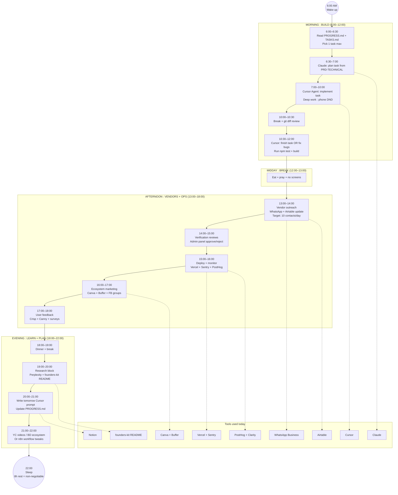

---

## Diagram 3 : Technical Build Map (Engineering Path)

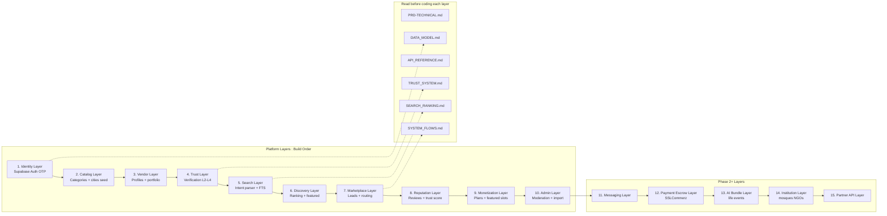

---

## Diagram 4 : User & Vendor Flywheel Map

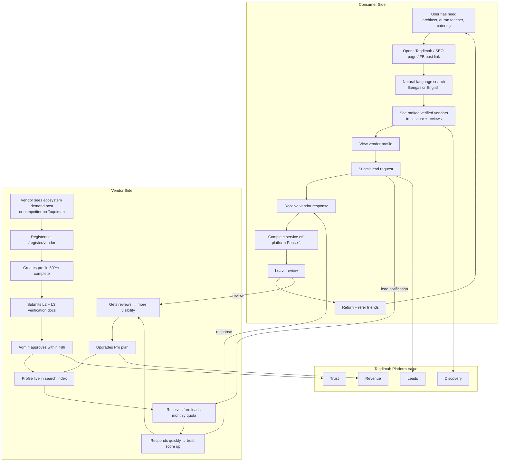

---

## Diagram 5 : Ecosystem Marketing Map (Chicken & Egg Solver)

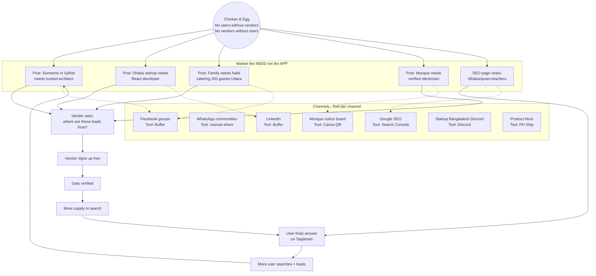

---

## Diagram 6 : Revenue & Ummah Monetization Map

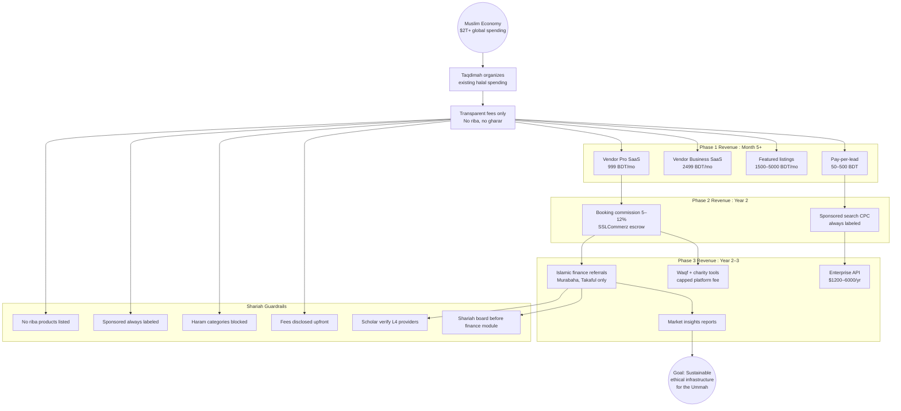

---

## Diagram 7 : Tool Selection Decision Map

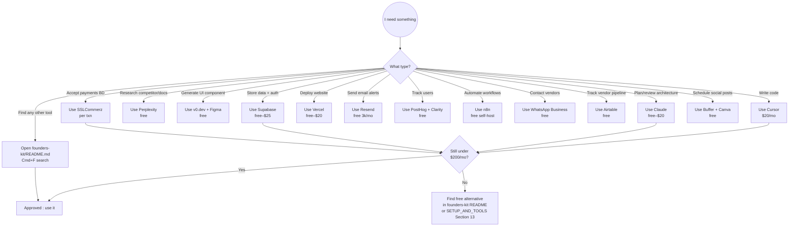

---

## Diagram 8 : Agentic AI Development Map (Cursor Workflow)

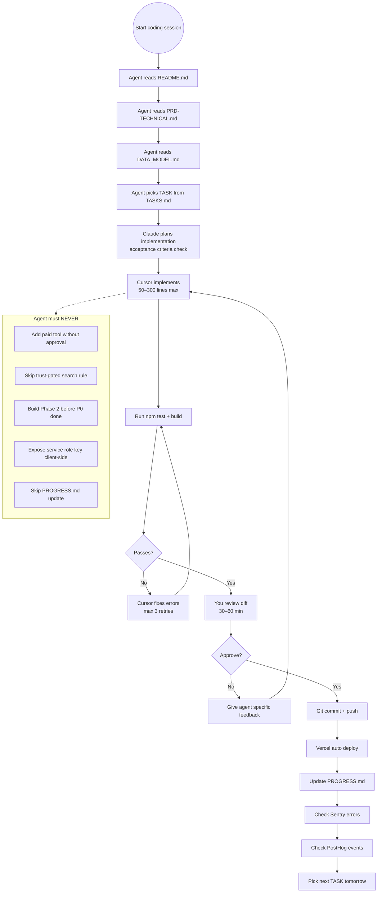

---

## Diagram 9 : Bangladesh Funding Path Map

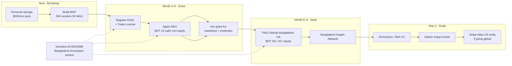

---

## Diagram 10 : Document Navigation Map (What to Read When)

```mermaid
flowchart TD
    Q((What do I need?))

    Q -->|Understand vision| A1[PRD.md]
    Q -->|Engineering spec| A2[PRD-TECHNICAL.md]
    Q -->|Setup + tools| A3[SETUP_AND_TOOLS.md]
    Q -->|This guideline map| A4[GUIDELINE_MAP.md]
    Q -->|Database schema| A5[DATA_MODEL.md]
    Q -->|API endpoints| A6[API_REFERENCE.md]
    Q -->|Feature acceptance| A7[FEATURES.md]
    Q -->|System flows| A8[SYSTEM_FLOWS.md]
    Q -->|Search algorithm| A9[SEARCH_RANKING.md]
    Q -->|Trust + verification| A10[TRUST_SYSTEM.md]
    Q -->|Revenue + GTM| A11[BUSINESS_PLAN.md]
    Q -->|Revenue diagrams all 17| A21[REVENUE_MODEL_MAP.md]
    Q -->|AI bundles Phase 2| A12[AI_ENGINE.md]
    Q -->|Payments Phase 2| A13[PAYMENTS_ESCROW.md]
    Q -->|What to code next| A14[TASKS.md]
    Q -->|Build status| A15[PROGRESS.md]
    Q -->|Find external tool| A16[founders-kit/README.md]
    Q -->|Architecture overview| A17[ARCHITECTURE.md]
    Q -->|Service design| A18[TECHNICAL_DESIGN.md]
    Q -->|Why we chose X| A19[DECISIONS.md]
    Q -->|Events async| A20[EVENTS.md]

    A3 --> A16
    A14 --> A2
    A14 --> A5
```

---

## Diagram 11 : Master Map (Single Page Overview)

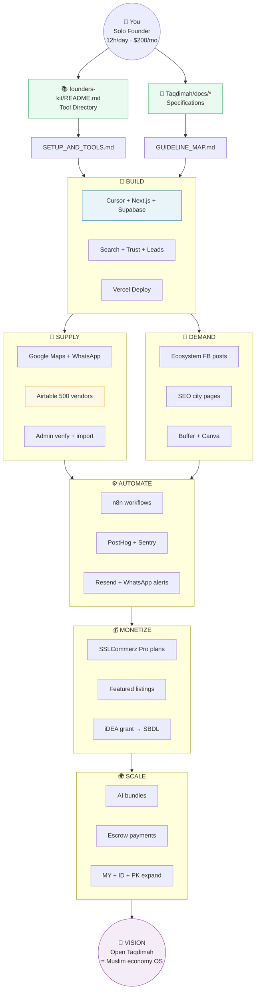

---

## How to Use This Map

| If you are… | Start at diagram |
|-------------|------------------|
| New : just starting | Diagram 1 (full journey) |
| Planning today | Diagram 2 (daily 12h) |
| Coding | Diagram 3 + Diagram 8 |
| Getting vendors | Diagram 4 + Diagram 5 |
| Planning revenue | Diagram 6 |
| Choosing a tool | Diagram 7 |
| Fundraising in BD | Diagram 9 |
| Lost in docs | Diagram 10 |
| Need one-page overview | Diagram 11 |

---

**Related:** [SETUP_AND_TOOLS.md](./SETUP_AND_TOOLS.md) · [README.md](../README.md) · [founders-kit README](../../README.md)