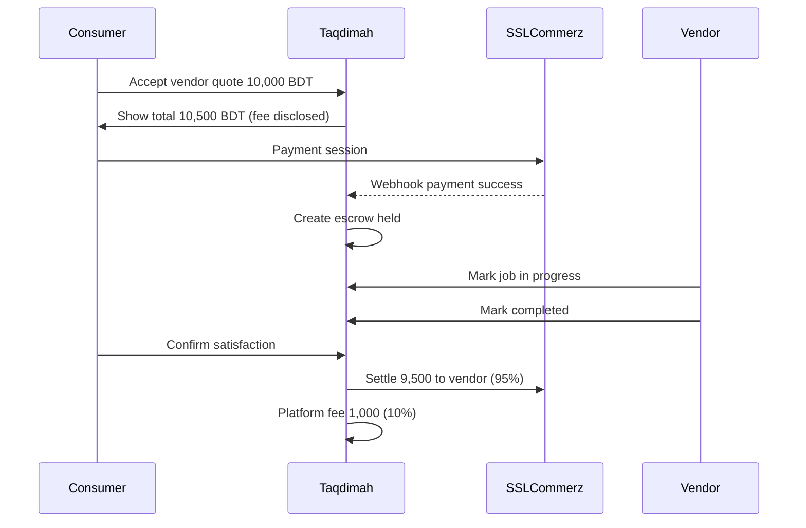
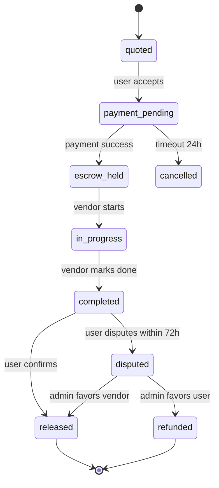
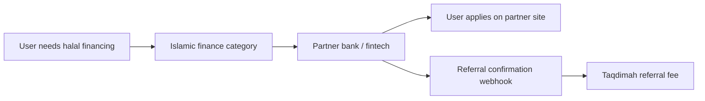

# Taqdimah : Payments & Escrow (Phase 2 Design)

**Version:** 1.0  
**Phase:** P2 : implement after MVP lead loop proven  
**Parent:** [BUSINESS_PLAN.md](./BUSINESS_PLAN.md) · [PRD-TECHNICAL.md](./PRD-TECHNICAL.md) §16

---

## 1. Objectives

1. Enable **in-platform booking payment** with transparent fees
2. **Escrow** protects consumers and vendors
3. **Halal-aligned** : no interest; ju'ālah (commission) disclosed upfront
4. Bangladesh first: **SSLCommerz**; global: **Stripe**

---

## 2. Payment Flow



---

## 3. State Machine



---

## 4. Fee Structure

| Category | Platform fee | Rationale |
|----------|--------------|-----------|
| Home services | 8% | Standard marketplace |
| Professional | 10% | Higher ticket |
| Islamic education | 5% | Community incentive |
| Catering / events | 10% | Coordination heavy |

**Display rule:** Fee shown before payment confirmation. Never hidden.

---

## 5. Data Model

```sql
CREATE TABLE payment_transactions (
  id UUID PRIMARY KEY DEFAULT gen_random_uuid(),
  lead_id UUID REFERENCES leads(id),
  user_id UUID REFERENCES profiles(id),
  vendor_id UUID REFERENCES vendor_profiles(id),
  amount DECIMAL(12,2) NOT NULL,
  platform_fee DECIMAL(12,2) NOT NULL,
  vendor_payout DECIMAL(12,2) NOT NULL,
  currency TEXT DEFAULT 'BDT',
  status TEXT CHECK (status IN (
    'pending','escrow_held','released','refunded','disputed','failed'
  )),
  gateway TEXT DEFAULT 'sslcommerz',
  gateway_tran_id TEXT UNIQUE,
  created_at TIMESTAMPTZ DEFAULT NOW(),
  released_at TIMESTAMPTZ
);
```

---

## 6. Islamic Finance Integration (Referral : not lending)

Taqdimah does **not** hold loans. Referral flow:



**Shariah board approval required** before any partner listed.

---

## 7. Waqf & Donation (Phase 3)

- Donations flow to NGO payment account directly
- Optional platform tip: user-visible, max 5%
- Full receipt from NGO, not Taqdimah

---

## 8. Compliance

- PCI: delegated to SSLCommerz/Stripe
- KYC: vendor bank account verification before payout
- Tax: VAT invoice generation Bangladesh NBR rules
- Refund policy: published, 72h dispute window

---

**Related:** [BUSINESS_PLAN.md](./BUSINESS_PLAN.md) · [EVENTS.md](./EVENTS.md)