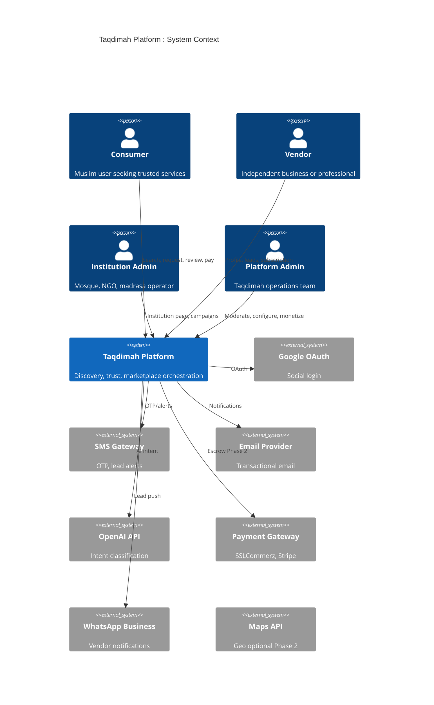
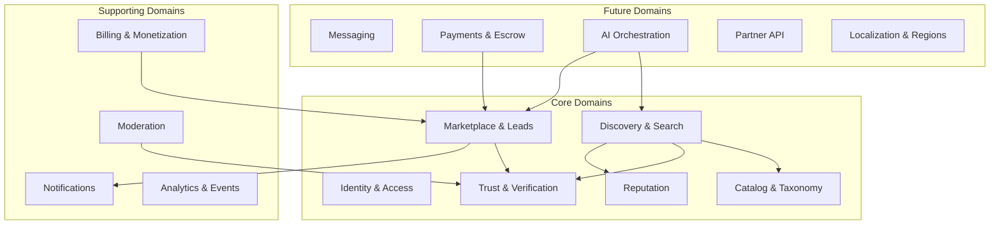
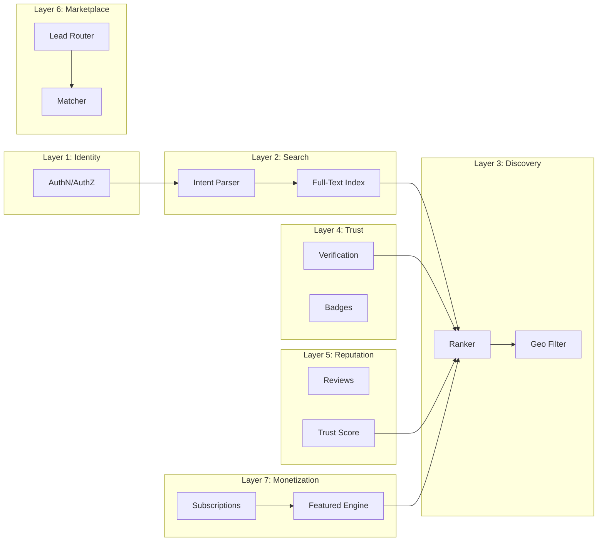
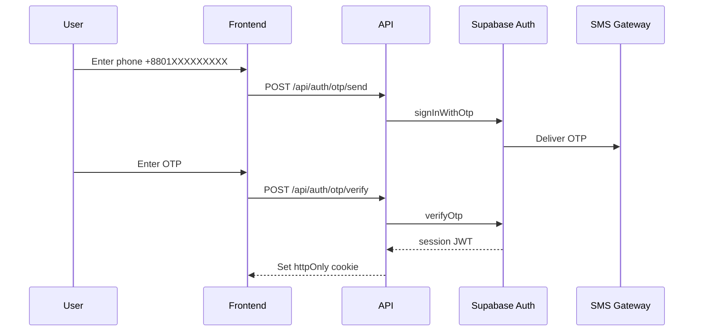
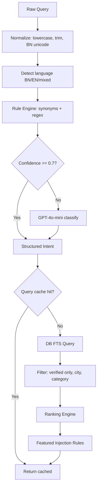
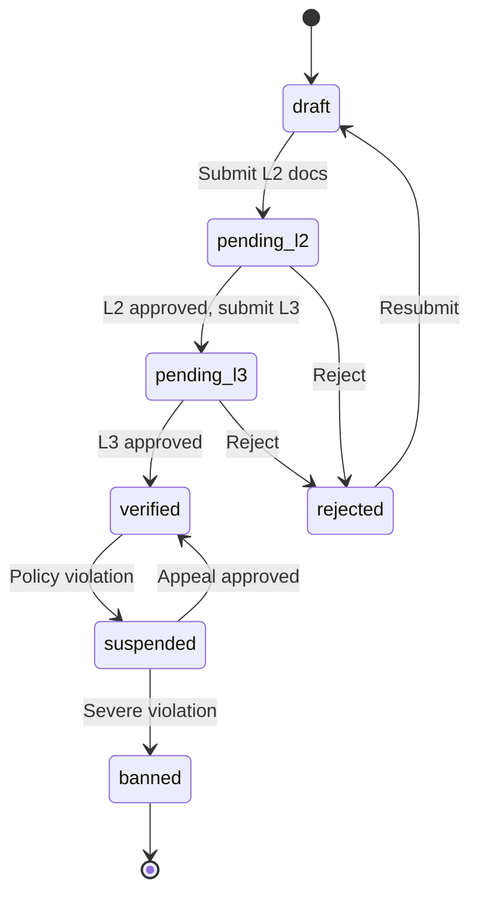
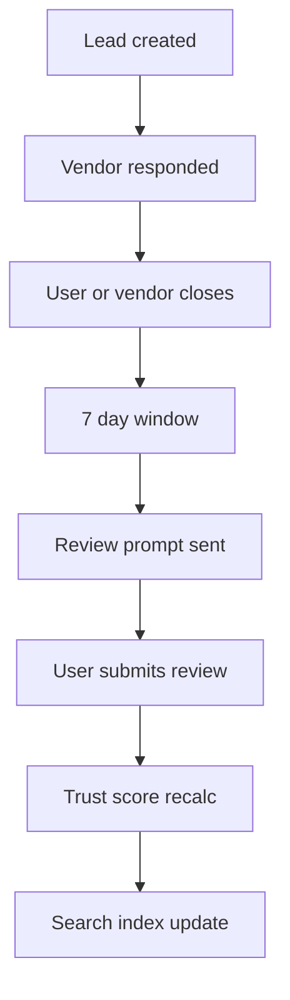
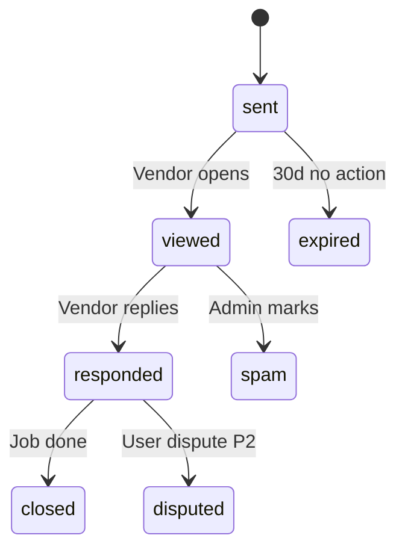
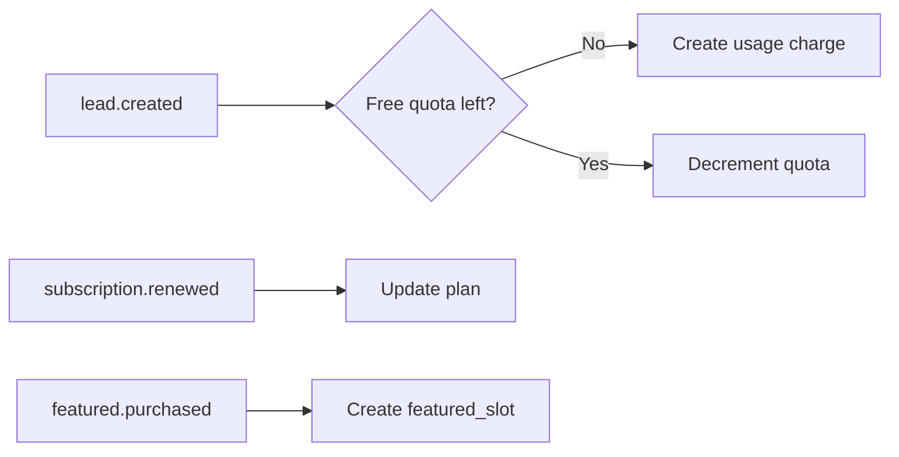

# Taqdimah : Advanced Technical PRD (Enterprise Grade)

**Document ID:** ALD-PRD-TECH-001  
**Version:** 2.0  
**Classification:** Internal / Engineering / Investors  
**Status:** Approved for implementation planning  
**Last updated:** July 2026  
**Companion docs:** [PRD.md](./PRD.md) · [TECHNICAL_DESIGN.md](./TECHNICAL_DESIGN.md) · [DATA_MODEL.md](./DATA_MODEL.md) · [API_REFERENCE.md](./API_REFERENCE.md) · [SYSTEM_FLOWS.md](./SYSTEM_FLOWS.md)

---

## Document Control

| Version | Date | Author | Changes |
|---------|------|--------|---------|
| 1.0 | 2026-07 | : | Initial MVP PRD |
| 2.0 | 2026-07 | : | Advanced technical PRD : full platform specification |

**Reviewers (target):** Engineering lead, Product, Shariah advisor (finance modules), Legal (BD marketplace compliance)

**Approval criteria for MVP launch:**
- All P0 functional requirements (FR-001 → FR-045) implemented
- All P0 non-functional requirements (NFR-001 → NFR-020) verified
- Trust layer live with verification SLA < 48h
- Security review passed (OWASP top 10)
- Load test: 100 concurrent searches, p95 < 2s

---

## Table of Contents

1. [Glossary](#1-glossary)
2. [System Context & Bounded Contexts](#2-system-context--bounded-contexts)
3. [Platform Layer Specification](#3-platform-layer-specification)
4. [Functional Requirements Registry](#4-functional-requirements-registry)
5. [Non-Functional Requirements Registry](#5-non-functional-requirements-registry)
6. [Identity & Access Management](#6-identity--access-management)
7. [Search & Intent Engine](#7-search--intent-engine)
8. [Discovery & Ranking](#8-discovery--ranking)
9. [Trust & Verification System](#9-trust--verification-system)
10. [Reputation & Review System](#10-reputation--review-system)
11. [Marketplace & Lead Orchestration](#11-marketplace--lead-orchestration)
12. [Vendor Independence Model](#12-vendor-independence-model)
13. [Institution & Islamic Ecosystem Module](#13-institution--islamic-ecosystem-module)
14. [Monetization Engine](#14-monetization-engine)
15. [Messaging Layer (Phase 2)](#15-messaging-layer-phase-2)
16. [Payment & Escrow Layer (Phase 2)](#16-payment--escrow-layer-phase-2)
17. [AI Recommendation Engine (Phase 2–3)](#17-ai-recommendation-engine-phase-23)
18. [Partner API Platform (Phase 3)](#18-partner-api-platform-phase-3)
19. [Event-Driven Architecture](#19-event-driven-architecture)
20. [Multi-Region & Localization](#20-multi-region--localization)
21. [Security Threat Model](#21-security-threat-model)
22. [Observability & SLOs](#22-observability--slos)
23. [Data Governance & Retention](#23-data-governance--retention)
24. [Testing & Quality Strategy](#24-testing--quality-strategy)
25. [Release Train & Feature Flags](#25-release-train--feature-flags)
26. [Migration & Scale Roadmap](#26-migration--scale-roadmap)
27. [Requirement Traceability Matrix](#27-requirement-traceability-matrix)

---

## 1. Glossary

| Term | Definition |
|------|------------|
| **Taqdimah** | The platform operator owning discovery, trust, and customer relationship layers |
| **Vendor** | Independent business, freelancer, or professional with a profile on Taqdimah |
| **Institution** | Mosque, madrasa, NGO, waqf, or charity with an institution profile |
| **Consumer** | End user searching for services or products |
| **Lead** | A qualified customer request routed to one or more vendors |
| **MQL** | Monthly Qualified Lead : lead with vendor response within 48h |
| **Trust Score** | Composite ranking signal (0–5) for vendor quality |
| **Verification Level** | L0–L4 credential depth (phone → Islamic verified) |
| **Discovery Layer** | Search, browse, category, location surfaces |
| **Supply** | All vendors + institutions on the platform |
| **Featured Slot** | Paid placement in category+city results |
| **Intent Bundle** | AI-generated multi-vendor recommendation set |
| **Ummah Economy** | Global Muslim consumer and business spending network |
| **Wasīlah** | Permissible intermediation : Taqdimah's brokerage role for leads/fees |

---

## 2. System Context & Bounded Contexts

### 2.1 C4 Context Diagram



### 2.2 Domain-Driven Bounded Contexts



| Bounded Context | Aggregate Roots | Owns |
|-----------------|-----------------|------|
| Identity | User, Session, Role | Authentication, authorization |
| Catalog | Category, Tag, City | Taxonomy, SEO URLs |
| Vendor | VendorProfile, Portfolio | Supply-side identity |
| Institution | InstitutionProfile, Campaign | Mosques, NGOs |
| Discovery | SearchQuery, SearchResult | Query execution, caching |
| Trust | VerificationRequest, Badge | Credential review |
| Reputation | Review, TrustScore | Ratings, ranking input |
| Marketplace | Lead, LeadAssignment | Demand-supply matching |
| Billing | Subscription, Invoice, FeaturedSlot | Revenue |
| Notifications | Notification, Template | Delivery orchestration |

### 2.3 Architectural Principles

1. **Platform not monolith** : Layers communicate via well-defined APIs and events
2. **Vendor sovereignty** : No forced exclusivity; vendors own brand and pricing
3. **Trust-gated index** : Only verified vendors enter public search index
4. **Event-first side effects** : Reviews, verifications, leads emit domain events
5. **Idempotent operations** : Lead creation, webhooks, payments retriable
6. **Fail closed on auth** : Unknown role = deny
7. **Labeled monetization** : Featured/sponsored never disguised as organic
8. **Shariah-by-design** : Blocked categories, transparent fees, scholar review for L4

---

## 3. Platform Layer Specification

Each layer has **inputs**, **outputs**, **SLA**, **data stores**, and **failure modes**.

### 3.1 Layer interaction map



### 3.2 Layer specification table

| Layer | Primary Service | Input | Output | SLA | Phase |
|-------|-----------------|-------|--------|-----|-------|
| Identity | `auth-service` | Credentials, OTP | JWT session, role | 99.9% auth | P0 |
| Search | `search-service` | Natural language query | Parsed intent + candidates | p95 < 2s | P0 |
| Discovery | `discovery-service` | Intent + filters | Ranked vendor list | p95 < 500ms after search | P0 |
| Trust | `trust-service` | Documents, admin action | Verification level | Review < 48h | P0 |
| Reputation | `reputation-service` | Review submission | Updated trust score | Score update < 5s | P0 |
| Marketplace | `marketplace-service` | Lead form | Routed lead, notifications | Notify < 60s | P0 |
| Messaging | `messaging-service` | Chat message | Thread delivery | Realtime < 1s | P2 |
| Payment | `payment-service` | Payment intent | Escrow state | PCI partner SLA | P2 |
| AI | `ai-orchestrator` | User life event text | Intent bundle | p95 < 5s | P2 |
| Partner API | `api-gateway` | REST + webhooks | Partner data | 99.5% | P3 |

---

## 4. Functional Requirements Registry

Format: `FR-{domain}{number}` : Priority: P0/P1/P2 : Phase: 1/2/3

### 4.1 Identity & Onboarding (IAM)

| ID | Requirement | Priority | Acceptance |
|----|-------------|----------|------------|
| FR-IAM001 | Phone OTP registration with +880 validation | P0 | 6-digit OTP, 5min expiry, 3 retries |
| FR-IAM002 | Google OAuth for consumer and vendor | P0 | PKCE flow, link to existing phone account |
| FR-IAM003 | Role assignment: user, vendor, moderator, admin | P0 | Role in JWT claims + DB |
| FR-IAM004 | Vendor registration creates draft VendorProfile | P0 | Auto-slug from business name |
| FR-IAM005 | Session refresh without re-login 30 days | P1 | Refresh token rotation |
| FR-IAM006 | Account deletion with 30-day grace | P1 | GDPR-style export before delete |
| FR-IAM007 | Multi-device session management | P2 | List/revoke sessions in settings |

### 4.2 Catalog & Taxonomy (CAT)

| ID | Requirement | Priority | Acceptance |
|----|-------------|----------|------------|
| FR-CAT001 | 3-level category hierarchy max | P0 | L1 → L2 → L3, no deeper |
| FR-CAT001 | 50+ seed categories bilingual | P0 | name_en + name_bn required |
| FR-CAT003 | Islamic Ecosystem L1 branch mandatory | P0 | Quran, scholars, finance, institutions |
| FR-CAT004 | Category admin CRUD with slug immutability | P0 | Redirect old slugs on rename |
| FR-CAT005 | Category synonym map for search | P0 | "AC" → ac-repair, "তিলাওয়াত" → quran-teachers |
| FR-CAT006 | Haram category blocklist | P0 | alcohol, gambling, adult : reject at onboarding |
| FR-CAT007 | City/area gazetteer for BD | P0 | Dhaka thanas, Ctg areas, Sylhet |

### 4.3 Vendor Profile (VEN)

| ID | Requirement | Priority | Acceptance |
|----|-------------|----------|------------|
| FR-VEN001 | Public profile at `/v/{slug}` | P0 | SSR, < 200ms TTFB cached |
| FR-VEN002 | Profile completeness score 0–100% | P0 | Blocks verification submit if < 60% |
| FR-VEN003 | Portfolio up to 10 images, 5MB each | P0 | WebP conversion on upload |
| FR-VEN004 | service_areas JSON: cities + areas[] | P0 | Used in geo filter |
| FR-VEN005 | Vendor claim flow for pre-seeded listings | P1 | OTP prove ownership |
| FR-VEN006 | Multi-user vendor accounts | P2 | Owner + staff roles |

### 4.4 Search & Discovery (SRC)

| ID | Requirement | Priority | Acceptance |
|----|-------------|----------|------------|
| FR-SRC001 | Natural language search BN + EN | P0 | See §7 |
| FR-SRC002 | Autocomplete from categories + popular queries | P1 | Debounce 300ms |
| FR-SRC003 | Search results pagination 20/page | P0 | Cursor-based |
| FR-SRC004 | Zero-results fallback: broaden city, suggest categories | P0 | UX spec in SYSTEM_FLOWS |
| FR-SRC005 | Search analytics logged immutably | P0 | search_logs table |
| FR-SRC006 | SEO SSG for city+category combos | P0 | 60+ pages at launch |
| FR-SRC007 | Voice search | P3 | Mobile PWA |

### 4.5 Trust & Verification (TRU)

| ID | Requirement | Priority | Acceptance |
|----|-------------|----------|------------|
| FR-TRU001 | L1 phone verification via OTP | P0 | Required all accounts |
| FR-TRU002 | L2 identity: NID/passport upload | P0 | Admin manual review |
| FR-TRU003 | L3 business: trade license | P0 | OCR assist optional P2 |
| FR-TRU004 | L4 Islamic: scholar credentials | P1 | Separate reviewer pool |
| FR-TRU005 | Halal badge for food vendors | P1 | Certificate upload |
| FR-TRU006 | Suspension with appeal flow | P0 | 3-strike policy |
| FR-TRU007 | Unverified excluded from search index | P0 | materialized view filter |

### 4.6 Reputation (REP)

| ID | Requirement | Priority | Acceptance |
|----|-------------|----------|------------|
| FR-REP001 | Review only after lead status=closed | P0 | Enforced FK + check |
| FR-REP002 | 1 review per lead per user | P0 | Unique constraint |
| FR-REP003 | Vendor single reply to review | P0 | Edit within 24h |
| FR-REP004 | Trust score recalc on events | P0 | See TRUST_SYSTEM.md |
| FR-REP005 | Report review → moderator queue | P0 | SLA 72h |
| FR-REP006 | Bayesian avg for low review count | P1 | Prevent 1-review 5★ dominance |

### 4.7 Marketplace & Leads (MKT)

| ID | Requirement | Priority | Acceptance |
|----|-------------|----------|------------|
| FR-MKT001 | Lead from profile CTA | P0 | Single vendor target |
| FR-MKT002 | Lead from search: route to top 3 optional | P1 | User selects or broadcast |
| FR-MKT003 | Lead status machine | P0 | sent→viewed→responded→closed |
| FR-MKT004 | Vendor response SLA tracking | P0 | Impacts trust score |
| FR-MKT005 | User rate limit 5 leads/day | P0 | Redis or DB counter |
| FR-MKT006 | Spam detection: duplicate text hash | P1 | Auto-flag |
| FR-MKT007 | Lead expiry 30 days inactive | P1 | Auto-close |

### 4.8 Sustenance & Compensation (SUST)

| ID | Requirement | Priority | Acceptance |
|----|-------------|----------|------------|
| FR-MON001 | Free plan: 10 leads/month hard cap | P0 | Enforced at lead create |
| FR-MON002 | Pro/Business plan tiers | P1 | See BUSINESS_PLAN |
| FR-MON003 | Featured slot scheduler admin | P1 | Max 3 per category+city |
| FR-MON004 | Sponsored label on all paid placements | P0 | CSS + JSON field |
| FR-MON005 | Lead overage billing | P1 | Ledger table |
| FR-MON006 | SSLCommerz subscription billing | P2 | Webhook idempotent |

### 4.9 Institution Module (INS)

| ID | Requirement | Priority | Acceptance |
|----|-------------|----------|------------|
| FR-INS001 | Institution profile type distinct from vendor | P1 | mosques, NGOs |
| FR-INS002 | Linked vendor recommendations | P1 | Curated list |
| FR-INS003 | Event listing | P2 | Ramadan programs |
| FR-INS004 | Donation campaign link outbound | P2 | No on-platform riba products |

### 4.10 Admin & Moderation (ADM)

| ID | Requirement | Priority | Acceptance |
|----|-------------|----------|------------|
| FR-ADM001 | Verification queue with assignee | P0 | Moderator workload |
| FR-ADM002 | Audit log immutable | P0 | admin_audit_log |
| FR-ADM003 | Bulk CSV vendor import | P0 | 500 row batch |
| FR-ADM004 | Feature flag admin UI | P1 | Toggle per region |
| FR-ADM005 | Dashboard: MQL, MAU, revenue | P1 | PostHog + internal |

---

## 5. Non-Functional Requirements Registry

| ID | Category | Requirement | Target |
|----|----------|-------------|--------|
| NFR-001 | Performance | Search p95 latency | < 2000ms |
| NFR-002 | Performance | Profile page TTFB | < 300ms cached |
| NFR-003 | Performance | API p95 (non-search) | < 500ms |
| NFR-004 | Availability | Platform uptime MVP | 99.5% |
| NFR-005 | Availability | Auth uptime | 99.9% |
| NFR-006 | Scalability | Concurrent searches | 500 (MVP load test) |
| NFR-007 | Scalability | Vendor listings | 100K indexed (Year 2 design) |
| NFR-008 | Security | OWASP Top 10 | Zero critical at launch |
| NFR-009 | Security | RLS on all tenant data | 100% tables |
| NFR-010 | Security | PII encryption at rest | Supabase AES-256 |
| NFR-011 | Privacy | Contact phone hidden until lead | Enforced API |
| NFR-012 | Accessibility | WCAG 2.1 AA | Core flows Phase 1 |
| NFR-013 | i18n | Bengali + English UI | 100% MVP strings |
| NFR-014 | SEO | Lighthouse performance | > 80 mobile |
| NFR-015 | Observability | Error tracking | 100% API routes instrumented |
| NFR-016 | Data | Backup RPO | 24h (Supabase) |
| NFR-017 | Data | Backup RTO | 4h |
| NFR-018 | Compliance | Marketplace T&C | BD legal review |
| NFR-019 | Compliance | Shariah policy published | Before finance module |
| NFR-020 | Maintainability | Test coverage critical paths | > 70% unit + integration |

---

## 6. Identity & Access Management

### 6.1 Authentication flows



### 6.2 RBAC matrix

| Resource | guest | user | vendor | moderator | admin |
|----------|-------|------|--------|-----------|-------|
| Search | R | R | R | R | R |
| Vendor profile public | R | R | R | R | R |
| Create lead | - | C | C | C | C |
| Edit own vendor profile | - | - | U | - | U |
| Respond leads | - | - | U | - | U |
| Verification review | - | - | - | U | U |
| Featured slots | - | - | - | - | CRUD |
| User suspend | - | - | - | - | U |

### 6.3 JWT claims

```json
{
  "sub": "user-uuid",
  "role": "vendor",
  "vendor_id": "vendor-uuid",
  "locale": "bn",
  "plan": "pro",
  "iat": 1710000000,
  "exp": 1710086400
}
```

---

## 7. Search & Intent Engine

See [SEARCH_RANKING.md](./SEARCH_RANKING.md) for full algorithm.

### 7.1 Processing pipeline



### 7.2 Intent object schema

```typescript
interface SearchIntent {
  raw_query: string;
  language: 'bn' | 'en' | 'mixed';
  category_slug: string | null;
  category_confidence: number;
  city: string | null;
  area: string | null;
  keywords: string[];
  intent_type: 'find_vendor' | 'find_institution' | 'ambiguous';
  secondary_categories: string[];
}
```

### 7.3 Rule engine examples (100+ rules at launch)

| Pattern (regex/keyword) | category_slug | confidence |
|-------------------------|---------------|------------|
| architect, স্থপতি | architects | 0.95 |
| quran, hifz, তিলাওয়াত, কুরআন | quran-teachers | 0.95 |
| moving, relocation, সামান বহন | moving-companies | 0.9 |
| halal catering, হালাল ক্যাটারিং | halal-catering | 0.95 |
| backend, java dev, developer | software-developers | 0.85 |

---

## 8. Discovery & Ranking

**Default sort:** `trust_score DESC, avg_rating DESC, review_count DESC, profile_views DESC`

**Featured injection rules:**
1. Max 3 featured per result page
2. Featured inserted at positions 1, 4, 8 (if available)
3. Featured must match category + city
4. Featured vendor must be verification_level >= 2
5. User toggle "Hide sponsored" removes featured (accessibility setting)

**Diversity rule:** Same business group max 2 results per page (future holding companies)

---

## 9. Trust & Verification System

See [TRUST_SYSTEM.md](./TRUST_SYSTEM.md).

### 9.1 Verification state machine



### 9.2 Trust score formula (production)

```
trust_score = (
  Wv * normalize(verification_level, 0, 4) +
  Wr * bayesian_rating(avg_rating, review_count) +
  Ws * response_rate +
  Wc * profile_completeness +
  Wf * freshness_decay(days_since_update)
) * 5

Default weights: Wv=0.30, Wr=0.30, Ws=0.20, Wc=0.10, Wf=0.10
```

**Bayesian rating:**
```
bayesian = (C * m + sum_ratings) / (C + review_count)
C=10, m=3.5 prior
```

---

## 10. Reputation & Review System

### 10.1 Review eligibility graph



### 10.2 Anti-fraud rules

- Device fingerprint rate limit (optional P2)
- Review text simhash vs other reviews → flag
- Vendor cannot review own business
- Burst 5★ reviews same day → moderator alert

---

## 11. Marketplace & Lead Orchestration

### 11.1 Lead routing strategies

| Strategy | When | Behavior |
|----------|------|----------|
| Direct | Profile CTA | Single vendor_id |
| Top-N | Search "request quote" | User picks or system sends to top 3 by trust |
| Broadcast | Category page bulk | P2 : opt-in vendors only |
| AI Bundle | Phase 2 | Multi-vendor from intent bundle |

### 11.2 Lead state machine



---

## 12. Vendor Independence Model

**Legal/technical separation:**

| Capability | Vendor owns | Taqdimah owns |
|------------|-------------|-------------|
| Brand & logo | ✓ | |
| Pricing & quotes | ✓ | |
| Service delivery | ✓ | |
| Customer contract | ✓ | |
| Profile discovery | | ✓ |
| Search ranking | | ✓ |
| Review display | Shared | Moderation |
| Lead introduction | | ✓ |
| Payment escrow | Shared P2 | Processing |

**Data portability:** Vendor can export profile + reviews CSV on departure (GDPR-style).

**No exclusivity clause** in vendor T&C for MVP.

---

## 13. Institution & Islamic Ecosystem Module

### 13.1 Institution types

| Type | Verification | Features |
|------|--------------|----------|
| Mosque | Community referral + admin | Prayer times link, events |
| Madrasa | Registration doc | Teacher listings |
| NGO | RJSC/NGOAB | Campaign links |
| Waqf | Waqf board doc | Project showcase |
| Scholar | Ijazah / credential L4 | Consultation leads |

### 13.2 Islamic finance integration (Phase 3)

- Referral-only : Taqdimah is not a lender
- Shariah board approves each partner product
- Disclosure: "Taqdimah receives referral fee from {partner}"
- No APR/interest-based personal loans listed

---

## 14. Sustenance Engine (Fair Compensation for Workers)

### 14.1 Billing events



### 14.2 Ledger tables (Phase 1 design, Phase 2 billing)

- `billing_accounts` : vendor billing state
- `usage_ledger` : per-lead charges
- `invoices` : monthly summaries
- `payment_transactions` : gateway refs

---

## 15. Messaging Layer (Phase 2)

- Thread per lead_id
- Messages stored encrypted at rest
- No phone number revealed in thread until mutual opt-in
- Media: links only MVP of messaging
- Moderation: keyword flag for abuse

---

## 16. Payment & Escrow Layer (Phase 2)

See [PAYMENTS_ESCROW.md](./PAYMENTS_ESCROW.md) (to be created in payment phase).

**States:** `initiated → held → released → refunded → disputed`

**Commission:** 5–12% disclosed at checkout

**Partner:** SSLCommerz (BD), Stripe (global expansion)

---

## 17. AI Recommendation Engine (Phase 2–3)

See [AI_ENGINE.md](./AI_ENGINE.md).

**Input:** "I'm moving next week to Banani"

**Output bundle:**
```json
{
  "bundle_id": "uuid",
  "intents": [
    { "category": "moving-companies", "priority": 1 },
    { "category": "electricians", "priority": 2 },
    { "category": "cleaning-services", "priority": 3 },
    { "category": "interior-designers", "priority": 4, "optional": true }
  ],
  "suggested_vendors": { "moving-companies": ["uuid1", "uuid2"] }
}
```

---

## 18. Partner API Platform (Phase 3)

- API keys with scopes: `read:vendors`, `write:leads`, `read:categories`
- Rate limits: 1000 req/hour growth tier
- Webhooks: `lead.created`, `vendor.verified`, `review.created`
- Embed widget: `<script src="https://cdn.Taqdimah.app/widget.js">`

---

## 19. Event-Driven Architecture

See [EVENTS.md](./EVENTS.md).

**Core events (CloudEvents format):**
- `Taqdimah.vendor.registered`
- `Taqdimah.vendor.verified`
- `Taqdimah.lead.created`
- `Taqdimah.lead.responded`
- `Taqdimah.review.created`
- `Taqdimah.trust_score.updated`
- `Taqdimah.subscription.changed`

**Consumers:**
- Notification service
- Analytics pipeline
- Trust score worker
- Billing worker
- Search index updater

---

## 20. Multi-Region & Localization

| Region | Locale | Currency | Payment | Phase |
|--------|--------|----------|---------|-------|
| Bangladesh | bn, en | BDT | SSLCommerz | P0 |
| Malaysia | ms, en | MYR | Curlec | P3 |
| Indonesia | id, en | IDR | Midtrans | P3 |
| Pakistan | ur, en | PKR | TBD | P3 |
| GCC | ar, en | SAR/AED | TBD | P4 |

**Data residency:** Country shard when MAU > 100K per region

---

## 21. Security Threat Model

| Threat | Impact | Mitigation |
|--------|--------|------------|
| Fake vendor listings | High | Verification + report + ML P2 |
| Lead spam | Medium | Rate limit + captcha |
| Review bombing | Medium | Eligibility + Bayesian + mod queue |
| PII leak | Critical | RLS + signed URLs + audit |
| Account takeover | High | OTP + refresh rotation |
| Prompt injection (AI) | Medium | Sanitize user input in prompts |
| Payment fraud | Critical | Partner KYC, escrow |
| Scraping | Low | Rate limit, robots.txt |

---

## 22. Observability & SLOs

| SLI | SLO | Alert |
|-----|-----|-------|
| Search success rate | > 99% | PagerDuty P2 |
| Lead notification delivery | > 98% | P2 |
| Verification SLA | < 48h p90 | Weekly report |
| Error rate 5xx | < 0.5% | P1 if > 1% |

**Dashboards:** Grafana or PostHog : MAU, MQL, search zero-rate, revenue

---

## 23. Data Governance & Retention

| Data type | Retention | Delete policy |
|-----------|-----------|---------------|
| search_logs | 12 months | Anonymize user_id |
| agent_logs / AI | 90 days | Auto purge |
| verification docs | 7 years | Legal hold |
| leads | 3 years | Anonymize PII |
| reviews | Permanent | Vendor delete hides |
| audit logs | 7 years | Immutable |

---

## 24. Testing & Quality Strategy

```
        /\
       /E2E\        5% : Playwright critical paths
      /------\
     /Integration\  25% : API + DB + RLS
    /------------\
   /  Unit Tests  \ 70% : Trust score, intent parser, ranker
  /----------------\
```

**Critical E2E paths:**
1. Search → profile → lead → vendor respond → review
2. Vendor register → verify → appear in search
3. Admin approve verification

---

## 25. Release Train & Feature Flags

| Flag | Default | Description |
|------|---------|-------------|
| `ff_ai_intent` | false | LLM intent fallback |
| `ff_messaging` | false | In-app chat |
| `ff_payments` | false | Escrow checkout |
| `ff_institution` | false | Mosque/NGO profiles |
| `ff_broadcast_leads` | false | Multi-vendor broadcast |

**Release cadence:** Weekly deploy to staging, biweekly production (post-MVP)

---

## 26. Migration & Scale Roadmap

| MAU | Architecture milestone |
|-----|------------------------|
| < 10K | Monolithic Next.js + Supabase |
| 10K–50K | Add Redis cache, read replica |
| 50K–200K | Meilisearch, background workers (Inngest/Trigger.dev) |
| 200K+ | Split search service, CDN images, multi-region |
| 1M+ | Country shards, dedicated AI inference budget |

---

## 27. Requirement Traceability Matrix

| Business goal | FR IDs | Metric |
|---------------|--------|--------|
| Trusted discovery | FR-TRU*, FR-SRC*, FR-REP* | Zero-result rate < 15% |
| Vendor leads | FR-MKT*, FR-MON* | MQL 1000/mo |
| Network effects | FR-VEN*, FR-CAT* | 500 vendors |
| Ummah revenue | FR-MON* | $3K MRR |
| Islamic ecosystem | FR-INS*, FR-CAT003 | 50 Islamic listings |
| Global scale | NFR-006, §20 | Multi-region ready design |

---

**This document is the engineering source of truth. For strategic summary see [PRD.md](./PRD.md). For implementation details see companion technical docs.**

**Next:** [TECHNICAL_DESIGN.md](./TECHNICAL_DESIGN.md) · [DATA_MODEL.md](./DATA_MODEL.md) · [API_REFERENCE.md](./API_REFERENCE.md) · [SYSTEM_FLOWS.md](./SYSTEM_FLOWS.md)