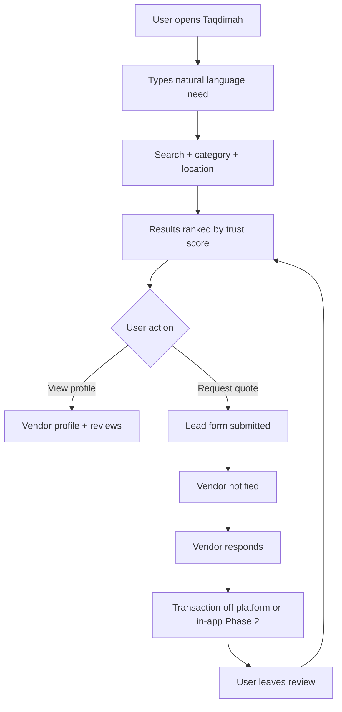
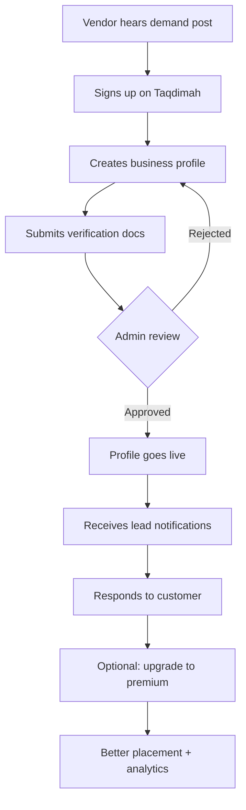
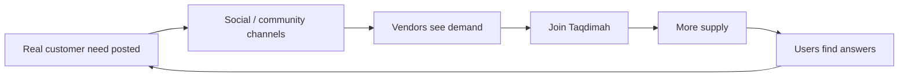

# Taqdimah : Product Requirements Document (PRD)

**Version:** 1.1 - Reframed as Gift  
**Status:** Strategic direction for a public good offering  
**Last updated:** July 2026

---

## 1. Executive Summary

**Taqdimah (التقديمة)** is a **gift** - an offering presented to the Khalifah for the betterment (islah) of society.

It is long-term digital infrastructure for the Muslim Ummah, built with the intention of strengthening society under righteous leadership. While the core mission is service and societal reform, the workers and team who build and operate Taqdimah are sustained through fair, transparent mechanisms so they can dedicate themselves fully to this gift.

Taqdimah brings together:

- Trusted discovery and coordination
- Service, professional, and institutional networks
- Strong identity, verification, and amanah
- Deep Islamic ecosystem participation (scholars, dawah, mosques, NGOs, waqf, education, businesses)

into **one connected network of trust and benefit**.

**Positioning statement:**

> Taqdimah is a gift to the Khalifah : digital infrastructure that only facilitates what is genuinely good and beneficial for the Ummah. Offered for the islah (betterment) of society in both deen and dignified life. Workers who maintain the purity of this gift are supported fairly.

**MVP goal (6 months):** Deliver foundational infrastructure in 2–3 Bangladesh cities with 500+ verified participants who offer things that are good for the Ummah, strong search, connection tools, and early dawah/education features. Success is measured by real benefit brought to the Ummah - increased access to beneficial knowledge, trusted essential services, and community strength.

---

## 2. Problem Statement

### 2.1 For consumers (the Ummah as customers)

| Pain | Today | With Taqdimah |
|------|-------|-------------|
| Fragmentation | Jump between Facebook, WhatsApp, Google, Bikroy, Sheba | One trusted search |
| Trust | Unknown freelancers, fake reviews, no halal filter | Verification + reputation layer |
| Islamic needs | Quran teachers, halal vendors, scholars scattered | Dedicated ecosystem categories |
| Local discovery | "Who is good in my area?" is unanswered | Location + category intelligence |
| Time waste | Ask friends, post in groups, wait for replies | Request → matched vendors in minutes |

### 2.2 For businesses & professionals (supply side)

| Pain | Today | With Taqdimah |
|------|-------|-------------|
| Customer acquisition | Expensive ads, no targeting | Inbound leads from intent-based search |
| No digital presence | SMEs invisible online | Free basic profile, paid premium |
| Platform lock-in fear | Marketplaces take over brand | Vendor keeps identity & operations |
| Islamic positioning | Hard to signal halal/trustworthy | Trust badges, category fit |
| Lead quality | Random calls from classifieds | Structured requests with context |

### 2.3 For institutions (mosques, NGOs, waqf, madaris)

| Pain | Today | With Taqdimah |
|------|-------|-------------|
| Community reach | Announcements stuck in WhatsApp | Discoverable institution profiles |
| Fundraising | Disconnected donation flows | Linked charity / waqf modules (Phase 2+) |
| Service referrals | "Who teaches Quran here?" | Searchable scholar & teacher network |

---

## 3. Vision & Mission

**Vision:** To be accepted as a sincere gift (taqdimah) to the Khalifah - a means by which society is strengthened through trust, knowledge, dawah, and beneficial coordination, so the Ummah may flourish in both dunya and deen.

**Mission:** Build and operate digital infrastructure as an amanah. Connect the Ummah to trusted and beneficial people, services, knowledge, and institutions. Preserve independence of participants. Enable fair compensation for the workers who maintain this gift so they can serve the whole Ummah effectively. Prioritize islah (reform and betterment) in all features.

**What Taqdimah is NOT:**

- Not a purely profit-maximizing startup that extracts from the Ummah
- Not a super app that owns operations or vendors
- Not a platform that burdens small users or the needy
- Not replacing real masjids, scholars, or community work
- Not involved in riba or haram activities

**What Taqdimah IS:**

- A gift/offering (taqdimah) to the Khalifah and the Ummah - **only of what is good**
- Discovery, verification, and trust layer (amanah of only beneficial things)
- Coordination and knowledge infrastructure for dawah, tarbiyah, family, community, and essential dignified needs
- A platform that sustains its workers fairly while keeping the offering pure
- A tool for real societal islah (spiritual, moral, and communal betterment) with uncompromising Shariah alignment

---

## 4. Strategic Inspiration (Differentiation)

| Reference | What we take | What we avoid |
|-----------|--------------|---------------|
| Bikroy | Listings scale, local categories | Low trust, classifieds chaos |
| Sheba.xyz | Service marketplace UX | Narrow home-services only |
| Taskrabbit | Task-to-provider matching | US-only gig model |
| LinkedIn | Professional identity | Corporate-only focus |
| Google Business | Local discovery | No Islamic/trust layer |
| Yellow Pages | Directory mental model | Static, no transactions |
| Grab / Gojek / WeChat | Ecosystem philosophy | Owning all operations |

**Taqdimah differentiation:** Broader categories + Islamic ecosystem + trust-first + vendor independence + network-effect marketing.

---

## 5. Target Users & Personas

### 5.1 Primary personas

**Persona A : Fatima (Consumer, Dhaka)**  
- Age 32, homemaker + part-time online seller  
- Needs: halal catering, AC repair, Quran teacher for kids  
- Behavior: asks in Facebook groups, frustrated by spam  
- Success: finds 3 trusted vendors in 2 minutes on Taqdimah

**Persona B : Karim (SME Owner, Sylhet)**  
- Runs a small construction supply business  
- Needs: more qualified leads without Facebook ad spend  
- Behavior: relies on word of mouth  
- Success: receives 10+ inbound leads/month from Taqdimah

**Persona C : Yusuf (Freelancer, remote)**  
- Java developer, portfolio on LinkedIn  
- Needs: local + global Muslim client trust  
- Behavior: competes on low-cost platforms  
- Success: verified profile + reviews → higher-trust clients

**Persona D : Imam / Institution (Mosque admin)**  
- Needs: electrician, event caterer, fundraiser visibility  
- Success: mosque page + linked trusted vendors

### 5.2 User segments

| Segment | Role | MVP priority |
|---------|------|--------------|
| B2C consumers | Search, request, review | P0 |
| SMEs & local businesses | Profile, leads, respond | P0 |
| Freelancers & professionals | Profile, portfolio, leads | P0 |
| Home service providers | Category-heavy supply | P0 |
| Islamic service providers | Quran teachers, scholars | P1 |
| Restaurants & halal food | Discovery + leads | P1 |
| NGOs, charities, waqf | Institution profiles | P2 |
| Mosques & madaris | Institution + events | P2 |
| Enterprise / agencies | API, bulk listings | P3 |

---

## 6. Product Principles - Only What Is Good for the Ummah

1. **Only beneficial things** : Taqdimah will **never** facilitate, list, or promote anything that is not genuinely good and beneficial for the Ummah. No consumerism for its own sake, no haram, no doubtful, no things that weaken faith or community.
2. **Amanah before scale** : Verification, truthfulness, and clear benefit to the Ummah come before any growth.
3. **Independence & barakah** : Participants (scholars, masjids, beneficial providers) keep their identity and direct relationships.
4. **Deen + dignified dunya** : Prioritize knowledge, dawah, tarbiyah, family, and community - while also enabling the essential trusted services Muslims need to live honorably.
5. **Workers sustained fairly, without tainting the gift** : Any support for the team comes second to the purity of the offering.
6. **Transparency & minimal burden** : Everything is clear. We avoid burdening the needy or small community efforts.
7. **Network effects for real islah** : Every connection should increase good - in iman, knowledge, family strength, or community capability.

---

## 7. Core User Journeys

### 7.1 Consumer journey (MVP)



### 7.2 Vendor journey (MVP)



### 7.3 Ecosystem marketing loop



---

## 8. MVP Feature Scope

### 8.1 P0 : Must ship

| ID | Feature | Description |
|----|---------|-------------|
| F-001 | Natural language search | Parse intent → category + keywords |
| F-002 | Location filter | City, area, optional geo |
| F-003 | Category taxonomy | 50+ seed categories (see FEATURES.md) |
| F-004 | Vendor profile | Name, logo, description, services, contact |
| F-005 | Verification workflow | Phone, NID/business doc, admin approve |
| F-006 | Trust score v1 | Reviews + verification + response rate |
| F-007 | Lead request | User submits need → vendor inbox |
| F-008 | Vendor dashboard | Edit profile, view/respond leads |
| F-009 | Reviews & ratings | Post-engagement review |
| F-010 | Admin panel | Approve vendors, moderate, featured slots |
| F-011 | Bilingual UI | Bengali + English |
| F-012 | Landing + SEO pages | City + category landing pages |

### 8.2 P1 : Should ship (Month 4–6)

| ID | Feature | Description |
|----|---------|-------------|
| F-020 | In-app messaging | User ↔ vendor chat |
| F-021 | Premium profiles | Subscription for vendors |
| F-022 | Featured listings | Paid top placement |
| F-023 | Sponsored search tags | Labeled ads in results |
| F-024 | Institution profiles | Mosques, NGOs, madaris |
| F-025 | Islamic badges | Halal certified, scholar verified |
| F-026 | WhatsApp lead alerts | Vendor notification channel |

### 8.3 P2 : Future

| ID | Feature | Description |
|----|---------|-------------|
| F-030 | AI intent engine | "I'm moving next week" → multi-service bundle |
| F-031 | Booking & scheduling | Calendar integration |
| F-032 | Payments & escrow | SSLCommerz, Stripe, halal finance partners |
| F-033 | Partner APIs | Third-party integrations |
| F-034 | Waqf / donation module | Charity campaigns |
| F-035 | Mobile apps | iOS + Android native |

---

## 9. Category Taxonomy - Only Beneficial for the Ummah (Seed)

We only include categories and providers that clearly support a strong, faithful, and dignified Ummah life. No frivolous or potentially harmful offerings.

**Essential Services for Dignified Life:**
- Home maintenance & repair (electricians, plumbers, AC, basic building work that keeps families secure)
- Halal food & nutrition (producers, butchers, ethical caterers, grocers)
- Modest clothing & Islamic products makers
- Safe transportation & moving for families

**Knowledge, Education & Tarbiyah (high priority):**
- Quran teachers, hifz, tajweed
- Scholars, da'ees, imams (L4 verified)
- Islamic studies, fiqh, aqeedah, Arabic
- Family & tarbiyah (parenting, marriage per Sunnah)
- Revert / new Muslim support mentors

**Community Infrastructure:**
- Mosques, madaris, Islamic schools
- NGOs, charities, waqf organizations doing real good work
- Builders & craftsmen for masjids and community facilities

**Beneficial Professions:**
- Ethical doctors, nurses, and healthcare providers
- Accountants & advisors for halal businesses and institutions (Shariah-vetted)
- Engineers, architects focused on community or halal projects
- Skilled trades that build and maintain the Ummah (carpenters, tailors for modest needs, etc.)

**Dawah & Reform Support:**
- Dawah content creators (verified)
- Family strengthening & counseling (Sunnah-based)
- Community reform initiatives

Anything that does not clearly uplift the Ummah in deen or dignified dunya will not be listed.

---

## 10. Trust & Safety Requirements

- Phone OTP verification for all accounts
- Business verification: trade license or equivalent document
- Islamic scholar category: credential review by admin
- Report & flag flow for fake listings
- No anonymous reviews (must have lead or interaction)
- Clear halal / sponsorship labels on paid placements
- Privacy: user contact shared only after lead consent

---

## 11. Success Metrics - Impact for the Ummah & the Khalifah + Worker Sustainability

### 11.1 North star metrics (dual)

1. **Beneficial Verified Connections & Islah Impact (BVC-I):** Trust-verified connections + dawah/education/reform outcomes that improve lives in halal ways (practical needs met + spiritual/educational growth).
2. **Worker Sustainability Health:** The operating team is fairly compensated and can continue dedicating full effort without the mission being compromised by financial stress.

### 11.2 MVP targets (Month 6)

| Metric | Target |
|--------|--------|
| Verified participants (vendors, professionals, institutions, scholars, da'ees) | 500+ |
| Monthly active users (MAU) | 5,000 |
| Monthly searches (dunya + deen needs) | 10,000+ |
| Beneficial connections made | 1,000+/month |
| Dawah/education connections (Quran, classes, scholar consults, reverts support) | 200+/month |
| Response/fulfillment rate | > 60% |
| Trust coverage | > 40% with reviews or verifications |
| Cities live | Dhaka, Chattogram, Sylhet |
| Team sustenance | Operating team receives fair compensation from platform activity |

### 11.3 Long-term (societal + sustained workers)

| Metric | Direction |
|--------|-----------|
| Reach & adoption | Widespread use by Ummah for both worldly needs and Islamic growth |
| Masjid & scholar integration | High number of verified mosques, madaris, and scholars actively participating |
| Dawah & reform outcomes | Measurable increase in access to authentic Islamic knowledge, revert support, family strengthening |
| Leadership recognition | Viewed positively by righteous leaders as infrastructure aiding societal betterment |
| Self-sustaining workers | Revenue fairly supports the team maintaining Taqdimah at high quality, allowing continued service to the Ummah |

---

## 12. Competitive Landscape

| Competitor | Strength | Weakness | Taqdimah edge |
|------------|----------|----------|-------------|
| Bikroy | Massive listings | Low trust, noisy | Trust + Islamic categories |
| Sheba.xyz | Services UX | Not ecosystem-wide | Broader supply + institutions |
| Facebook groups | Free, social | Unstructured, scam risk | Verified + searchable |
| Google Maps | Discovery | No lead workflow, no Islamic layer | Intent + trust + leads |
| Pathao / super apps | Logistics | Own the operation | Aggregate, don't replace |

---

## 13. Risks & Mitigations

| Risk | Impact | Mitigation |
|------|--------|------------|
| Chicken-and-egg (insufficient trusted supply) | High | Manual seeding with known righteous participants + mosque & community partnerships |
| Erosion of trust | High | Extremely strict verification (L0–L4), slow growth over fast scale, public accountability |
| Misuse for haram or deceptive purposes | High | Strong moderation, category guardrails, scholar involvement where relevant |
| Perception that it is "just another app" or commercial | High | Consistent messaging as gift/amanah; no aggressive monetization language or practices |
| Dependency on single founder / sustainability | Medium | Design for handover to righteous stewards or waqf structure over time |
| Political / leadership perception | Medium | Focus purely on benefit to the people; remain non-partisan and transparent |

---

## 14. Release Phases

```mermaid
gantt
    title Taqdimah - Delivery of the Gift
    dateFormat YYYY-MM
    section Phase 1 : Foundation of the Offering (MVP)
    Trusted Directory + Search + Profiles     :2026-07, 3M
    Connection Requests + Participant Tools   :2026-09, 2M
    Reviews + Verification Maturity           :2026-11, 2M
    section Phase 2 : Strengthening the Amanah
    Secure Messaging + Light Coordination     :2027-01, 4M
    AI for Life-Event Bundles (real needs)    :2027-03, 3M
    section Phase 3 : Expanding Benefit
    Additional regions + Waqf/Charity tooling :2027-07 onward
    Potential tools to support societal oversight
```

---

## 15. Open Questions

1. Payment escrow: partner with which Islamic bank / fintech first?
2. Scholar verification: internal panel or partner with existing madaris?
3. Commission vs subscription: which is primary revenue in Bangladesh?
4. Bengali NLP: build or buy for intent parsing?

---

## 16. Appendix : Example Search Queries (MVP)

- "I need an architect in Dhaka"
- "AC repair near Mirpur"
- "Halal catering for 200 guests"
- "Quran teacher for kids at home"
- "Java developer for startup"
- "Moving company Sylhet to Dhaka"
- "Islamic marriage counselor"
- "Electrician for mosque renovation"

## 17. Dawah & Islah Ideas (Additional Concepts for Societal Betterment)

These expand the "gift to the Khalifah" mission beyond services into spiritual and communal reform. Many are captured as features in FEATURES.md.

**High-priority dawah directions:**
- Verified scholar/da'ee directory with credential strength (ijazah tracking)
- Masjid digital presence + public needs boards (reverse marketplace for community)
- Structured "Ask a Scholar" with quality control and public knowledge base option
- Rich Quran/hifz/tajweed discovery + group classes
- Curated dawah content hub (short videos, articles, audio) by verified contributors only
- Dedicated revert/new Muslim welcome system (mentors + resources + local connection)
- Family islah: pre-marriage, marital counseling per Sunnah, parenting resources
- Time-bound community campaigns run by masjids/NGOs (e.g. "Protect the Youth from Haram")
- AI-assisted (later) personalized deen growth paths ("how do I fix my salah consistency?")
- Transparent waqf & sadaqah impact tracking

**Leadership / Khalifah angle ideas:**
- Aggregated, anonymized "State of the Ummah" signals (high demand areas for Islamic teachers, common social problems reported via needs, etc.)
- Tools for verified institutions to coordinate large-scale good (disaster relief, education drives)
- Optional reporting dashboards that righteous leadership could use to understand community needs without surveillance

All dawah features must prioritize:
- Rigorous verification of scholars and content
- Protection from fitnah or incorrect rulings
- Accessibility (Bengali + English, mobile-first)
- Adab and respect in all interactions
- Clear separation: Taqdimah facilitates connection, does not issue fatwa itself

See the full Dawah section in [FEATURES.md](./FEATURES.md) for acceptance criteria and phased rollout.

---

---

## Advanced Technical Documentation

This is the **strategic PRD**. For full engineering specification see:

| Document | Contents |
|----------|----------|
| [PRD-TECHNICAL.md](./PRD-TECHNICAL.md) | 45+ functional requirements, 20 NFRs, security, SLOs |
| [TECHNICAL_DESIGN.md](./TECHNICAL_DESIGN.md) | Service modules, caching, deployment |
| [DATA_MODEL.md](./DATA_MODEL.md) | Complete DDL, RLS, indexes |
| [API_REFERENCE.md](./API_REFERENCE.md) | Full REST API contracts |
| [SYSTEM_FLOWS.md](./SYSTEM_FLOWS.md) | 10 end-to-end sequence diagrams |
| [SEARCH_RANKING.md](./SEARCH_RANKING.md) | Intent engine + ranking formula |
| [TRUST_SYSTEM.md](./TRUST_SYSTEM.md) | Verification L0–L4 + trust score math |
| [AI_ENGINE.md](./AI_ENGINE.md) | Life-event bundle AI (Phase 2) |
| [EVENTS.md](./EVENTS.md) | Event-driven architecture |
| [PAYMENTS_ESCROW.md](./PAYMENTS_ESCROW.md) | Halal escrow design (Phase 2) |

**Next documents:** [FEATURES.md](./FEATURES.md) · [BUSINESS_PLAN.md](./BUSINESS_PLAN.md) · [PRD-TECHNICAL.md](./PRD-TECHNICAL.md)