# Taqdimah : Business & Revenue Model Maps (Visual)

> **All ways Taqdimah can earn money** : mapped visually.  
> Companion to [BUSINESS_PLAN.md](./BUSINESS_PLAN.md) · [GUIDELINE_MAP.md](./GUIDELINE_MAP.md) Diagram 6

**Principle:** Transparent fees. No riba. No hidden ads. Serve the Ummah : don't extract from it.

---

## Map 1 : Business Model at a Glance (Who Pays for What)

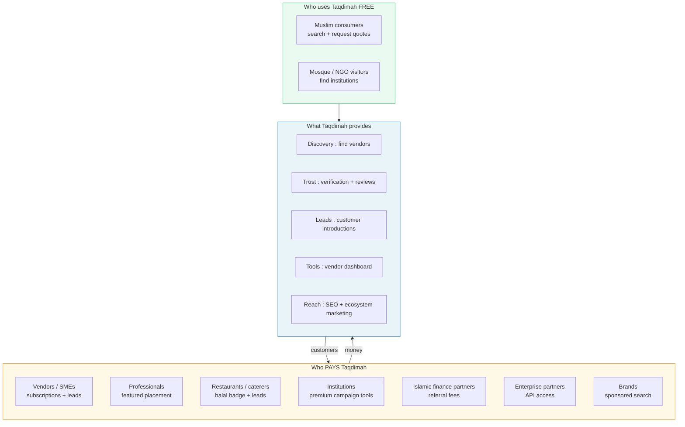

**Key insight:** Consumers never pay for search. Vendors and partners pay for **access to trusted demand**.

---

## Map 2 : All 12 Revenue Streams (Complete List)

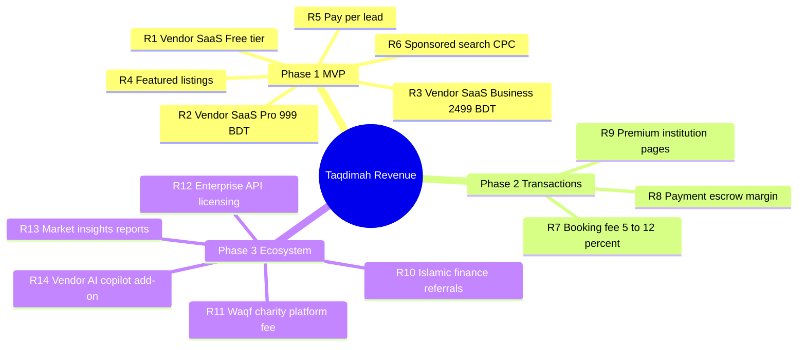

---

## Map 3 : Revenue Stream Detail Matrix

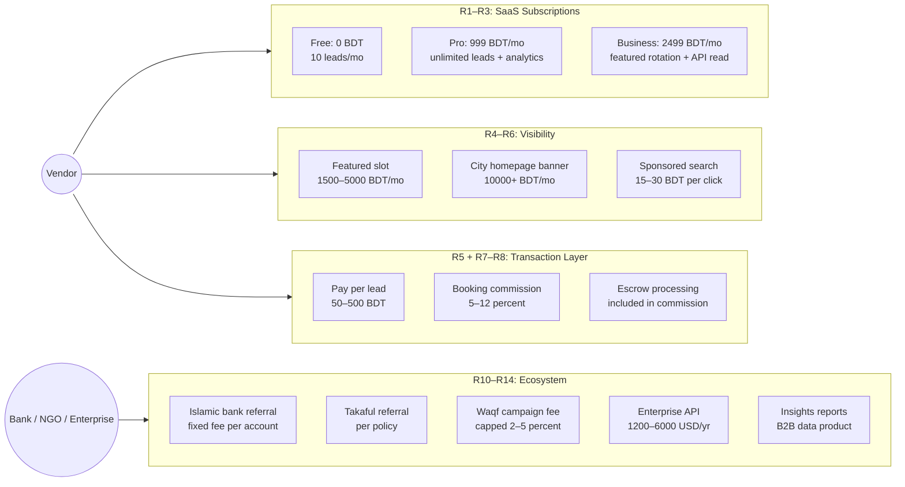

---

## Map 4 : How Money Flows (Ummah Economy → Taqdimah)

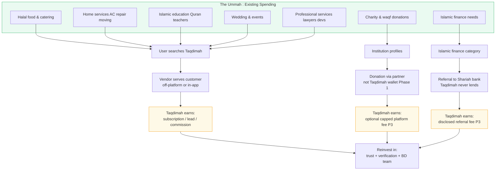

**Taqdimah does not create new spending.** It **organizes and trusts** spending that already happens in WhatsApp groups and Facebook.

---

## Map 5 : Revenue by Platform Layer (What Enables What)

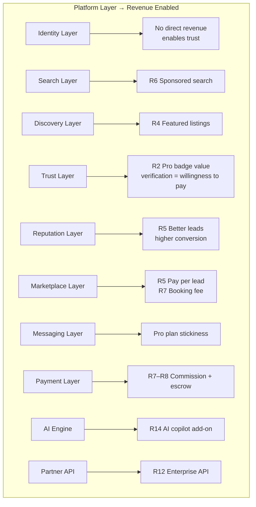

---

## Map 6 : Pricing Tiers vs Revenue (Vendor Side)

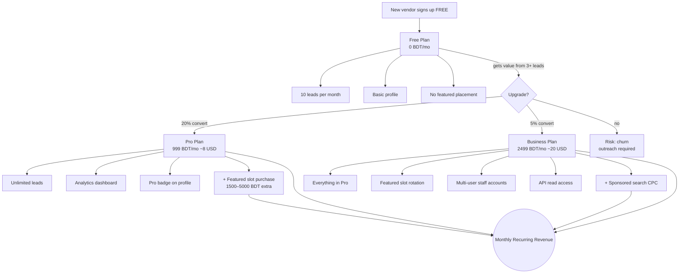

---

## Map 7 : Lead Economics (Pay-Per-Lead Model)

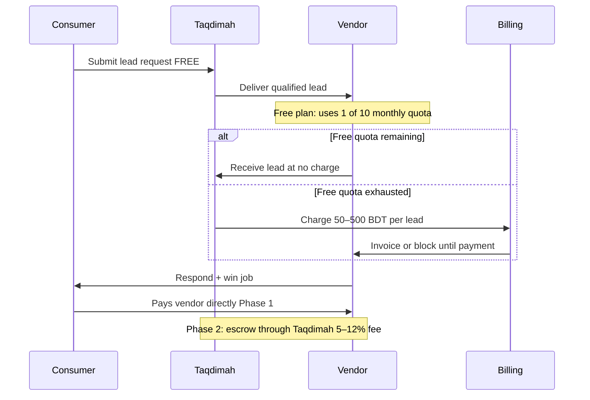

| Lead type | BDT per lead | Example |
|-----------|--------------|---------|
| Standard home service | 50–150 | AC repair, cleaning |
| Professional | 150–300 | Lawyer, accountant |
| High-value | 300–500 | Architect, developer |
| Event / catering | 200–400 | 100+ guest events |

---

## Map 8 : Transaction & Escrow Model (Phase 2)

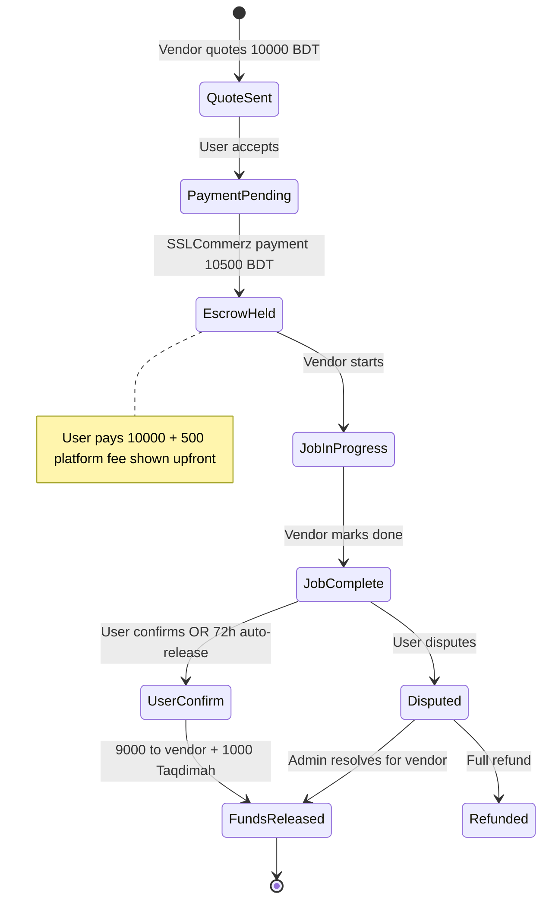

| Category | Commission | Why |
|----------|------------|-----|
| Home services | 8% | Standard marketplace |
| Professional | 10% | Higher ticket, more trust value |
| Islamic education | 5% | Community incentive |
| Catering / events | 10% | Coordination heavy |

---

## Map 9 : Islamic Finance & Waqf Revenue (Phase 3 : Halal Only)

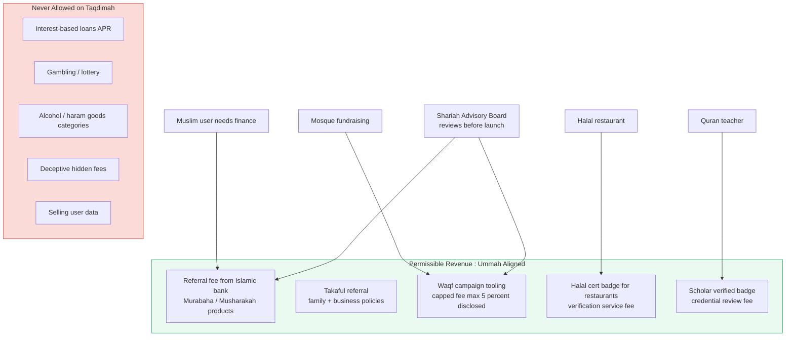

---

## Map 10 : Revenue Timeline (When Each Stream Goes Live)

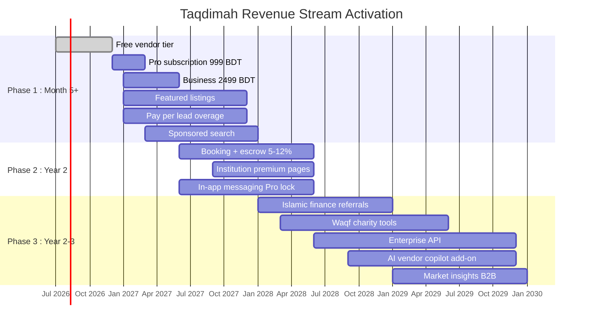

---

## Map 11 : Revenue Mix Evolution (Year 1 → Year 5)

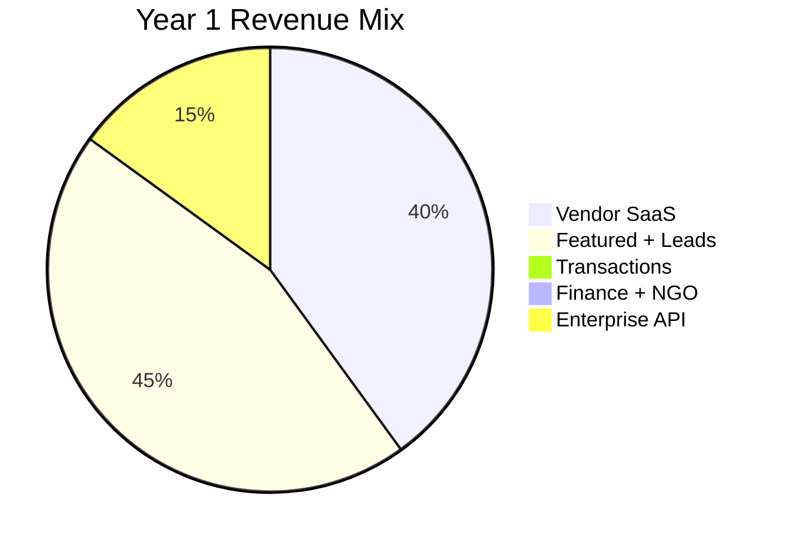

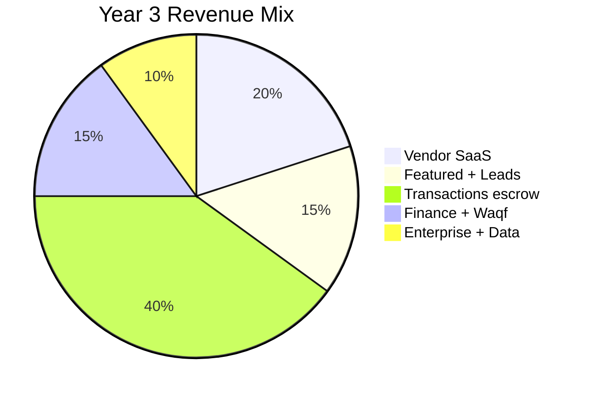

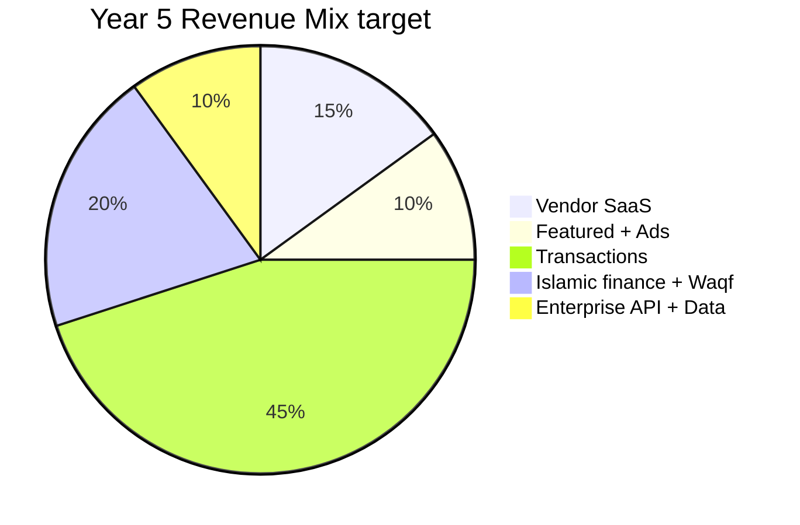

| Year | ARR target | Primary driver |
|------|------------|----------------|
| Y1 | $15–25K | Subscriptions + featured |
| Y2 | $120–200K | Escrow commissions kick in |
| Y3 | $500K–1M | Transactions + finance referrals |
| Y5 | $2M+ | Full ecosystem |

---

## Map 12 : Unit Economics (One Vendor Lifecycle)

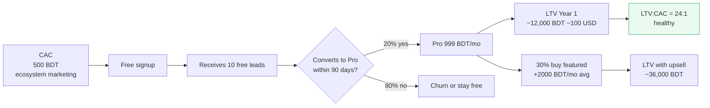

---

## Map 13 : Network Effect → Revenue Flywheel

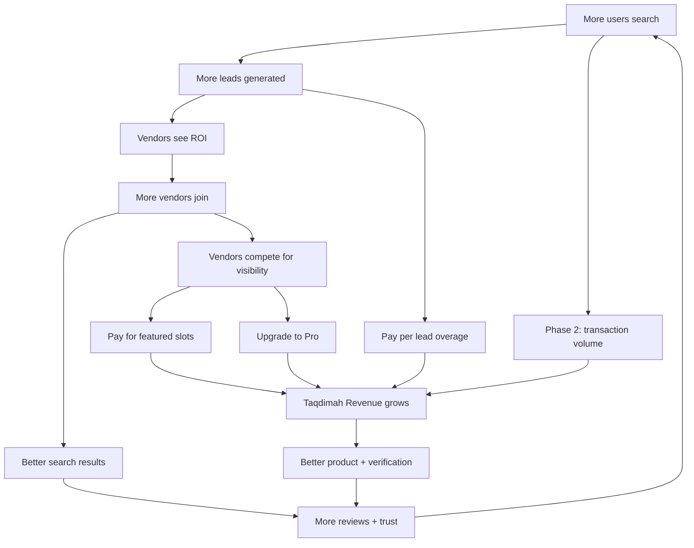

---

## Map 14 : Business Model Canvas (Visual)

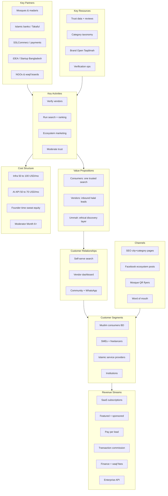

---

## Map 15 : Competitive Revenue Positioning

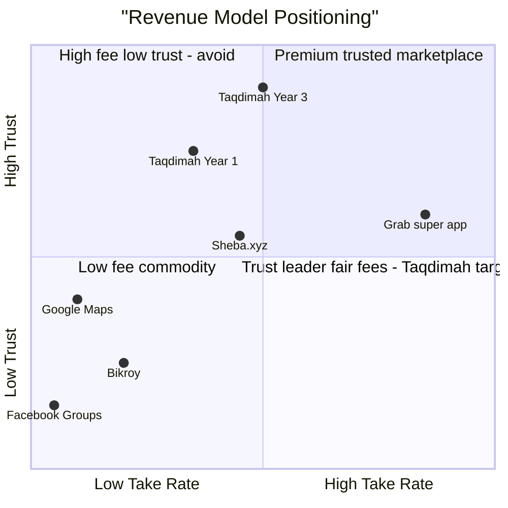

**Taqdimah target quadrant:** High trust + moderate fair fees (not the cheapest, not extractive).

---

## Map 16 : Possible vs Planned (Everything You CAN Do)

| # | Revenue model | Phase | Status | Halal fit |
|---|---------------|-------|--------|-----------|
| 1 | Free vendor tier (funnel) | P1 | Planned | Yes |
| 2 | Pro SaaS 999 BDT/mo | P1 | Planned | Yes |
| 3 | Business SaaS 2499 BDT/mo | P1 | Planned | Yes |
| 4 | Featured category slots | P1 | Planned | Yes : if labeled |
| 5 | City homepage banners | P1 | Planned | Yes : if labeled |
| 6 | Sponsored search CPC | P1 | Planned | Yes : if labeled |
| 7 | Pay-per-lead | P1 | Planned | Yes : wasīlah |
| 8 | Booking commission 5–12% | P2 | Planned | Yes : ju'ālah |
| 9 | Escrow payment processing | P2 | Planned | Yes : disclosed |
| 10 | Institution premium pages | P2 | Planned | Yes |
| 11 | In-app messaging (Pro gate) | P2 | Planned | Yes |
| 12 | Halal certification badge fee | P2 | Possible | Yes |
| 13 | Scholar verification fee | P2 | Possible | Yes |
| 14 | Islamic finance referrals | P3 | Planned | Yes : Shariah review |
| 15 | Takaful referrals | P3 | Possible | Yes |
| 16 | Waqf campaign platform fee | P3 | Planned | Yes : capped |
| 17 | NGO donation tooling | P3 | Possible | Yes : transparent |
| 18 | Enterprise API licensing | P3 | Planned | Yes |
| 19 | White-label search widget | P3 | Possible | Yes |
| 20 | Market insights reports | P3 | Possible | Yes |
| 21 | AI vendor copilot add-on | P3 | Possible | Yes |
| 22 | Recruitment / job listings | P4 | Possible | Yes |
| 23 | Halal product marketplace | P4 | Possible | Yes |
| 24 | Event ticketing (Islamic) | P4 | Possible | Yes |
| 25 | Training course marketplace | P4 | Possible | Yes |
| 26 | Affiliate halal products | P4 | Possible | Yes : no haram |
| 27 | Data licensing anonymized | P4 | Possible | Yes : privacy |
| 28 | Franchise listing fees | P4 | Possible | Yes |

**28 possible streams. MVP needs only #1–7.**

---

## Map 17 : Revenue Decision Tree (What to launch when)

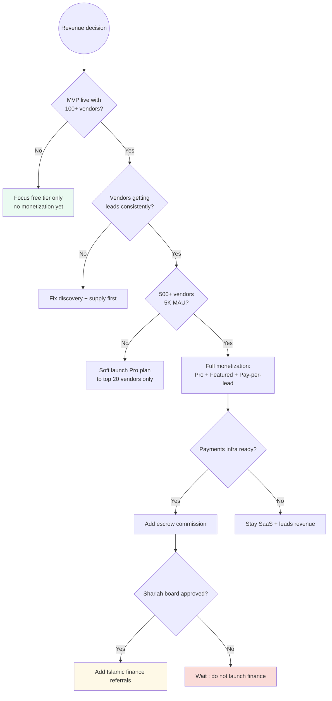

---

## Summary : All Revenue Through One Platform

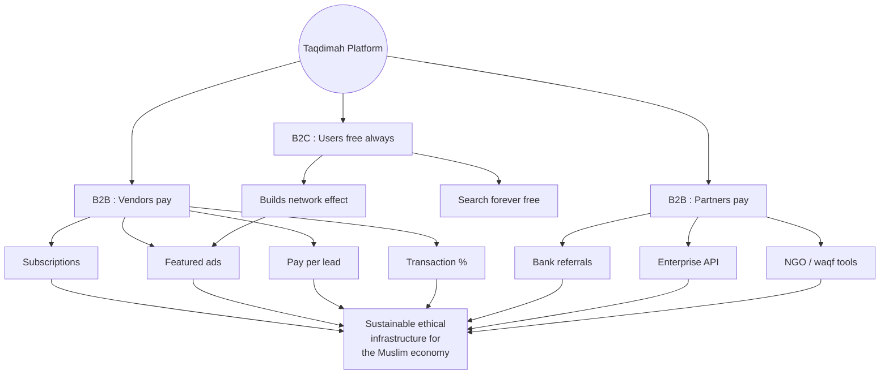

---

**Read next:** [BUSINESS_PLAN.md](./BUSINESS_PLAN.md) (full narrative) · [GUIDELINE_MAP.md](./GUIDELINE_MAP.md) · [PRD.md](./PRD.md)