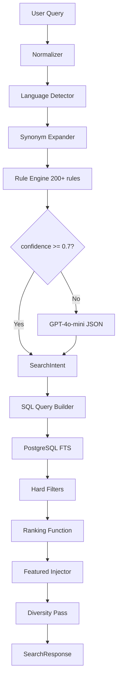
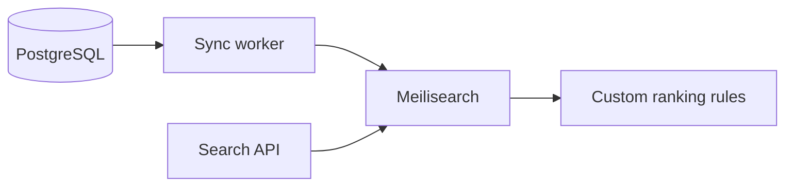

# Taqdimah : Search & Ranking Engine

**Version:** 1.0  
**Parent:** [PRD-TECHNICAL.md](./PRD-TECHNICAL.md) §7–8

---

## 1. Architecture Overview



---

## 2. Query Normalization

```typescript
function normalizeQuery(raw: string): string {
  return raw
    .trim()
    .toLowerCase()
    .replace(/\s+/g, ' ')
    .replace(/[^\p{L}\p{N}\s-]/gu, '') // unicode letters
    .normalize('NFC'); // Bengali unicode normalize
}
```

**Bengali handling:**
- Accept both Bengali and English in same query
- Transliteration map optional P2: "architect" ↔ "স্থপতি"

---

## 3. Intent Classification

### 3.1 Rule engine (priority order)

1. Exact synonym match → confidence 0.95
2. Regex pattern match → confidence 0.90
3. Multi-token keyword set → confidence 0.85
4. Category name substring → confidence 0.75
5. No match → confidence 0.0 → LLM fallback

### 3.2 Rule table (sample : full 200+ in seed)

| ID | Pattern | category_slug | lang |
|----|---------|---------------|------|
| R001 | `\b(architect\|স্থপতি)\b` | architects | both |
| R002 | `\b(ac repair\|এসি\|air cond)\b` | ac-repair | both |
| R003 | `\b(quran\|hifz\|তিলাওয়াত\|কুরআন)\b` | quran-teachers | both |
| R004 | `\b(halal cater\|হালাল ক্যাটার)\b` | halal-catering | both |
| R005 | `\b(moving\|relocation\|সামান)\b` | moving-companies | both |
| R006 | `\b(java\|react\|developer\|ডেভেলপার)\b` | software-developers | both |
| R007 | `\b(lawyer\|আইনজীবী\|legal)\b` | lawyers | both |
| R008 | `\b(electrician\|ইলেকট্রিশিয়ান)\b` | electricians | both |
| R009 | `\b(marriage\|wedding\|নিকাহ\|ফটোগ্রাফ)\b` | wedding-photographers | both |
| R010 | `\b(islamic finance\|হালাল ঋণ\|মুরাবাহা)\b` | islamic-finance | both |

### 3.3 Location extraction

```typescript
const CITY_ALIASES = {
  dhaka: ['dhaka', 'ঢাকা', 'dacca'],
  chattogram: ['chittagong', 'chattogram', 'চট্টগ্রাম'],
  sylhet: ['sylhet', 'সিলেট'],
};

const AREA_PATTERNS = {
  mirpur: ['mirpur', 'মিরপুর'],
  uttara: ['uttara', 'উত্তরা'],
  banani: ['banani', 'বনানী'],
  // ... 30+ areas
};
```

### 3.4 LLM fallback prompt (abbreviated)

```
You classify service search queries for Bangladesh marketplace.
Return JSON: { category_slug, city, area, keywords[], confidence, language }
Categories: [list of 50 slugs]
If ambiguous, set category_slug null and confidence < 0.5.
```

**Budget control:** Max 500 LLM calls/day at MVP.

---

## 4. SQL Query Construction

```sql
SELECT si.*
FROM search_index si
WHERE
  si.search_vector @@ plainto_tsquery('simple', :keywords)
  AND (:category_id IS NULL OR si.primary_category_id = :category_id)
  AND (
    :city IS NULL
    OR si.service_areas @> jsonb_build_array(jsonb_build_object('city', :city))
  )
ORDER BY
  rank_search(:weights, si) DESC
LIMIT :limit OFFSET :offset;
```

---

## 5. Ranking Function

### 5.1 Base score (organic)

```typescript
function organicScore(v: SearchIndexRow, intent: SearchIntent): number {
  const trust = v.trust_score / 5;                    // 0-1
  const rating = bayesianRating(v.avg_rating, v.review_count);
  const relevance = textRelevance(v, intent.keywords); // 0-1 FTS rank
  const geo = geoMatch(v.service_areas, intent.city, intent.area); // 0-1
  const freshness = freshnessBoost(v.last_active_at);
  const planBoost = v.plan === 'business' ? 0.05 : v.plan === 'pro' ? 0.02 : 0;

  return (
    relevance * 0.30 +
    trust * 0.25 +
    rating * 0.20 +
    geo * 0.15 +
    freshness * 0.10 +
    planBoost
  );
}
```

### 5.2 Bayesian rating

```typescript
function bayesianRating(avg: number, count: number, C = 10, m = 3.5): number {
  return (C * m + avg * count) / (C + count) / 5; // normalize 0-1
}
```

### 5.3 Freshness boost

| Days since last_active | Boost |
|------------------------|-------|
| < 7 | 1.0 |
| 7–30 | 0.8 |
| 30–90 | 0.5 |
| > 90 | 0.3 |

### 5.4 Geo match

| Match | Score |
|-------|-------|
| Exact area | 1.0 |
| Same city different area | 0.6 |
| National vendor | 0.4 |
| Wrong city | 0.0 (filtered out) |

---

## 6. Featured & Sponsored Injection

```typescript
function injectFeatured(
  organic: RankedVendor[],
  featured: FeaturedSlot[],
  hideSponsored: boolean
): RankedVendor[] {
  if (hideSponsored) return organic;

  const positions = [0, 3, 7]; // 1st, 4th, 8th on page
  const result = [...organic];
  let fi = 0;

  for (const pos of positions) {
    if (fi >= featured.length) break;
    const slot = featured[fi++];
    result.splice(pos, 0, {
      ...slot.vendor,
      placement_type: slot.slot_type,
      is_featured: true,
    });
  }

  return dedupeByVendorId(result).slice(0, 20);
}
```

**Rules:**
- Featured vendor must match `category_id` + `city`
- Max 3 per page
- Must have `verification_level >= 2`
- Label `placement_type: 'featured' | 'sponsored'` in API always

---

## 7. Diversity Pass

Prevent single vendor dominating:

```typescript
function diversityPass(results: RankedVendor[]): RankedVendor[] {
  const count = new Map<string, number>();
  return results.filter(v => {
    const n = count.get(v.id) || 0;
    if (n >= 1) return false; // max 1 per page
    count.set(v.id, n + 1);
    return true;
  });
}
```

---

## 8. Caching

```typescript
const cacheKey = `search:${hashIntent(intent)}:${page}:${hideSponsored}`;
// TTL 300 seconds
// Invalidate on: vendor.verified, review.created, featured_slot.changed
```

---

## 9. Search Quality Metrics

| Metric | Target | Action if miss |
|--------|--------|----------------|
| Zero-result rate | < 15% | Add synonyms |
| Click-through rate position 1 | > 25% | Tune ranking |
| Intent accuracy (manual sample) | > 85% | Add rules |
| p95 latency | < 2s | Index tuning |

**Weekly review:** Sample 100 search_logs, manual label intent correctness.

---

## 10. Migration to Meilisearch (Phase 2)

**Trigger:** > 10K vendors OR p95 > 2s consistently



Meilisearch settings:
```json
{
  "rankingRules": ["words", "typo", "proximity", "attribute", "sort", "exactness"],
  "sortableAttributes": ["trust_score", "avg_rating", "review_count"],
  "filterableAttributes": ["city", "category_slug", "verification_level", "halal_badge"]
}
```

---

**Related:** [TECHNICAL_DESIGN.md](./TECHNICAL_DESIGN.md) · [TRUST_SYSTEM.md](./TRUST_SYSTEM.md)