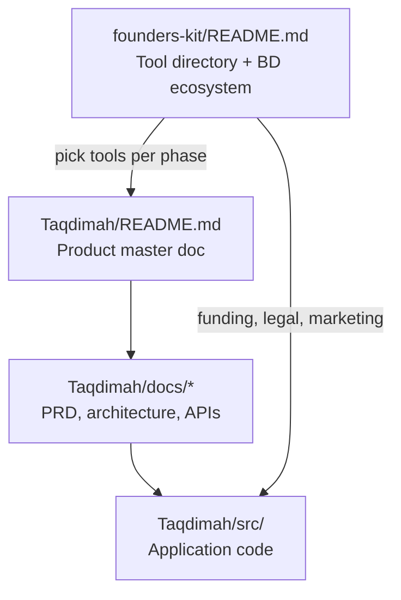
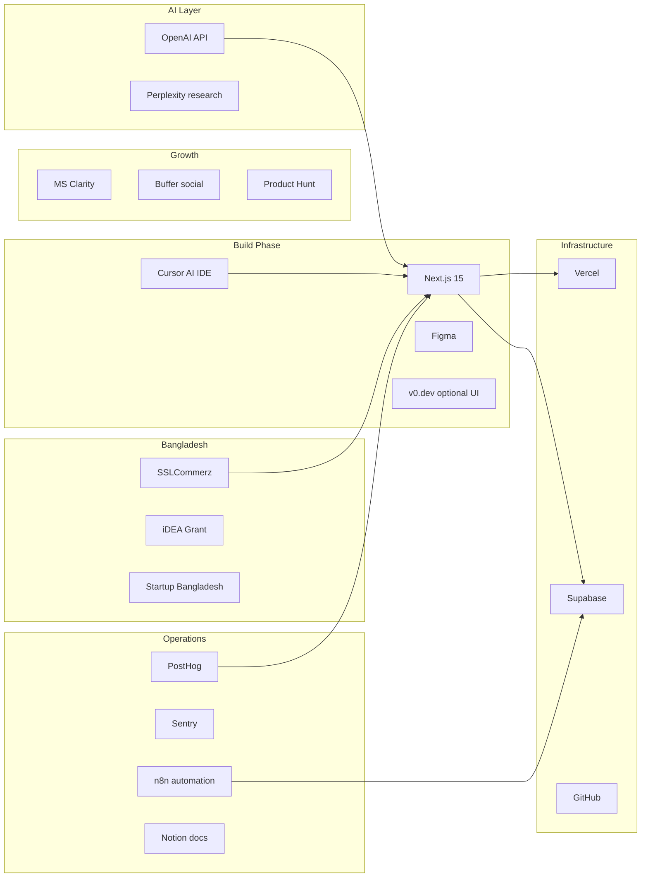
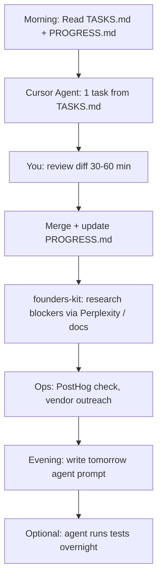
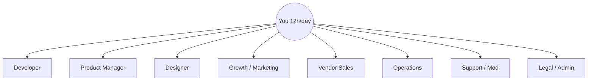

# Taqdimah : Setup, Toolchain & Founders Kit Integration

**Version:** 1.0  
**Parent resource:** [founders-kit README](../../README.md)  
**Budget:** ~$200/month (solo founder)  
**Work model:** One-person army + AI agents, 12h/day

---

## 1. How This Repo Fits Together



| Folder | Purpose |
|--------|---------|
| [`founders-kit/README.md`](../../README.md) | **Tool supermarket** : 100+ curated links by category. Use `Cmd+F` to find tools. Never buy a tool without checking here first. |
| `Taqdimah/` | **Product** : Muslim digital ecosystem platform |
| `Taqdimah/docs/` | **Specifications** : what to build |
| `Taqdimah/src/` | **Code** : implementation (starts at ALD-001) |

**Rule:** When you need a tool (payments, analytics, design, hosting), open [founders-kit/README.md](../../README.md), search the category, pick the Taqdimah-approved option from Section 3 below.

---

## 2. First-Time Setup (Step by Step)

### Step 1: Clone the repository

```bash
git clone https://github.com/Mahir101/startup-boot.git founders-kit
cd founders-kit/Taqdimah
```

### Step 2: Read documentation (mandatory before coding)

| Order | File | Time |
|-------|------|------|
| 1 | [../README.md](../README.md) | 10 min |
| 2 | [PRD.md](./PRD.md) | 30 min |
| 3 | [PRD-TECHNICAL.md](./PRD-TECHNICAL.md) | 60 min |
| 4 | [DATA_MODEL.md](./DATA_MODEL.md) | 45 min |
| 5 | [TASKS.md](./TASKS.md) | 15 min |

### Step 3: Install local development tools

| Tool | Install | founders-kit reference |
|------|---------|------------------------|
| Node.js 20 LTS | [nodejs.org](https://nodejs.org/) | : |
| Git | pre-installed | : |
| Cursor | [cursor.com](https://cursor.com/) | [AI Coding : Cursor](../../README.md) (Essential AI Startup Stack) |
| Supabase CLI | `npm i -g supabase` | [Supabase](../../README.md) (Automation & Backend) |
| Vercel CLI | `npm i -g vercel` | [Vercel](../../README.md) (Website & Hosting) |

### Step 4: Create accounts (free tiers first)

| Service | Sign up | Used for |
|---------|---------|----------|
| [GitHub](https://github.com/) | Repo + CI | Code hosting |
| [Supabase](https://supabase.com/) | Database, auth, storage | Core backend |
| [Vercel](https://vercel.com/) | Deploy | Production hosting |
| [OpenAI](https://platform.openai.com/) | API key | Search intent |
| [PostHog](https://posthog.com/) | Analytics | Funnels, MAU |
| [Sentry](https://sentry.io/) | Error tracking | Production bugs |
| [Figma](https://figma.com/) | Design | UI mockups (free) |

All linked from [founders-kit/README.md](../../README.md).

### Step 5: Initialize the app (when starting ALD-001)

```bash
cd founders-kit/Taqdimah
npx create-next-app@latest . --typescript --tailwind --eslint --app --src-dir --import-alias "@/*"
npx shadcn@latest init
npm install @supabase/supabase-js @supabase/ssr openai zod
```

### Step 6: Environment variables

Create `.env.local` (never commit):

```bash
# Supabase : from project Settings → API
NEXT_PUBLIC_SUPABASE_URL=https://xxxx.supabase.co
NEXT_PUBLIC_SUPABASE_ANON_KEY=eyJ...
SUPABASE_SERVICE_ROLE_KEY=eyJ...

# OpenAI : from platform.openai.com
OPENAI_API_KEY=sk-...

# App
NEXT_PUBLIC_APP_URL=http://localhost:3000
```

### Step 7: Supabase project setup

```bash
supabase login
supabase init
supabase link --project-ref YOUR_PROJECT_REF
supabase db push   # after migrations exist in Taqdimah/supabase/migrations/
```

### Step 8: Run locally

```bash
npm run dev
# Open http://localhost:3000
```

### Step 9: Deploy to production

```bash
vercel link
vercel env pull .env.local
git push origin main   # auto-deploys if Vercel connected to GitHub
```

---

## 3. Taqdimah Tool Stack (Mapped to Founders Kit)

This is the **approved stack** for Taqdimah. Each tool links back to the parent [founders-kit/README.md](../../README.md) section where more alternatives are listed.

### 3.1 Taqdimah tool mesh



### 3.2 Phase-by-phase tool selection

#### Phase 0 : Documentation & planning (now)

| Need | Use this | founders-kit section |
|------|----------|---------------------|
| Startup playbooks | [Y Combinator Startup School](https://www.ycombinator.com/library) | [Learning & Knowledge](../../README.md) |
| Network effects theory | [The Cold Start Problem](https://www.coldstartproblem.com/) | Books in Learning |
| Customer discovery | [The Mom Test](https://www.momtestbook.com/) | [Customer Development](../../README.md) |
| Market research | [Perplexity AI](https://www.perplexity.ai/) | [Essential AI Startup Stack](../../README.md) |
| Pitch deck | [Sequoia Template](https://www.sequoiacap.com/build/pitch-deck-template/) | [Fundraising](../../README.md) |
| BD ecosystem map | founders-kit BD sections | [Bangladesh Startup Ecosystem](../../README.md) |

#### Phase 1 : MVP build (Month 1–3)

| Need | Tool | Link in founders-kit | Monthly cost |
|------|------|---------------------|--------------|
| AI coding | **Cursor** | Essential AI Stack → AI Coding | $20 |
| UI design | **Figma** | Design Tools | $0 |
| Quick UI components | **v0.dev** | Essential AI Stack | $0–20 |
| Frontend | **Next.js** | : (in Taqdimah TDD) | $0 |
| Database + Auth | **Supabase** | Automation & Backend | $0–25 |
| Hosting | **Vercel** | Website & Hosting | $0–20 |
| Search intent AI | **OpenAI API** | Essential AI Stack → LLMs | $40–60 |
| UI components | **shadcn/ui** | : (code library) | $0 |
| Icons/images | **Unsplash**, **Icons8** | Stock Resources | $0 |
| Errors | **Sentry** | Monitoring & Logging | $0 |
| Analytics | **PostHog** | Analytics & Data | $0 |
| Session replay | **Microsoft Clarity** | Behavior Analytics | $0 |
| Task tracking | **GitHub Issues** + PROGRESS.md | : | $0 |
| Docs | **Notion** or repo markdown | Documentation | $0 |

#### Phase 2 : Growth & automation (Month 4–6)

| Need | Tool | founders-kit section | Cost |
|------|------|---------------------|------|
| Workflow automation | **n8n** | Automation & Backend | $0 self-host |
| Lead SMS alerts | Local SMS gateway / **Twilio** | Cloud Telephony programs | ~$10–20 |
| Transactional email | **Postmark** or **Resend** | Email & Newsletters | $0–10 |
| SEO meta tags | **Metatags.io** | Content & SEO | $0 |
| User feedback | **Canny** or **Feedbear** | User Feedback | $0 startup tier |
| Social scheduling | **Buffer** | Marketing Tools | $0 |
| Launch | **Product Hunt** | Places to Share | $0 |
| BD communities | **Startup Bangladesh Discord** | Bangladesh section | $0 |

#### Phase 3 : Monetization (Month 5+)

| Need | Tool | founders-kit section | Notes |
|------|------|---------------------|-------|
| BD payments | **SSLCommerz** | Payments (Bangladesh) | Primary for BDT |
| Backup gateway | **AamarPay** | Payments (Bangladesh) | Fallback |
| Global payments | **Stripe** | Payments | Expansion markets |
| Subscription billing | **Chargebee** program | Startup Programs | Phase 2+ |
| CRM (light) | Supabase tables first; then **HubSpot for Startups** | CRM & Support | Free startup tier |

#### Phase 4 : Funding & legal (Month 4–6 apply)

| Need | Resource | founders-kit section |
|------|----------|---------------------|
| Grant (prototype) | **iDEA Project** (BDT 10L) | Bangladesh → Accelerators |
| Seed equity | **Startup Bangladesh Ltd** | Bangladesh → VC |
| Angels | **Bangladesh Angels Network** | Bangladesh → VC |
| Incorporation | **RJSC** | Regulatory & Financials |
| Trade license | Local city corporation | Regulatory |
| Research reports | **LightCastle Partners** | News & Portals |
| Community | **Future Startup**, Discord | Communities |

---

## 4. Monthly $200 Budget (Mapped to Tools)

| Item | Tool (from founders-kit) | USD/mo |
|------|--------------------------|--------|
| AI IDE | [Cursor](https://cursor.com/) | $20 |
| LLM API | [OpenAI](https://platform.openai.com/) | $50–70 |
| Database | [Supabase](https://supabase.com/) Pro if needed | $0–25 |
| Hosting | [Vercel](https://vercel.com/) Pro if needed | $0–20 |
| SMS | Twilio / local gateway | $10–15 |
| Email | [Postmark](https://postmarkapp.com/) | $0–10 |
| Domain | [GoDaddy](https://godaddy.com/) or similar | ~$1 |
| Buffer | Unexpected API overage | $30–50 |
| **Total** | | **~$150–195** |

**Free tools that replace paid alternatives:**

| Instead of | Use (from founders-kit) | Savings |
|------------|-------------------------|---------|
| Jasper ($49+) | ChatGPT / Claude for copy | $49 |
| Ahrefs ($99+) | Google Search Console + PostHog | $99 |
| HubSpot full CRM | Supabase + spreadsheet MVP | $50+ |
| Zapier Pro | [n8n](https://n8n.io/) self-hosted | $20+ |
| Datadog | [Sentry](https://sentry.io/) + Vercel Analytics | $15+ |
| Linear | GitHub Issues | $8 |
| Midjourney | Figma + [Unsplash](https://unsplash.com/) | $10 |

---

## 5. How to Use Founders Kit Day-to-Day

### When you need X, go to Y

| I need to… | Open founders-kit section | Taqdimah action |
|------------|---------------------------|---------------|
| Find a payment gateway | [Payments](../../README.md) | SSLCommerz for BD MVP |
| Set up analytics | [Analytics & Data](../../README.md) | PostHog + Clarity |
| Design vendor profile page | [Design Tools](../../README.md) | Figma → v0.dev → Cursor |
| Automate lead notifications | [Automation & Backend](../../README.md) | n8n workflow |
| Write ecosystem marketing posts | [Marketing Tools](../../README.md) | Buffer schedule |
| Research competitors | [Inspiration & Discovery](../../README.md) | Bikroy, Sheba.xyz analysis |
| Apply for free credits | [Startup Programs & Credits](../../README.md) | Supabase, PostHog, Vercel programs |
| Launch publicly | [Places to Share & Promote](../../README.md) | Product Hunt, r/SideProject |
| Learn fundraising | [Fundraising](../../README.md) + BD roadmap | iDEA → SBDL path |
| Hire later | [Company Building](../../README.md) | Wellfound Bangladesh |
| Understand PMF | [Key Articles](../../README.md) | Retention is King, PMF essays |
| Legal setup | [Bangladesh Regulatory](../../README.md) | RJSC + trade license |

### founders-kit Quick Start (from parent README)

1. **Browse by category** : table of contents in [README.md](../../README.md)
2. **Search** : `Cmd+F` / `Ctrl+F` for tool name
3. **Bookmark** : star the repo
4. **Do not hoard tools** : pick one per category from Section 3 above

---

## 6. Agentic Development Workflow (One-Man Army)

### 6.1 Daily loop



### 6.2 Cursor agent prompt template

```
Context:
- Repo: founders-kit/Taqdimah/
- Parent tools: founders-kit/README.md (check before adding new services)
- Read: Taqdimah/docs/PRD-TECHNICAL.md, DATA_MODEL.md
- Task: [paste from TASKS.md e.g. ALD-005]

Constraints:
- Budget $200/mo : no new paid tools without approval
- Use Supabase + Vercel + OpenAI mini only
- Update docs/PROGRESS.md when done

founders-kit references for this task:
- [list relevant section e.g. Analytics → PostHog]
```

### 6.3 When stuck

| Blocker | founders-kit resource |
|---------|----------------------|
| How to validate idea | [Customer Development](../../README.md) + Mom Test book |
| SEO for `/dhaka/architects` | [Content & SEO](../../README.md) |
| Vendor won't join | [Traction book](https://www.tractionbook.com/) + ecosystem marketing in BUSINESS_PLAN |
| Payment integration | [SSLCommerz](https://www.sslcommerz.com/) in Payments section |
| Burnout | [Key Articles → Mental Health](../../README.md) |
| Architecture doubt | `Taqdimah/docs/PRD-TECHNICAL.md` + [Awesome CTO](https://github.com/kuchin/awesome-cto) in founders-kit |

---

## 7. Startup Credits to Apply For (Free Money)

Apply after MVP scaffold exists. All listed in [Startup Programs & Credits](../../README.md):

| Program | Benefit for Taqdimah | Apply when |
|---------|-------------------|------------|
| [Google Cloud for Startups](https://cloud.google.com/developers/startups/) | Backup infra credits | Month 2 |
| [Microsoft for Startups](https://startups.microsoft.com/) | Azure credits | Month 2 |
| [PostHog startups](https://posthog.com/) | Analytics scale | Month 3 |
| [Intercom Early Stage](https://www.intercom.com/early-stage) | Support chat P2 | Month 4 |
| [HubSpot for Startups](https://www.hubspot.com/startups) | CRM when scaling | Month 5 |
| [AWS Activate](https://aws.amazon.com/activate/) | If moving off Vercel | Month 6+ |
| [iDEA Project](https://idea.gov.bd/) | **BDT 10 lakh grant** | Month 4–5 |
| [Startup Bangladesh Ltd](https://startupbangladesh.vc/) | Seed equity | Month 6+ with traction |

---

## 8. Bangladesh-Specific Setup for Taqdimah

From [founders-kit Bangladesh sections](../../README.md):

### Legal (before iDEA / SBDL)

1. **Trade license** : local city corporation
2. **RJSC incorporation** : [roc.gov.bd](https://roc.gov.bd/)
3. **Bank account** : business account for SSLCommerz

### Payments (vendor subscriptions + escrow P2)

| Priority | Gateway | founders-kit link |
|----------|---------|-------------------|
| 1 | SSLCommerz | [Payments → Bangladesh](../../README.md) |
| 2 | AamarPay | Same section |
| 3 | ShurjoPay | Same section |

### Hosting (if BDIX latency matters later)

| Provider | When | founders-kit link |
|----------|------|-------------------|
| Vercel | MVP (global CDN) | Website & Hosting |
| ExonHost / XeonBD | BD-specific media | Website & Hosting → Bangladesh |

### Community distribution

| Channel | Use for Taqdimah |
|---------|----------------|
| [Startup Bangladesh Discord](https://discord.gg/startupbangladesh) | Beta vendors + users |
| [Future Startup](https://futurestartup.com/) | PR story |
| Facebook groups | Ecosystem demand posts |
| Mosque partnerships | QR → category pages |

---

## 9. Tool Decision Matrix (Use / Skip)

| founders-kit tool | Taqdimah verdict | Reason |
|-------------------|----------------|--------|
| Cursor | **USE** | Primary builder |
| Supabase | **USE** | Core backend |
| Vercel | **USE** | Deploy + SEO |
| OpenAI | **USE** | Intent parser |
| PostHog | **USE** | Product analytics |
| Sentry | **USE** | Errors |
| Figma | **USE** | Design |
| n8n | **USE** | Automation P2 |
| SSLCommerz | **USE** | BD payments |
| Perplexity | **USE** | Research |
| v0.dev | **OPTIONAL** | UI speed |
| Lovable/Bolt | **SKIP** | Vendor lock, expensive |
| Firebase | **SKIP** | Supabase chosen |
| AWS full stack | **SKIP** | Overkill for MVP |
| Ahrefs | **SKIP** | Too expensive |
| HubSpot | **LATER** | After 100 vendors |
| Jasper/Copy.ai Pro | **SKIP** | ChatGPT enough |
| Bubble | **SKIP** | Need custom platform |
| Datadog | **SKIP** | Sentry enough |

---

## 10. Environment Checklist (Before ALD-001)

- [ ] `founders-kit` repo cloned
- [ ] Read `Taqdimah/README.md` + `PRD-TECHNICAL.md`
- [ ] Cursor installed and opened on `founders-kit/`
- [ ] GitHub account + repo access
- [ ] Supabase project created (ap-south-1 preferred)
- [ ] Vercel account linked to GitHub
- [ ] OpenAI API key with $50 spending limit set
- [ ] PostHog project created
- [ ] Sentry project created
- [ ] Figma account for wireframes
- [ ] `founders-kit/README.md` bookmarked for tool lookups
- [ ] `.env.local` template ready (Section 2 Step 6)

---

## 11. Recommended Reading from Founders Kit (Taqdimah-Specific)

| Topic | Resource in founders-kit |
|-------|--------------------------|
| Marketplace cold start | [The Cold Start Problem](https://www.coldstartproblem.com/) |
| Network effects | Startup Architecture mesh diagrams in [README](../../README.md) |
| Do things that don't scale | [Paul Graham : Do Things That Don't Scale](http://paulgraham.com/ds.html) |
| Bangladesh funding path | [Investment Roadmap](../../README.md) |
| Dhaka → global bridge | Holy Grail Bridge diagram in [README](../../README.md) |
| PMF | [12 Things About PMF : a16z](https://a16z.com/12-things-about-product-market-fit) |
| Retention | [Retention is King](http://andrewchen.co/retention-is-king/) |
| BD YouTube ecosystem | [Business Inspection BD](https://www.youtube.com/@BusinessInspectionBD) |

---

## 12. Support & Community

| Resource | Link |
|----------|------|
| Parent repo issues | [GitHub Issues](https://github.com/Mahir101/startup-boot/issues) |
| BD founder community | [Startup Bangladesh Discord](https://discord.gg/startupbangladesh) |
| Taqdimah progress | [PROGRESS.md](./PROGRESS.md) |

---

**Next step:** Complete Section 10 checklist → start [TASKS.md](./TASKS.md) ALD-001.

**Parent tool directory:** [founders-kit/README.md](../../README.md)

---

## 13. One-Man Army : Extended Toolkit (More Tools)

You are one person doing the job of ~8 roles. Below are **additional tools** beyond Section 3 : organized by the hat you wear each hour. Total extra cost should stay within your $200/mo if you prioritize **free tiers**.

### 13.1 The 8 hats of a solo Taqdimah founder



---

### 13.2 AI agents : your virtual team (highest ROI)

Use **different AI tools for different jobs**. Do not use one chat for everything.

| Tool | Role | Use for Taqdimah | Cost | founders-kit |
|------|------|----------------|------|--------------|
| [Cursor](https://cursor.com/) | Senior dev | Build features from TASKS.md | $20/mo | Essential AI Stack |
| [Claude](https://claude.ai/) | Architect + reviewer | Review PRD, catch logic bugs, write policies | $20/mo or free tier | Essential AI Stack |
| [ChatGPT](https://chat.openai.com/) | Generalist | Vendor outreach copy, brainstorming | $20/mo or free | AI Tools |
| [Perplexity](https://perplexity.ai/) | Researcher | Competitor analysis, BD market data, fatwa/policy research | Free–$20 | Essential AI Stack |
| [v0.dev](https://v0.dev/) | UI generator | Vendor profile, search results, dashboard screens | Free credits | Essential AI Stack |
| [DeepSeek](https://www.deepseek.com/) | Cheap coding backup | Simple scripts when OpenAI budget tight | Very low API | Essential AI Stack |
| [GitHub Copilot](https://github.com/features/copilot) | Autocomplete | Optional if Cursor enough | $10/mo | : |

**Agent stack workflow:**
```
Claude  → read PRD-TECHNICAL, plan the task
Cursor  → implement code
Claude  → review diff before merge
ChatGPT → write vendor onboarding WhatsApp template
Perplexity → research SSLCommerz integration docs
```

---

### 13.3 Development & DevOps (ship faster alone)

| Tool | Use for Taqdimah | Cost | When |
|------|----------------|------|------|
| [GitHub Actions](https://github.com/features/actions) | CI: lint, test, build on every PR | Free | ALD-001+ |
| [Trigger.dev](https://trigger.dev/) or [Inngest](https://www.inngest.com/) | Background jobs: trust score, email, index refresh | Free tier | Month 3+ |
| [Upstash Redis](https://upstash.com/) | Rate limiting, search cache | Free tier | Month 4+ |
| [Resend](https://resend.com/) | Transactional email (lead alerts) | Free 3k/mo | Month 2+ |
| [Turbo](https://turbo.build/) | Monorepo speed if repo grows | Free | Later |
| [Playwright](https://playwright.dev/) | E2E tests for search → lead flow | Free | Month 3+ |
| [Vitest](https://vitest.dev/) | Unit tests trust score, intent parser | Free | Month 2+ |
| [DeepSource](https://deepsource.io/) | Auto code review | Free startup program | founders-kit Startup Programs |

---

### 13.4 Design & content (look pro without a designer)

| Tool | Use for Taqdimah | Cost |
|------|----------------|------|
| [Figma](https://figma.com/) | Wireframes all pages | Free |
| [v0.dev](https://v0.dev/) | Generate shadcn components | Free–$20 |
| [Canva](https://canva.com/) | Social posts, mosque flyers, QR posters | Free |
| [Unsplash](https://unsplash.com/) + [Undraw](https://undraw.co/) | Hero images, empty states | Free |
| [Icons8](https://icons8.com/) | Category icons | Free tier |
| [Mobbin](https://mobbin.com/) | Copy UX patterns from Bikroy, Airbnb, Sheba | Free tier |
| [Remove.bg](https://remove.bg/) | Vendor logo cleanup | Free tier |
| [Captions.ai](https://www.captions.ai/) | Bengali marketing reels | founders-kit AI Tools |
| [Lumen5](https://lumen5.com/) | Turn blog → video for Facebook | founders-kit AI Tools |
| [Metatags.io](https://metatags.io/) | SEO preview for city+category pages | Free |

---

### 13.5 Growth & ecosystem marketing (your main GTM weapon)

| Tool | Use for Taqdimah | Cost |
|------|----------------|------|
| [Buffer](https://buffer.com/) | Schedule FB/LinkedIn demand posts | Free tier |
| [Notion](https://notion.so/) | Content calendar, vendor pipeline CRM | Free |
| [Google Sheets](https://sheets.google.com/) | Track 500 vendor onboarding spreadsheet | Free |
| [WhatsApp Business](https://business.whatsapp.com/) | Vendor outreach, lead alerts | Free |
| [Telegram](https://telegram.org/) | Beta tester group | Free |
| [Typeform](https://typeform.com/) or [Tally](https://tally.so/) | Vendor waitlist + user surveys | Free |
| [Google Search Console](https://search.google.com/search-console) | Index `/dhaka/architects` pages | Free |
| [Google Trends](https://trends.google.com/) | Which categories trending in BD | Free |
| [SimilarWeb](https://similarweb.com/) extension | Bikroy/Sheba traffic research | Free tier |
| [Product Hunt Ship](https://www.producthunt.com/ship) | Pre-launch waitlist page | Free |
| [Hashnode](https://hashnode.com/) | "Building Taqdimah" dev blog for SEO | Free |

**Ecosystem post template (use Buffer):**
> "উত্তরায় ১৫০ জনের হালাল ক্যাটারিং দরকার শুক্রবার। Trusted vendor কে recommend করেন? আমরা Taqdimah এ verified list তৈরি করছি।"

---

### 13.6 Vendor onboarding at scale (you alone, 500 vendors)

This is your bottleneck. These tools help:

| Tool | Use for Taqdimah | Cost |
|------|----------------|------|
| [Google Maps](https://maps.google.com/) | Find AC repair, architects, caterers in Dhaka | Free |
| [Apollo.io](https://apollo.io/) or [Hunter.io](https://hunter.io/) | Find business emails (global vendors) | Free tier |
| [n8n](https://n8n.io/) | Scrape → CSV → Supabase bulk import pipeline | Free self-host |
| [Airtable](https://airtable.com/) | Vendor pipeline: found → contacted → verified → live | Free | founders-kit Automation |
| [Loom](https://loom.com/) | 2-min "how to claim your profile" video for vendors | Free | founders-kit Team Management |
| [Calendly](https://calendly.com/) | Book verification calls with vendors | Free | founders-kit Team Management |
| [Scribe](https://scribehow.com/) | Auto-generate vendor dashboard tutorial | Free | founders-kit Documentation |
| [QR Code Generator](https://www.qr-code-generator.com/) | Mosque flyers → `/dhaka/quran-teachers` | Free |

**Manual seed workflow (Month 1):**
```
Google Maps → find 20 vendors/category
WhatsApp → "We're listing trusted [category] on Taqdimah : free profile"
Airtable → track status
Admin CSV import → Taqdimah/docs/API_REFERENCE admin import
Vendor claims profile → verification queue
```

---

### 13.7 Operations & automation (run while you sleep)

| Tool | Use for Taqdimah | Cost |
|------|----------------|------|
| [n8n](https://n8n.io/) | Lead → WhatsApp + email + Slack notify | Free |
| [Make](https://make.com/) | Alternative to n8n if you prefer UI | Free tier | founders-kit |
| [Zapier](https://zapier.com/) | Only if n8n too hard | Free 100 tasks | founders-kit |
| [UptimeRobot](https://uptimerobot.com/) | Alert if Taqdimah.app down | Free | founders-kit Monitoring |
| [Better Stack](https://betterstack.com/) | Uptime + incident | Free tier |
| [Cron-job.org](https://cron-job.org/) | Hit `/api/cron/expire-leads` until Inngest ready | Free |
| [Slack](https://slack.com/) or [Discord](https://discord.com/) | Your own alert channel for new leads | Free |

**n8n workflows to build (Month 3):**
1. New lead → WhatsApp vendor + email user
2. Nightly → vendor performance digest to you
3. Verification submitted → Telegram alert to you
4. New review → update trust score trigger

---

### 13.8 Analytics & decisions (know what to build next)

| Tool | Use for Taqdimah | Cost |
|------|----------------|------|
| [PostHog](https://posthog.com/) | Funnels: search → profile → lead | Free 1M events |
| [Microsoft Clarity](https://clarity.microsoft.com/) | Heatmaps : where users drop on search | Free |
| [Google Looker Studio](https://lookerstudio.google.com/) | Weekly dashboard: leads, vendors, cities | Free | founders-kit |
| [June](https://june.so/) | SaaS metrics pretty dashboard | Free tier | founders-kit Analytics |
| [Mixpanel](https://mixpanel.com/) | Alternative : apply startup program | Free startup | founders-kit Programs |

**Metrics to watch solo:**
- Zero-result search rate → add categories/synonyms
- Lead → response rate → chase vendors
- Profile view → lead conversion → fix CTA
- Vendor churn on free plan → improve lead quality

---

### 13.9 Support & moderation (without a team)

| Tool | Use for Taqdimah | Cost |
|------|----------------|------|
| [Crisp](https://crisp.chat/) | Live chat on site | Free startup program | founders-kit Programs |
| [Intercom](https://intercom.com/) | When scale : early stage program | Free startup | founders-kit Programs |
| [Canny](https://canny.io/) | Feature requests from users | Free tier | founders-kit User Feedback |
| [Feedbear](https://feedbear.com/) | Public roadmap | Free early stage | founders-kit Programs |
| [Notion](https://notion.so/) | FAQ + trust policy + halal guidelines public page | Free |

---

### 13.10 Legal, admin & money (Bangladesh)

| Tool | Use for Taqdimah | Cost |
|------|----------------|------|
| RJSC + Trade License | Legally operate + iDEA eligible | Govt fees |
| [SSLCommerz](https://sslcommerz.com/) | Vendor subscription payments | Per txn | founders-kit Payments |
| [Google Docs](https://docs.google.com/) | Terms of Service, Privacy Policy drafts | Free |
| Claude / ChatGPT | Draft T&C → lawyer review later | Included |
| [Wave](https://waveapps.com/) or spreadsheet | Track revenue, expenses | Free |
| [iDEA](https://idea.gov.bd/) | BDT 10L grant | Free to apply |
| [Notion](https://notion.so/) | Investor data room when fundraising | Free |

---

### 13.11 Communication & focus (12h/day without burnout)

| Tool | Use for Taqdimah | Cost |
|------|----------------|------|
| [Todoist](https://todoist.com/) | Daily 3 tasks max | Free | founders-kit PM |
| [Google Calendar](https://calendar.google.com/) | Time block: code AM, vendors PM | Free |
| [Freedom](https://freedom.to/) or phone DND | Deep work blocks | Optional |
| [Loom](https://loom.com/) | Async updates to mentors/investors | Free |
| [Slack](https://slack.com/) | Startup Bangladesh Discord for mentors | Free |

**Suggested 12h split:**
| Block | Hours | Tools |
|-------|-------|-------|
| Deep code (Cursor) | 4h | Cursor, GitHub |
| Vendor outreach | 3h | WhatsApp, Airtable, Sheets |
| Review + deploy | 1h | Vercel, Sentry |
| Marketing posts | 2h | Canva, Buffer |
| Analytics + plan | 1h | PostHog, Notion |
| Learning | 1h | founders-kit README, YC videos |

---

### 13.12 Recommended "stack packs" by month

**Month 1 : Build ($20–40/mo)**
```
Cursor + Supabase + Vercel + Figma + v0 + GitHub Actions + Notion + Google Sheets
```

**Month 2 : Launch ($60–80/mo)**
```
Above + OpenAI API + Resend + PostHog + Clarity + WhatsApp Business + Canva + Buffer
```

**Month 3 : Grow ($100–150/mo)**
```
Above + n8n + Loom + Calendly + Typeform + Playwright + UptimeRobot + Crisp
```

**Month 4–6 : Monetize ($150–200/mo)**
```
Above + SSLCommerz + Apply iDEA + Canny + Product Hunt launch + Trigger.dev
```

---

### 13.13 Tools to avoid as solo founder (saves money + focus)

| Tool | Why skip |
|------|----------|
| HubSpot full suite | Overkill until 100+ paying vendors |
| AWS from day 1 | Vercel + Supabase enough |
| Ahrefs / SEMrush | Google Search Console free |
| Jasper / Copy.ai Pro | ChatGPT enough |
| Lovable / Bolt.new Pro | Cursor builds the real product |
| Multiple LLM subscriptions | Pick Cursor + one of Claude/ChatGPT |
| Hiring agency for BD outreach | You do first 100 vendors manually |
| Custom mobile app Month 1 | PWA mobile web first |

---

### 13.14 Ultimate one-man army stack (summary)

| Layer | Tools |
|-------|-------|
| **Brain** | Cursor, Claude, Perplexity, ChatGPT |
| **Build** | Next.js, Supabase, Vercel, GitHub Actions |
| **Design** | Figma, v0, shadcn, Canva, Unsplash |
| **Grow** | Buffer, WhatsApp, Google SEO, Product Hunt |
| **Onboard vendors** | Google Maps, Airtable, Loom, Calendly, CSV import |
| **Automate** | n8n, Resend, Trigger.dev, Cron |
| **Measure** | PostHog, Clarity, Looker Studio |
| **Support** | Crisp, Notion FAQ, Canny |
| **Money** | SSLCommerz, Wave, iDEA grant |
| **Reference** | [founders-kit/README.md](../../README.md) |

**You + this stack = engineer + PM + designer + growth + sales + ops.**

That is how one person builds a platform that normally needs 8–10 people.