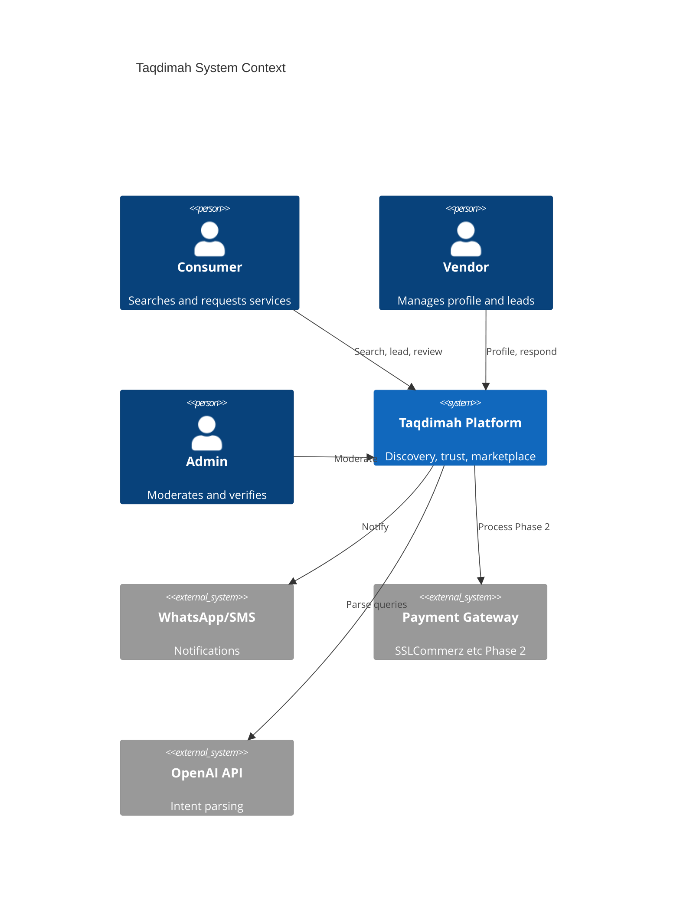
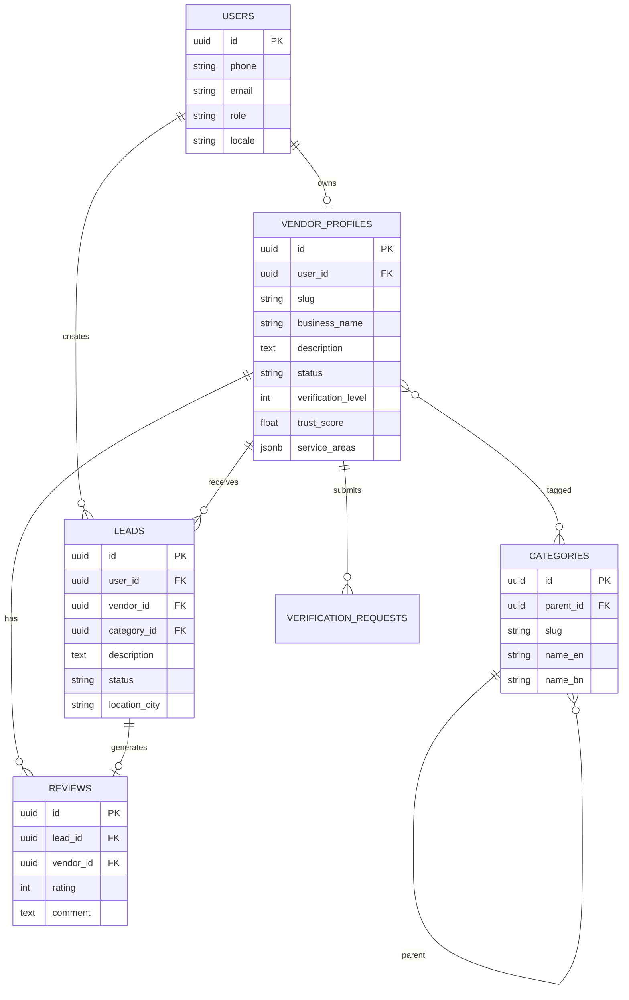
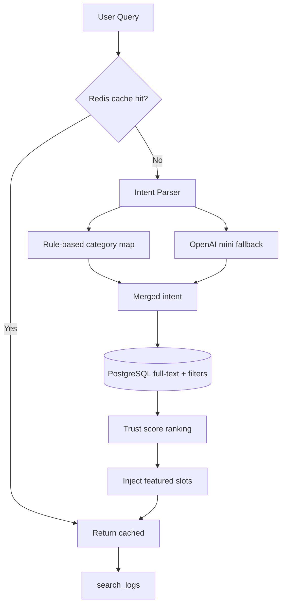

# Taqdimah : Technical Specifications

**Version:** 1.0  
**Companion to:** [PRD.md](./PRD.md) · [FEATURES.md](./FEATURES.md) · [ARCHITECTURE.md](./ARCHITECTURE.md)

---

## 1. System Context



---

## 2. User Roles & Permissions

| Role | Permissions |
|------|-------------|
| `guest` | Search, view public profiles, cannot submit lead without login |
| `user` | Search, lead, review, manage own leads |
| `vendor` | All user perms + dashboard, profile edit, lead respond |
| `moderator` | Review queue, hide content, no billing |
| `admin` | Full access, featured slots, user suspend |

---

## 3. Data Models

### 3.1 Entity Relationship



### 3.2 Table Definitions (PostgreSQL)

```sql
-- users (extends Supabase auth.users via profiles)
CREATE TABLE profiles (
  id UUID PRIMARY KEY REFERENCES auth.users(id) ON DELETE CASCADE,
  full_name TEXT,
  phone TEXT UNIQUE,
  role TEXT NOT NULL DEFAULT 'user' CHECK (role IN ('user','vendor','moderator','admin')),
  locale TEXT DEFAULT 'bn',
  avatar_url TEXT,
  created_at TIMESTAMPTZ DEFAULT NOW()
);

CREATE TABLE categories (
  id UUID PRIMARY KEY DEFAULT gen_random_uuid(),
  parent_id UUID REFERENCES categories(id),
  slug TEXT UNIQUE NOT NULL,
  name_en TEXT NOT NULL,
  name_bn TEXT NOT NULL,
  icon TEXT,
  sort_order INT DEFAULT 0,
  is_active BOOLEAN DEFAULT TRUE
);

CREATE TABLE vendor_profiles (
  id UUID PRIMARY KEY DEFAULT gen_random_uuid(),
  user_id UUID NOT NULL REFERENCES profiles(id) ON DELETE CASCADE,
  slug TEXT UNIQUE NOT NULL,
  business_name TEXT NOT NULL,
  description TEXT,
  logo_url TEXT,
  cover_url TEXT,
  phone TEXT NOT NULL,
  whatsapp TEXT,
  website TEXT,
  primary_category_id UUID REFERENCES categories(id),
  service_areas JSONB DEFAULT '[]',
  verification_level INT DEFAULT 0,
  verification_status TEXT DEFAULT 'draft'
    CHECK (verification_status IN ('draft','pending','verified','rejected','suspended')),
  trust_score DECIMAL(5,2) DEFAULT 0,
  plan TEXT DEFAULT 'free' CHECK (plan IN ('free','pro','business')),
  is_featured BOOLEAN DEFAULT FALSE,
  featured_until TIMESTAMPTZ,
  profile_views INT DEFAULT 0,
  response_rate DECIMAL(5,2) DEFAULT 0,
  created_at TIMESTAMPTZ DEFAULT NOW(),
  updated_at TIMESTAMPTZ DEFAULT NOW()
);

CREATE TABLE vendor_categories (
  vendor_id UUID REFERENCES vendor_profiles(id) ON DELETE CASCADE,
  category_id UUID REFERENCES categories(id) ON DELETE CASCADE,
  PRIMARY KEY (vendor_id, category_id)
);

CREATE TABLE verification_requests (
  id UUID PRIMARY KEY DEFAULT gen_random_uuid(),
  vendor_id UUID REFERENCES vendor_profiles(id) ON DELETE CASCADE,
  level INT NOT NULL,
  document_urls JSONB,
  notes TEXT,
  reviewed_by UUID REFERENCES profiles(id),
  status TEXT DEFAULT 'pending' CHECK (status IN ('pending','approved','rejected')),
  created_at TIMESTAMPTZ DEFAULT NOW()
);

CREATE TABLE leads (
  id UUID PRIMARY KEY DEFAULT gen_random_uuid(),
  user_id UUID REFERENCES profiles(id),
  vendor_id UUID REFERENCES vendor_profiles(id),
  category_id UUID REFERENCES categories(id),
  description TEXT NOT NULL,
  location_city TEXT NOT NULL,
  location_area TEXT,
  budget_min INT,
  budget_max INT,
  urgency TEXT,
  contact_phone TEXT NOT NULL,
  contact_method TEXT DEFAULT 'whatsapp',
  status TEXT DEFAULT 'sent' CHECK (status IN ('sent','viewed','responded','closed','spam')),
  vendor_response TEXT,
  responded_at TIMESTAMPTZ,
  created_at TIMESTAMPTZ DEFAULT NOW()
);

CREATE TABLE reviews (
  id UUID PRIMARY KEY DEFAULT gen_random_uuid(),
  lead_id UUID UNIQUE REFERENCES leads(id),
  user_id UUID REFERENCES profiles(id),
  vendor_id UUID REFERENCES vendor_profiles(id),
  rating INT CHECK (rating BETWEEN 1 AND 5),
  comment TEXT,
  vendor_reply TEXT,
  is_visible BOOLEAN DEFAULT TRUE,
  created_at TIMESTAMPTZ DEFAULT NOW()
);

CREATE TABLE search_logs (
  id UUID PRIMARY KEY DEFAULT gen_random_uuid(),
  query TEXT NOT NULL,
  parsed_category_id UUID,
  parsed_city TEXT,
  results_count INT,
  user_id UUID,
  created_at TIMESTAMPTZ DEFAULT NOW()
);

CREATE TABLE featured_slots (
  id UUID PRIMARY KEY DEFAULT gen_random_uuid(),
  vendor_id UUID REFERENCES vendor_profiles(id),
  category_id UUID REFERENCES categories(id),
  city TEXT NOT NULL,
  starts_at TIMESTAMPTZ NOT NULL,
  ends_at TIMESTAMPTZ NOT NULL,
  slot_type TEXT DEFAULT 'featured' CHECK (slot_type IN ('featured','sponsored'))
);
```

---

## 4. API Specification

### 4.1 Public APIs

#### `GET /api/search`

**Query params:**
| Param | Type | Required |
|-------|------|----------|
| q | string | Yes |
| city | string | No |
| category | string | No |
| page | int | No |
| limit | int | No (max 20) |

**Response:**
```json
{
  "query": "AC repair Mirpur",
  "parsed": {
    "category_slug": "ac-repair",
    "city": "dhaka",
    "area": "mirpur",
    "keywords": ["ac", "repair"]
  },
  "results": [
    {
      "id": "uuid",
      "slug": "cool-air-services",
      "business_name": "Cool Air Services",
      "trust_score": 4.7,
      "verification_level": 3,
      "avg_rating": 4.5,
      "review_count": 23,
      "is_featured": false,
      "primary_category": "AC Repair"
    }
  ],
  "total": 15,
  "page": 1
}
```

#### `GET /api/vendors/[slug]`

Returns full public vendor profile + reviews summary.

#### `POST /api/leads`

**Auth:** required (user)

**Body:**
```json
{
  "vendor_id": "uuid",
  "category_id": "uuid",
  "description": "Need AC servicing for 2 units",
  "location_city": "dhaka",
  "location_area": "mirpur",
  "contact_phone": "+8801XXXXXXXXX",
  "contact_method": "whatsapp"
}
```

**Response:** `201` with lead object.

---

### 4.2 Vendor APIs

| Method | Path | Description |
|--------|------|-------------|
| GET | /api/vendor/dashboard | Stats overview |
| PATCH | /api/vendor/profile | Update profile |
| GET | /api/vendor/leads | List leads |
| PATCH | /api/vendor/leads/[id] | Respond / close |
| POST | /api/vendor/verification | Submit docs |

---

### 4.3 Admin APIs

| Method | Path | Description |
|--------|------|-------------|
| GET | /api/admin/verification-queue | Pending verifications |
| PATCH | /api/admin/vendors/[id]/verify | Approve/reject |
| POST | /api/admin/featured-slots | Schedule featured |
| GET | /api/admin/reports | Flagged content |

---

## 5. Search & Intent Pipeline



**Rule-based examples (no LLM cost):**
| Query pattern | Category |
|---------------|----------|
| architect, architectural | architects |
| AC, air conditioner | ac-repair |
| Quran, hifz, তিলাওয়াত | quran-teachers |
| halal catering | halal-catering |
| moving, relocation | moving-companies |

**LLM used when:** confidence < 0.7 from rules.

---

## 6. Trust Score Computation

**Trigger events:**
- New review
- Verification approved
- Lead responded / ignored
- Profile field updated

**Pseudocode:**
```typescript
function computeTrustScore(vendor: VendorProfile): number {
  const vScore = vendor.verification_level / 4; // 0-1
  const rScore = vendor.avg_rating / 5;         // 0-1
  const respScore = vendor.response_rate / 100; // 0-1
  const completeScore = profileCompleteness(vendor);

  return (
    vScore * 0.35 +
    rScore * 0.35 +
    respScore * 0.20 +
    completeScore * 0.10
  ) * 5; // scale 0-5
}
```

---

## 7. Notification Events

| Event | Channel | Recipient |
|-------|---------|-----------|
| lead.created | Email, SMS (P1) | Vendor |
| lead.responded | Email | User |
| verification.approved | Email, SMS | Vendor |
| review.received | Email | Vendor |
| review.prompt | Email | User (7d after close) |

---

## 8. Page Routes (Next.js App Router)

```
/                           Home + search
/search?q=                  Search results
/[city]                     City hub
/[city]/[category]          City category listing
/categories/[slug]          National category
/v/[slug]                   Vendor profile
/login                      Auth
/register                   User signup
/register/vendor            Vendor signup
/dashboard                  User leads
/vendor                     Vendor dashboard
/vendor/leads               Lead inbox
/vendor/profile             Edit profile
/vendor/upgrade             Pricing
/admin                      Admin console
/about                      About Taqdimah
/trust                      Trust & safety policy
/halal-policy               Islamic business policy
```

---

## 9. Edge Cases & Business Rules

| Case | Rule |
|------|------|
| Vendor not verified | Profile not in search index |
| User spam leads | Rate limit 5/day, captcha on threshold |
| Duplicate vendor | Phone + business name fuzzy match flag |
| Offensive review | Auto-flag keywords, moderator queue |
| Featured + sponsored | Max 3 featured per category+city page |
| Vendor bypass contact | Still allowed Phase 1; value locked in reviews + premium |
| Scholar false credential | L4 requires manual credential check |
| Cross-city lead | Show vendors with matching service_areas |

---

## 10. Integrations (Phased)

| Integration | Phase | Purpose |
|-------------|-------|---------|
| Supabase Auth | P0 | Phone OTP, Google |
| Supabase Storage | P0 | Docs, images |
| OpenAI API | P0 | Intent fallback |
| Resend / SMS gateway | P0/P1 | Notifications |
| SSLCommerz | P2 | Payments |
| WhatsApp Business API | P1 | Lead alerts |
| PostHog | P0 | Analytics |
| Sentry | P0 | Errors |
| Google Search Console | P0 | SEO |

---

## 11. Security Requirements

- Row Level Security on all Supabase tables
- Vendor can only edit own profile
- User can only see own leads
- Admin routes protected by role middleware
- Document URLs signed, expire 1h
- PII encrypted at rest (Supabase default)
- CSRF protection on mutations
- Rate limiting on search and lead APIs

---

## 12. Performance & Indexing

```sql
CREATE INDEX idx_vendor_city_category ON vendor_profiles (verification_status, trust_score DESC);
CREATE INDEX idx_vendor_slug ON vendor_profiles (slug);
CREATE INDEX idx_leads_vendor_status ON leads (vendor_id, status);
CREATE INDEX idx_search_logs_created ON search_logs (created_at DESC);
CREATE INDEX idx_categories_slug ON categories (slug);

-- Full text on vendor_profiles
ALTER TABLE vendor_profiles ADD COLUMN search_vector tsvector;
CREATE INDEX idx_vendor_fts ON vendor_profiles USING GIN(search_vector);
```

---

**Next:** [ARCHITECTURE.md](./ARCHITECTURE.md) · [BUSINESS_PLAN.md](./BUSINESS_PLAN.md)