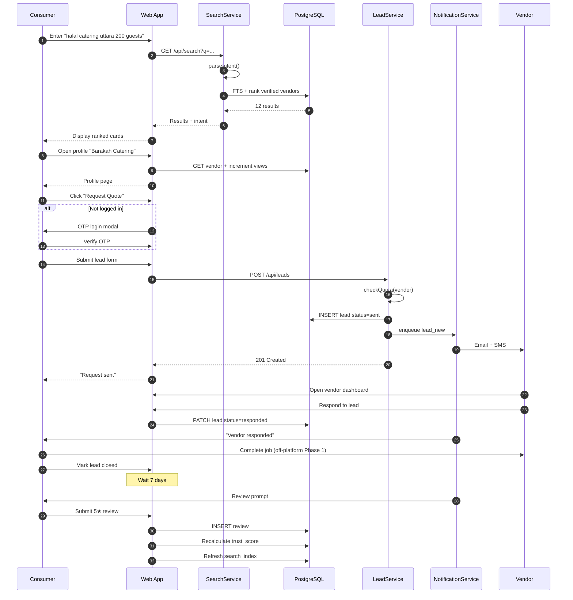
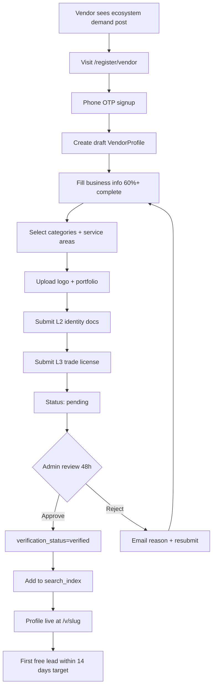
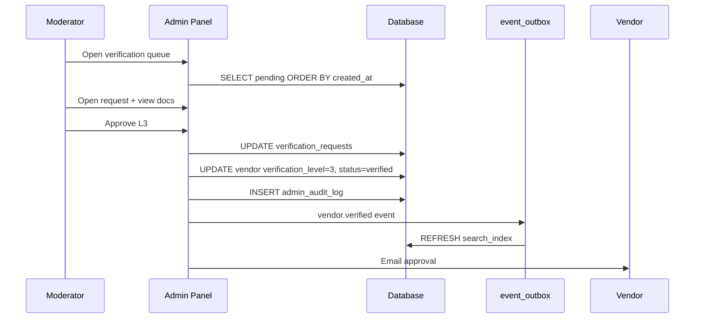
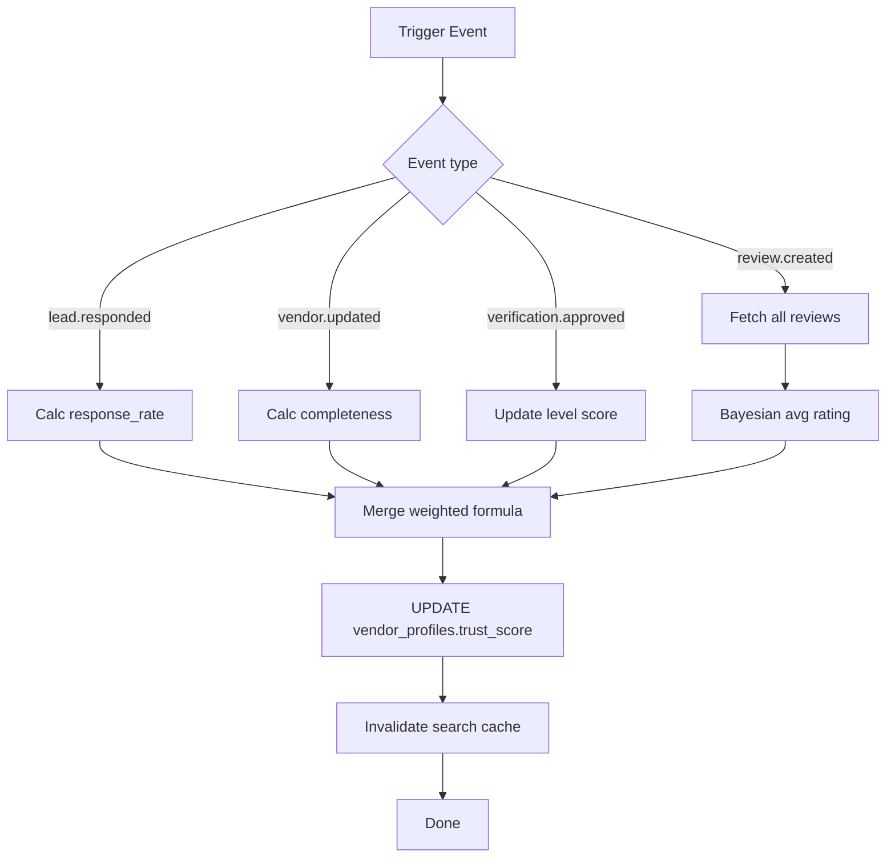
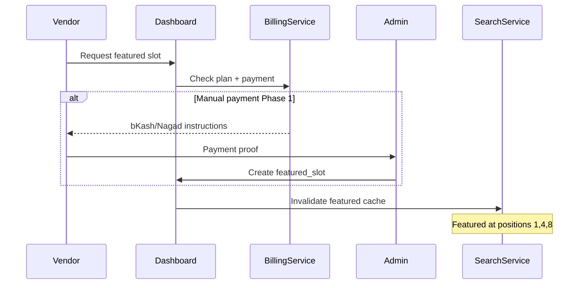
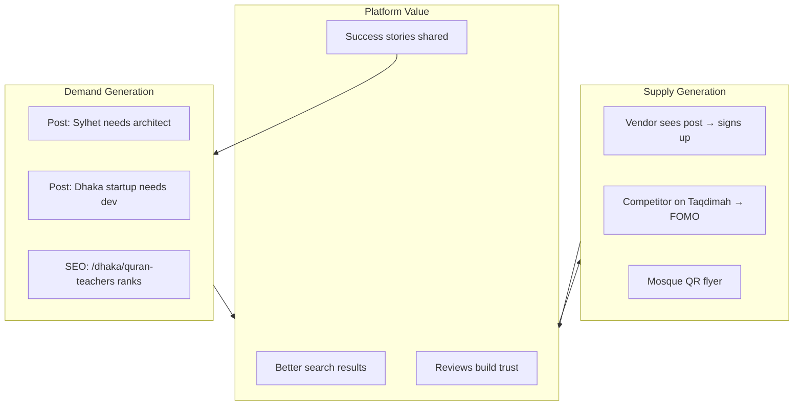
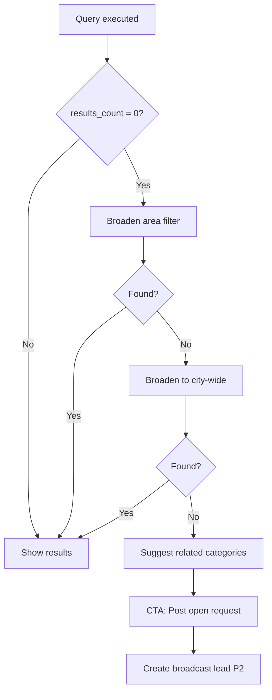
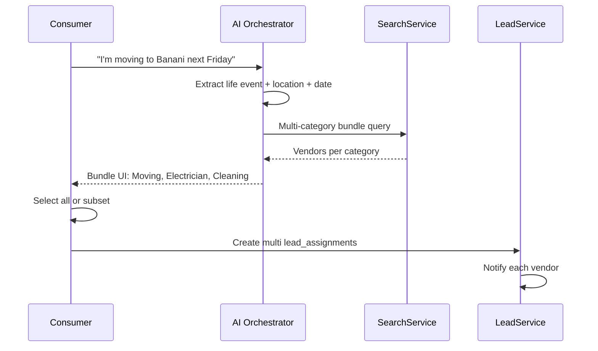
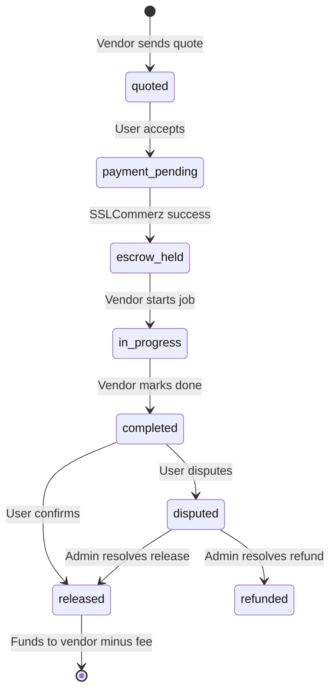
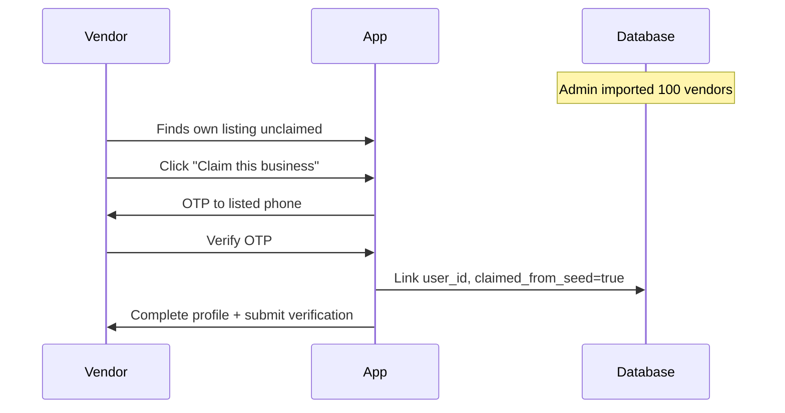

# Taqdimah : System Flows (Complete)

**Version:** 1.0  
**Parent:** [PRD-TECHNICAL.md](./PRD-TECHNICAL.md)

---

## Flow Index

| # | Flow | Actor | Phase |
|---|------|-------|-------|
| 1 | Consumer search to lead | Consumer | P0 |
| 2 | Vendor onboarding to live | Vendor | P0 |
| 3 | Verification approval | Admin | P0 |
| 4 | Review lifecycle | Consumer + Vendor | P0 |
| 5 | Featured listing purchase | Vendor + Admin | P1 |
| 6 | Ecosystem marketing loop | Platform | P0 |
| 7 | Institution onboarding | Institution | P1 |
| 8 | AI intent bundle | Consumer | P2 |
| 9 | Payment escrow | Consumer + Vendor | P2 |
| 10 | Partner API lead | Partner | P3 |

---

## Flow 1: Consumer Search → Lead → Review

---

## Flow 2: Vendor Onboarding → Live Profile

---

## Flow 3: Admin Verification

---

## Flow 4: Trust Score Recalculation

---

## Flow 5: Featured Listing (P1)

---

## Flow 6: Ecosystem Marketing Loop

---

## Flow 7: Zero Search Results Fallback

---

## Flow 8: AI Intent Bundle (P2)

---

## Flow 9: Payment Escrow (P2)

---

## Flow 10: Vendor Claim Pre-Seeded Profile

---

## User State Machines Summary

### Lead states

`sent` → `viewed` → `responded` → `closed`  
Branches: `expired`, `spam`, `disputed`

### Vendor verification states

`draft` → `pending` → `verified` | `rejected`  
Branches: `suspended`, `banned`

### Subscription states

`free` → `pro` → `business`  
Branches: `past_due`, `cancelled`

---

**Related:** [API_REFERENCE.md](./API_REFERENCE.md) · [TRUST_SYSTEM.md](./TRUST_SYSTEM.md)