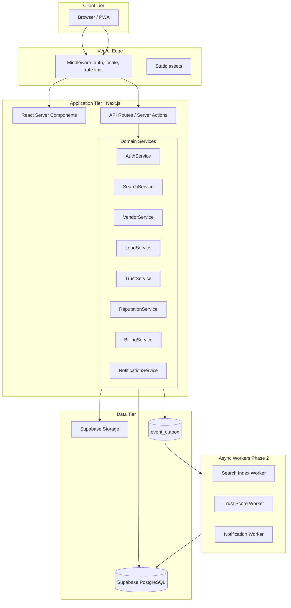
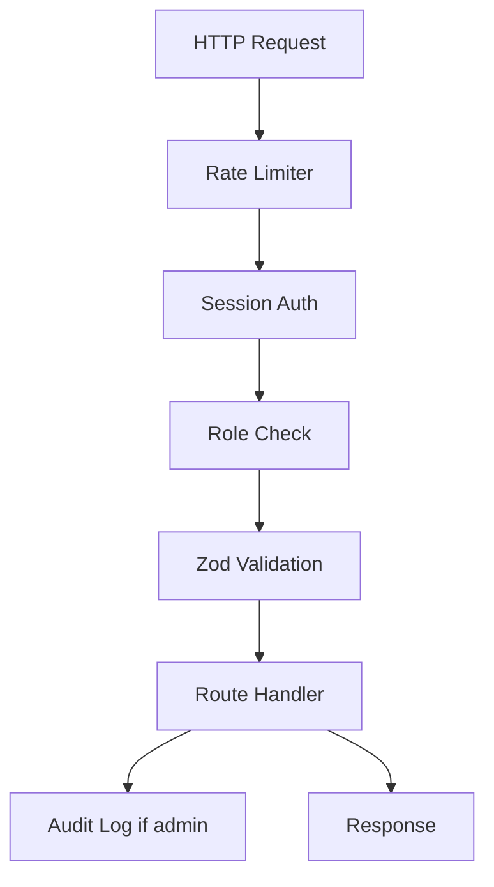
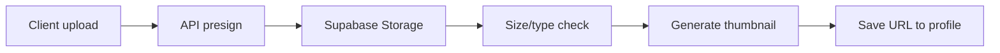
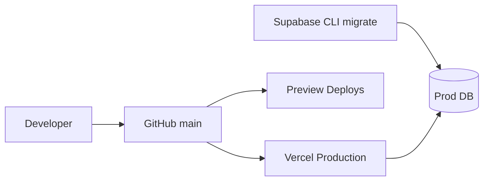

# Taqdimah : Technical Design Document (TDD)

**Version:** 1.0  
**Parent:** [PRD-TECHNICAL.md](./PRD-TECHNICAL.md)

---

## 1. Design Overview

Taqdimah is implemented as a **modular monolith** in Phase 1 (Next.js full-stack) with **clear service boundaries** that can extract to microservices at scale. Communication between logical services uses:

1. **Synchronous:** TypeScript service modules called from API routes
2. **Asynchronous:** Database-backed outbox pattern → workers (Phase 2: Inngest/Trigger.dev)
3. **Read models:** Materialized views for search index



---

## 2. Service Module Specifications

### 2.1 AuthService

**Responsibilities:** OTP, OAuth, session, role resolution

```typescript
// src/lib/services/auth.service.ts
interface AuthService {
  sendOtp(phone: string): Promise<{ success: boolean; retryAfter?: number }>;
  verifyOtp(phone: string, token: string): Promise<Session>;
  signInWithGoogle(code: string): Promise<Session>;
  getSession(req: Request): Promise<Session | null>;
  requireRole(session: Session, roles: Role[]): void;
}
```

**Dependencies:** Supabase Auth, SMS provider  
**Errors:** `AUTH_RATE_LIMITED`, `AUTH_INVALID_OTP`, `AUTH_SESSION_EXPIRED`

---

### 2.2 SearchService

**Responsibilities:** Intent parsing, query execution, result assembly

```typescript
interface SearchService {
  search(params: SearchParams): Promise<SearchResponse>;
  parseIntent(query: string): Promise<SearchIntent>;
  logSearch(intent: SearchIntent, resultsCount: number, userId?: string): Promise<void>;
}

interface SearchParams {
  q: string;
  city?: string;
  category?: string;
  page?: number;
  limit?: number;
  hideSponsored?: boolean;
  userId?: string;
}
```

**Pipeline stages:**
1. `normalizeQuery()`
2. `parseIntent()` : rules then LLM
3. `buildSqlQuery()` : FTS + filters
4. `rankResults()` : see SEARCH_RANKING.md
5. `injectFeatured()`
6. `cacheResult()` : 5min TTL per query hash

---

### 2.3 VendorService

```typescript
interface VendorService {
  createDraft(userId: string, input: CreateVendorInput): Promise<VendorProfile>;
  update(vendorId: string, input: UpdateVendorInput): Promise<VendorProfile>;
  getBySlug(slug: string): Promise<VendorPublicProfile>;
  calculateCompleteness(vendor: VendorProfile): number;
  isSearchEligible(vendor: VendorProfile): boolean;
}
```

**Search eligibility:**
```typescript
function isSearchEligible(v: VendorProfile): boolean {
  return (
    v.verification_status === 'verified' &&
    v.verification_level >= 2 &&
    v.profile_completeness >= 60 &&
    v.primary_category_id != null
  );
}
```

---

### 2.4 LeadService

```typescript
interface LeadService {
  create(input: CreateLeadInput, userId: string): Promise<Lead>;
  assignToVendors(lead: Lead, strategy: RoutingStrategy): Promise<LeadAssignment[]>;
  updateStatus(leadId: string, status: LeadStatus, actor: Actor): Promise<Lead>;
  checkQuota(vendorId: string): Promise<QuotaResult>;
}
```

**Quota check:**
```typescript
async function checkQuota(vendorId: string): Promise<QuotaResult> {
  const vendor = await getVendor(vendorId);
  const limits = PLAN_LIMITS[vendor.plan]; // free: 10/mo
  const used = await countLeadsThisMonth(vendorId);
  return { allowed: used < limits.leads, remaining: limits.leads - used };
}
```

---

### 2.5 TrustService

```typescript
interface TrustService {
  submitVerification(vendorId: string, level: number, docs: Document[]): Promise<VerificationRequest>;
  review(requestId: string, decision: ReviewDecision, adminId: string): Promise<void>;
  computeTrustScore(vendorId: string): Promise<number>;
  suspend(vendorId: string, reason: string, adminId: string): Promise<void>;
}
```

---

### 2.6 NotificationService

```typescript
interface NotificationService {
  enqueue(event: NotificationEvent): Promise<void>;
  sendEmail(template: string, to: string, data: Record<string, unknown>): Promise<void>;
  sendSms(phone: string, message: string): Promise<void>;
}
```

**Templates:** `lead_new`, `lead_response`, `verification_approved`, `review_prompt`, `subscription_renewal`

---

## 3. Database Design Patterns

### 3.1 Materialized view for search

```sql
CREATE MATERIALIZED VIEW search_index AS
SELECT
  v.id,
  v.slug,
  v.business_name,
  v.description,
  v.trust_score,
  v.verification_level,
  v.primary_category_id,
  v.service_areas,
  v.is_featured,
  v.plan,
  COALESCE(r.avg_rating, 0) AS avg_rating,
  COALESCE(r.review_count, 0) AS review_count,
  to_tsvector('simple', coalesce(v.business_name,'') || ' ' || coalesce(v.description,'')) AS search_vector
FROM vendor_profiles v
LEFT JOIN vendor_rating_agg r ON r.vendor_id = v.id
WHERE v.verification_status = 'verified'
  AND v.verification_level >= 2;

CREATE UNIQUE INDEX ON search_index (id);
CREATE INDEX ON search_index USING GIN (search_vector);
```

**Refresh:** `REFRESH MATERIALIZED VIEW CONCURRENTLY search_index` on events:
- vendor.verified
- review.created
- trust_score.updated

Phase 1: synchronous refresh acceptable < 500 vendors. Phase 2: async worker.

### 3.2 Event outbox pattern

```sql
CREATE TABLE event_outbox (
  id UUID PRIMARY KEY DEFAULT gen_random_uuid(),
  event_type TEXT NOT NULL,
  payload JSONB NOT NULL,
  created_at TIMESTAMPTZ DEFAULT NOW(),
  processed_at TIMESTAMPTZ,
  retry_count INT DEFAULT 0,
  status TEXT DEFAULT 'pending' CHECK (status IN ('pending','processing','done','failed'))
);

CREATE INDEX idx_outbox_pending ON event_outbox (status, created_at) WHERE status = 'pending';
```

---

## 4. Caching Strategy

| Key pattern | TTL | Invalidation |
|-------------|-----|--------------|
| `search:{hash}` | 5 min | vendor.verified, review.created |
| `vendor:slug:{slug}` | 15 min | vendor.updated |
| `category:tree` | 1 hour | category.admin_change |
| `featured:{city}:{cat}` | 10 min | featured_slot.changed |

Phase 1: In-memory LRU per serverless instance (limited).  
Phase 2: Upstash Redis.

---

## 5. API Middleware Stack



**Rate limits (MVP):**

| Endpoint | Limit |
|----------|-------|
| POST /api/auth/otp/send | 3/hour per phone |
| GET /api/search | 60/min per IP |
| POST /api/leads | 5/day per user |
| POST /api/vendor/* | 30/min per vendor |

---

## 6. File Upload Pipeline



**Rules:**
- Max 5MB image
- Allowed: jpg, png, webp, pdf (docs only)
- Virus scan: ClamAV P2 or provider scan
- Private bucket for verification docs

---

## 7. Deployment Architecture



**Environments:**

| Env | URL | DB |
|-----|-----|-----|
| local | localhost:3000 | Supabase local |
| staging | staging.Taqdimah.app | Supabase staging |
| production | Taqdimah.app | Supabase prod |

**Secrets:** Vercel env vars : never client-expose service role key

---

## 8. Error Handling Standard

```typescript
// Standard API error envelope
interface ApiError {
  error: {
    code: string;       // MACHINE_READABLE
    message: string;    // Human readable
    details?: unknown;
    request_id: string;
  };
}
```

**HTTP mapping:**

| Code | HTTP | Example |
|------|------|---------|
| VALIDATION_ERROR | 400 | Invalid phone |
| UNAUTHORIZED | 401 | No session |
| FORBIDDEN | 403 | Wrong role |
| NOT_FOUND | 404 | Vendor slug |
| RATE_LIMITED | 429 | Too many leads |
| QUOTA_EXCEEDED | 402 | Free plan leads exhausted |
| INTERNAL_ERROR | 500 | Unhandled |

---

## 9. Internationalization Architecture

```
src/
  messages/
    en.json
    bn.json
  i18n/
    config.ts
    request.ts
```

**next-intl** for App Router. Category names from DB (`name_en`, `name_bn`), not JSON files.

**URL strategy:**
- `/en/dhaka/architects`
- `/bn/dhaka/architects`
- Default locale from `Accept-Language` or cookie

---

## 10. Mobile Strategy (Phase 1–2)

**Phase 1:** Mobile-first responsive web + PWA manifest  
**Phase 2:** React Native app sharing API layer  
**Phase 3:** Push notifications via FCM

**PWA requirements:**
- Service worker cache for static
- Add to home screen prompt
- Offline: show cached category browse only

---

## 11. Third-Party Integration Contracts

### SMS (Bangladesh)

```
POST provider/send
{ "to": "+8801XXXXXXXXX", "message": "Your Taqdimah OTP: 123456" }
```

Fallback provider if primary fails within 30s.

### OpenAI Intent

```typescript
const response = await openai.chat.completions.create({
  model: 'gpt-4o-mini',
  temperature: 0.1,
  response_format: { type: 'json_object' },
  messages: [
    { role: 'system', content: INTENT_SYSTEM_PROMPT },
    { role: 'user', content: query }
  ]
});
```

**Cost cap:** $50/month → throttle LLM fallback to top 20% ambiguous queries only.

---

## 12. Disaster Recovery

| Scenario | RTO | Procedure |
|----------|-----|-----------|
| Vercel outage | 4h | Status page, redirect DNS to backup P2 |
| Supabase outage | 4h | Read-only mode message, queue writes |
| Bad deploy | 15min | Vercel instant rollback |
| Data corruption | 24h | Point-in-time recovery Supabase |

---

**Related:** [DATA_MODEL.md](./DATA_MODEL.md) · [API_REFERENCE.md](./API_REFERENCE.md) · [ARCHITECTURE.md](./ARCHITECTURE.md)