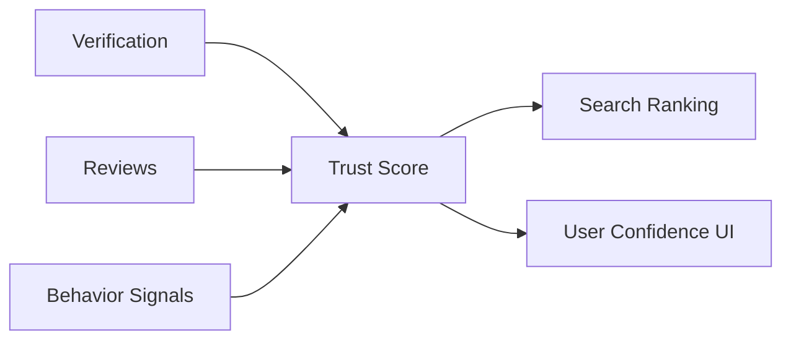
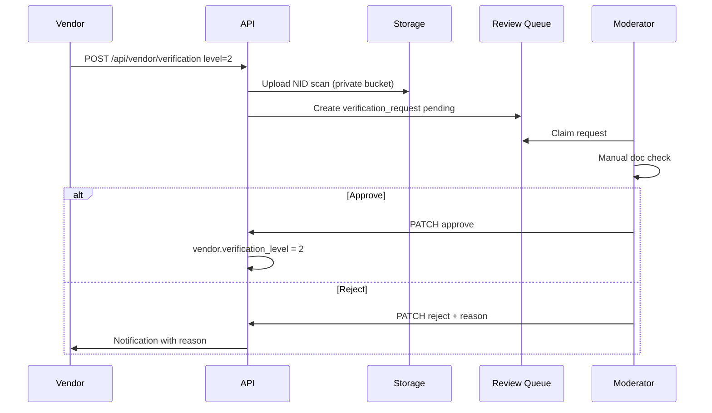
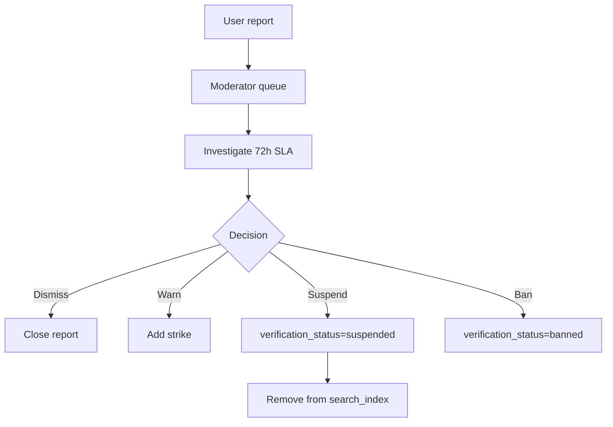

# Taqdimah : Trust & Reputation System

**Version:** 1.0  
**Parent:** [PRD-TECHNICAL.md](./PRD-TECHNICAL.md) §9–10

---

## 1. Trust System Overview

Taqdimah's moat is **trust**. The trust system has three components:



| Component | Question answered |
|-----------|-------------------|
| Verification | "Is this entity real?" |
| Reviews | "Did customers have good experiences?" |
| Behavior | "Do they respond and stay active?" |
| Trust Score | "Should we rank them highly?" |

---

## 2. Verification Levels

| Level | Name | Requirements | Badge | Search eligible |
|-------|------|--------------|-------|-----------------|
| L0 | Unverified | Account only | None | No |
| L1 | Phone | OTP verified | Phone Verified | No |
| L2 | Identity | NID / passport + selfie | Identity Verified | No |
| L3 | Business | Trade license / RJSC | Business Verified | **Yes** |
| L4 | Islamic | Ijazah / halal cert / NGO reg | Islamic Verified | **Yes** + category boost |

**Minimum for search index:** L2 + L3 approved (verification_level >= 2 AND business docs approved)

**Islamic categories** (quran-teachers, islamic-finance, scholars): require L4 for "Islamic Verified" badge; L3 sufficient to list.

---

## 3. Verification Workflow Detail



### Document requirements

| Level | Documents | OCR P2 |
|-------|-----------|--------|
| L2 | NID front/back or passport | Auto-extract name |
| L3 | Trade license or RJSC certificate | Expiry date check |
| L4 Islamic | Ijazah, halal cert, NGOAB letter | Manual only |

**Storage security:**
- Bucket: `verification-docs` (private)
- Signed URL expiry: 1 hour
- Access: admin + owning vendor only
- Retention: 7 years

---

## 4. Trust Score : Production Formula

### 4.1 Components

```typescript
interface TrustComponents {
  verification: number;  // 0-1 from level 0-4
  rating: number;        // 0-1 bayesian
  response: number;      // 0-1 response rate
  completeness: number;  // 0-1 profile fields
  freshness: number;     // 0-1 activity decay
  penalty: number;       // 0-1 reports/suspensions
}

function computeTrustScore(c: TrustComponents): number {
  const raw =
    c.verification * 0.30 +
    c.rating * 0.30 +
    c.response * 0.20 +
    c.completeness * 0.10 +
    c.freshness * 0.10;

  const penalized = raw * (1 - c.penalty);
  return Math.round(penalized * 5 * 100) / 100; // 0.00 - 5.00
}
```

### 4.2 Verification component

```typescript
const LEVEL_SCORES = [0, 0.25, 0.5, 0.75, 1.0]; // L0-L4
```

### 4.3 Response rate

```typescript
// Last 90 days
response_rate = responded_leads / total_leads_received
// Minimum 5 leads before response component fully applies
if (total_leads < 5) response_component = 0.5; // neutral
```

### 4.4 Profile completeness

| Field | Weight |
|-------|--------|
| business_name | 10 |
| description (>100 chars) | 15 |
| logo | 15 |
| primary_category | 10 |
| service_areas | 15 |
| phone + whatsapp | 10 |
| portfolio (3+ images) | 20 |
| website | 5 |

### 4.5 Penalty

| Event | Penalty |
|-------|---------|
| 1 open report | 0.05 |
| 3 open reports | 0.15 |
| Suspension (resolved) | 0.30 |
| Fake review confirmed | 0.50 |

---

## 5. Review System

### 5.1 Eligibility rules

```sql
-- Can review iff:
SELECT 1 FROM leads
WHERE id = :lead_id
  AND user_id = :user_id
  AND status = 'closed'
  AND NOT EXISTS (SELECT 1 FROM reviews WHERE lead_id = :lead_id);
```

### 5.2 Review display

**Public profile shows:**
- Average rating (Bayesian displayed to 1 decimal)
- Star distribution bar chart
- Recent 10 reviews
- Vendor reply if exists

**Wilson score** optional P2 for "top rated" badge:

```typescript
function wilsonScore(positive: number, total: number, z = 1.96): number {
  if (total === 0) return 0;
  const phat = positive / total;
  return (
    (phat + z*z/(2*total) - z * Math.sqrt((phat*(1-phat)+z*z/(4*total))/total)) /
    (1+z*z/total)
  );
}
```

---

## 6. Trust UI Signals

| Signal | Display | Threshold |
|--------|---------|-----------|
| Verified badge | Blue check | L3+ |
| Islamic verified | Green crescent | L4 Islamic |
| Halal badge | Halal icon | Admin approved cert |
| Top rated | Gold star | trust_score >= 4.5 AND reviews >= 10 |
| Fast responder | Lightning | response_rate >= 90% |
| New on Taqdimah | Label | < 30 days, no hide |

---

## 7. Moderation & Reports

### Report reasons

- `fake_listing`
- `scam`
- `wrong_category`
- `offensive_content`
- `fake_reviews`
- `haram_service`

### Strike policy

| Strikes | Action |
|---------|--------|
| 1 | Warning email |
| 2 | 7-day visibility reduction |
| 3 | Suspension pending review |
| Confirmed scam | Permanent ban |



---

## 8. Trust Events (async)

| Event | Handler |
|-------|---------|
| `review.created` | Recalc trust_score |
| `lead.responded` | Update response_rate |
| `verification.approved` | Recalc + refresh index |
| `vendor.suspended` | Remove from index |
| `report.actioned` | Apply penalty |

---

## 9. Anti-Fraud Measures

| Attack | Detection | Response |
|--------|-----------|----------|
| Fake reviews ring | Same IP/device cluster | Ban + hide reviews |
| Lead farming | High create rate, no close | Rate limit + captcha |
| Verification doc reuse | Image hash match | Reject + flag |
| Review gating bypass | DB constraint + API check | 403 |
| Trust score manipulation | Anomaly on response time < 1s | Manual audit |

---

## 10. Shariah Alignment

- No paid removal of negative honest reviews
- Sponsored placement cannot buy trust badges
- Islamic finance listings require L4 + partner approval
- Haram services blocked at category + moderation level

---

**Related:** [SEARCH_RANKING.md](./SEARCH_RANKING.md) · [SYSTEM_FLOWS.md](./SYSTEM_FLOWS.md)